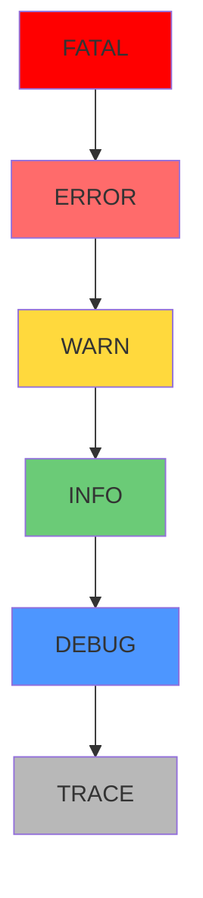

# 9.4.1 错误也分等级——日志级别：ERROR/WARN/INFO/DEBUG 使用

**日志级别决定了什么信息该记录、什么时候该告警。**

## 日志级别层次



## 级别使用指南

| 级别 | 使用场景 | 是否告警 | 示例 |
|------|----------|----------|------|
| ERROR | 需要人工介入的错误 | ✅ 立即 | 支付失败、数据库连接断开 |
| WARN | 潜在问题但可恢复 | ⚠️ 聚合 | 重试成功、降级处理 |
| INFO | 重要业务事件 | ❌ | 用户注册、订单创建 |
| DEBUG | 开发调试信息 | ❌ | SQL 查询、函数参数 |

## ERROR：需要立即处理

```typescript
// ✅ 正确使用 ERROR
try {
  await stripe.charges.create(paymentData);
} catch (err) {
  logger.error({
    err,
    userId,
    orderId,
    amount,
  }, '支付处理失败，需要人工介入');
  
  // 同时发送告警
  await alertService.sendCritical({
    title: '支付失败',
    details: { orderId, error: err.message },
  });
  
  throw new PaymentError('支付失败，请稍后重试');
}

// ❌ 错误示例：不是所有异常都是 ERROR
try {
  const user = await prisma.user.findUnique({ where: { id } });
  if (!user) {
    logger.error('用户不存在'); // ❌ 这应该是业务逻辑，不是 ERROR
  }
} catch (err) {
  // ...
}
```

## WARN：值得关注但不紧急

```typescript
// ✅ 正确使用 WARN
async function getInventory(productId: string) {
  try {
    return await inventoryService.getStock(productId);
  } catch (err) {
    logger.warn({
      productId,
      err,
      fallback: 'cache',
    }, '库存服务不可用，使用缓存数据');
    
    return await cache.get(`inventory:${productId}`);
  }
}

// ✅ 重试成功的情况
async function sendEmailWithRetry(email: EmailData) {
  for (let i = 0; i < 3; i++) {
    try {
      return await emailService.send(email);
    } catch (err) {
      if (i < 2) {
        logger.warn({
          attempt: i + 1,
          email: email.to,
          err,
        }, '邮件发送失败，正在重试');
        await sleep(1000 * (i + 1));
      } else {
        throw err;
      }
    }
  }
}
```

## INFO：业务关键事件

```typescript
// ✅ 正确使用 INFO
export async function createOrder(userId: string, items: OrderItem[]) {
  const order = await prisma.order.create({
    data: {
      userId,
      items: { create: items },
      status: 'PENDING',
    },
  });
  
  logger.info({
    action: 'order.created',
    orderId: order.id,
    userId,
    itemCount: items.length,
    total: order.total,
  }, '订单创建成功');
  
  return order;
}

// ✅ 用户认证事件
logger.info({
  action: 'user.login',
  userId,
  method: 'password',
  ip: req.ip,
}, '用户登录成功');

logger.info({
  action: 'user.logout',
  userId,
  sessionDuration: Date.now() - session.createdAt,
}, '用户登出');
```

## DEBUG：开发调试

```typescript
// ✅ 正确使用 DEBUG
export async function searchProducts(query: SearchQuery) {
  logger.debug({ query }, '搜索参数');
  
  const results = await prisma.product.findMany({
    where: buildWhereClause(query),
    orderBy: buildOrderBy(query.sort),
    take: query.limit,
    skip: query.offset,
  });
  
  logger.debug({
    query,
    resultCount: results.length,
    executionTime: Date.now() - startTime,
  }, '搜索完成');
  
  return results;
}
```

## 环境配置

```typescript
// lib/logger.ts
import pino from 'pino';

const levels = {
  production: 'info',
  development: 'debug',
  test: 'warn',
};

export const logger = pino({
  level: process.env.LOG_LEVEL || levels[process.env.NODE_ENV] || 'info',
});
```

```bash
# .env.production
LOG_LEVEL=info

# .env.development
LOG_LEVEL=debug

# .env.test
LOG_LEVEL=warn
```

## 常见错误

```typescript
// ❌ 用 console.log 代替日志
console.log('用户创建成功', user);

// ✅ 使用结构化日志
logger.info({ action: 'user.created', userId: user.id }, '用户创建成功');

// ❌ 所有错误都用 ERROR
logger.error('用户不存在'); // 这是正常业务逻辑

// ✅ 区分业务逻辑和系统错误
if (!user) {
  logger.debug({ userId }, '用户不存在');
  throw new NotFoundError('用户不存在');
}

// ❌ DEBUG 日志太详细
logger.debug({ request: req }); // 包含敏感信息

// ✅ 只记录必要信息
logger.debug({ 
  method: req.method, 
  path: req.path,
  query: req.query,
}, '收到请求');
```

## 本节小结

日志级别是分类信息的工具：ERROR 需要立即处理，WARN 值得关注，INFO 记录业务事件，DEBUG 用于开发调试。正确使用级别能让告警更精准，排查问题更高效。
