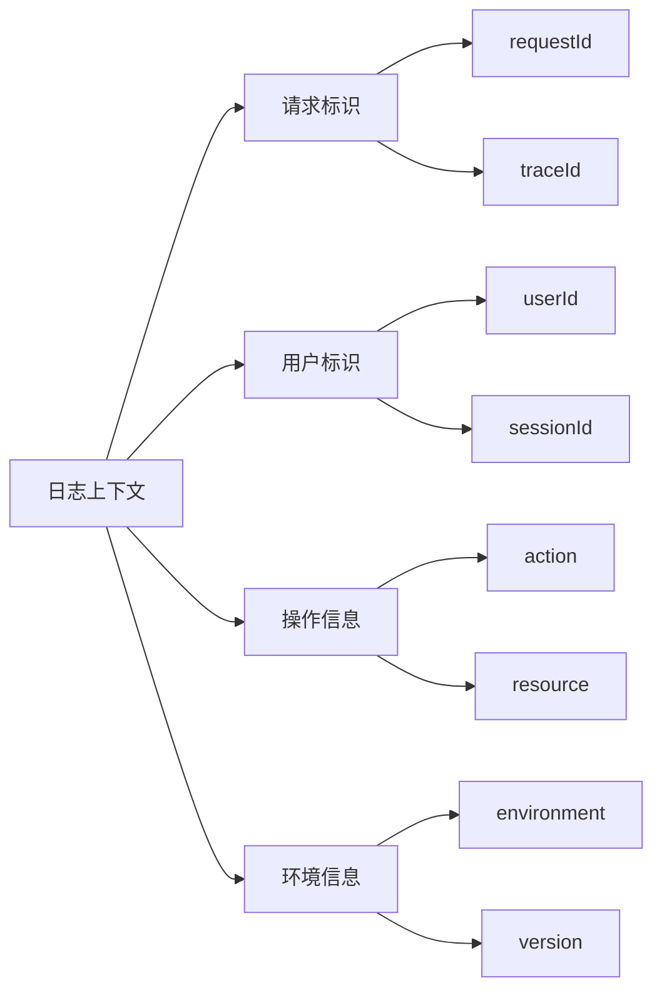

# 9.4.2 谁在什么时间干了啥——上下文信息：请求 ID/用户 ID/操作类型

**没有上下文的日志就像没有时间戳的监控录像——看得到发生了什么，但找不到是谁、什么时候。**

## 上下文信息类型



## 请求 ID 实现

请求 ID 用于追踪单个请求的完整链路。

```typescript
// middleware/request-id.ts
import { nanoid } from 'nanoid';
import { NextRequest, NextResponse } from 'next/server';

export function requestIdMiddleware(request: NextRequest) {
  const requestId = request.headers.get('x-request-id') || nanoid();
  
  const response = NextResponse.next();
  response.headers.set('x-request-id', requestId);
  
  return response;
}
```

```typescript
// lib/logger.ts
import pino from 'pino';
import { AsyncLocalStorage } from 'async_hooks';

interface RequestContext {
  requestId: string;
  userId?: string;
  path?: string;
}

export const contextStorage = new AsyncLocalStorage<RequestContext>();

export const logger = pino({
  mixin() {
    const context = contextStorage.getStore();
    return context ? { ...context } : {};
  },
});
```

```typescript
// middleware/context.ts
import { NextRequest } from 'next/server';
import { contextStorage, logger } from '@/lib/logger';
import { nanoid } from 'nanoid';

export async function withContext<T>(
  request: NextRequest,
  handler: () => Promise<T>
): Promise<T> {
  const requestId = request.headers.get('x-request-id') || nanoid();
  const userId = request.headers.get('x-user-id');
  
  return contextStorage.run(
    {
      requestId,
      userId,
      path: request.nextUrl.pathname,
    },
    handler
  );
}
```

## 使用示例

```typescript
// app/api/orders/route.ts
import { withContext } from '@/middleware/context';
import { logger } from '@/lib/logger';

export async function POST(request: NextRequest) {
  return withContext(request, async () => {
    const body = await request.json();
    
    // 自动包含 requestId、userId、path
    logger.info({ items: body.items.length }, '创建订单请求');
    
    const order = await orderService.create(body);
    
    logger.info({ orderId: order.id }, '订单创建成功');
    
    return NextResponse.json(order);
  });
}
```

输出示例：
```json
{
  "level": 30,
  "time": 1699123456789,
  "requestId": "abc123",
  "userId": "user_456",
  "path": "/api/orders",
  "items": 3,
  "msg": "创建订单请求"
}
```

## 子日志器

为不同模块创建带默认上下文的日志器。

```typescript
// services/order.service.ts
import { logger } from '@/lib/logger';

const log = logger.child({ service: 'order' });

export class OrderService {
  async create(data: CreateOrderInput) {
    log.info({ action: 'create', input: data }, '开始创建订单');
    
    const order = await prisma.$transaction(async (tx) => {
      // 创建订单
      const order = await tx.order.create({ data: { ... } });
      
      log.debug({ orderId: order.id }, '订单记录已创建');
      
      // 扣减库存
      await this.deductInventory(tx, data.items);
      
      log.debug({ orderId: order.id }, '库存已扣减');
      
      return order;
    });
    
    log.info({ 
      action: 'create.success',
      orderId: order.id,
      total: order.total,
    }, '订单创建成功');
    
    return order;
  }
}
```

## 分布式追踪

使用 traceId 追踪跨服务调用。

```typescript
// lib/tracing.ts
import { logger } from './logger';

export async function callExternalService<T>(
  url: string,
  options: RequestInit = {}
): Promise<T> {
  const context = contextStorage.getStore();
  
  const response = await fetch(url, {
    ...options,
    headers: {
      ...options.headers,
      'x-request-id': context?.requestId,
      'x-trace-id': context?.traceId,
    },
  });
  
  logger.debug({
    url,
    status: response.status,
    duration: Date.now() - startTime,
  }, '外部服务调用完成');
  
  return response.json();
}
```

## 标准上下文字段

| 字段 | 描述 | 示例 |
|------|------|------|
| requestId | 请求唯一标识 | `req_abc123` |
| traceId | 分布式追踪 ID | `trace_xyz789` |
| userId | 当前用户 ID | `user_456` |
| sessionId | 会话 ID | `sess_def` |
| action | 操作类型 | `order.create` |
| service | 服务名称 | `order-service` |
| environment | 运行环境 | `production` |
| version | 应用版本 | `1.2.3` |

## 最佳实践

```typescript
// ✅ 好：包含完整上下文
logger.info({
  action: 'payment.process',
  orderId,
  amount,
  currency,
  paymentMethod,
}, '开始处理支付');

// ❌ 坏：缺少上下文
logger.info('处理支付');

// ✅ 好：错误包含上下文
logger.error({
  err,
  action: 'payment.failed',
  orderId,
  amount,
  retryCount,
}, '支付处理失败');

// ❌ 坏：只记录错误消息
logger.error('支付失败');
```

## 本节小结

上下文信息是日志的"身份证"。通过 requestId 追踪请求链路，通过 userId 定位用户行为，通过 action 理解操作类型。使用 AsyncLocalStorage 自动传递上下文，让日志自动携带必要信息。
