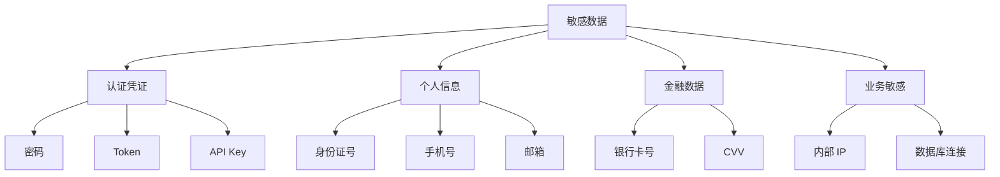

# 9.4.3 日志里不能泄露密码——敏感信息脱敏：实施指南与安全设计原则

**日志是安全漏洞的高发区——很多数据泄露都是因为日志里包含了敏感信息。**

## 需要脱敏的数据类型



## Pino 自动脱敏

```typescript
// lib/logger.ts
import pino from 'pino';

export const logger = pino({
  redact: {
    paths: [
      // 认证凭证
      'password',
      'token',
      'accessToken',
      'refreshToken',
      'authorization',
      'apiKey',
      'secret',
      
      // 个人信息
      '*.password',
      '*.idCard',
      '*.bankCard',
      'user.password',
      'req.headers.authorization',
      'req.headers.cookie',
      
      // 嵌套对象
      'data.*.password',
      'users[*].password',
    ],
    censor: '[REDACTED]',
  },
});
```

## 自定义脱敏函数

```typescript
// lib/mask.ts
export const mask = {
  // 手机号：138****8888
  phone: (phone: string): string => {
    if (!phone || phone.length < 7) return phone;
    return phone.slice(0, 3) + '****' + phone.slice(-4);
  },
  
  // 邮箱：t***@example.com
  email: (email: string): string => {
    const [local, domain] = email.split('@');
    if (!domain) return email;
    return local[0] + '***@' + domain;
  },
  
  // 身份证：110***********1234
  idCard: (id: string): string => {
    if (!id || id.length < 8) return id;
    return id.slice(0, 3) + '*'.repeat(id.length - 7) + id.slice(-4);
  },
  
  // 银行卡：****8888
  bankCard: (card: string): string => {
    if (!card || card.length < 4) return card;
    return '****' + card.slice(-4);
  },
  
  // Token：eyJh...abc (只显示前后)
  token: (token: string): string => {
    if (!token || token.length < 10) return '[REDACTED]';
    return token.slice(0, 4) + '...' + token.slice(-3);
  },
};
```

## 使用脱敏函数

```typescript
// services/user.service.ts
import { logger } from '@/lib/logger';
import { mask } from '@/lib/mask';

export async function createUser(data: CreateUserInput) {
  logger.info({
    action: 'user.create',
    email: mask.email(data.email),
    phone: mask.phone(data.phone),
  }, '创建用户');
  
  const user = await prisma.user.create({
    data: {
      email: data.email,
      phone: data.phone,
      password: await hash(data.password),
    },
  });
  
  logger.info({
    action: 'user.created',
    userId: user.id,
    email: mask.email(user.email),
  }, '用户创建成功');
  
  return user;
}
```

## HTTP 请求脱敏

```typescript
// middleware/logging.ts
import { NextRequest } from 'next/server';
import { logger } from '@/lib/logger';

const sensitiveHeaders = [
  'authorization',
  'cookie',
  'x-api-key',
  'x-auth-token',
];

function sanitizeHeaders(headers: Headers): Record<string, string> {
  const result: Record<string, string> = {};
  
  headers.forEach((value, key) => {
    if (sensitiveHeaders.includes(key.toLowerCase())) {
      result[key] = '[REDACTED]';
    } else {
      result[key] = value;
    }
  });
  
  return result;
}

export function logRequest(request: NextRequest) {
  logger.info({
    method: request.method,
    path: request.nextUrl.pathname,
    headers: sanitizeHeaders(request.headers),
  }, '收到请求');
}
```

## 请求体脱敏

```typescript
// lib/sanitize.ts
const sensitiveFields = [
  'password',
  'confirmPassword',
  'currentPassword',
  'newPassword',
  'token',
  'accessToken',
  'refreshToken',
  'apiKey',
  'secret',
  'creditCard',
  'cvv',
  'ssn',
  'idCard',
];

export function sanitizeBody(body: unknown): unknown {
  if (!body || typeof body !== 'object') {
    return body;
  }
  
  if (Array.isArray(body)) {
    return body.map(sanitizeBody);
  }
  
  const result: Record<string, unknown> = {};
  
  for (const [key, value] of Object.entries(body)) {
    if (sensitiveFields.includes(key)) {
      result[key] = '[REDACTED]';
    } else if (typeof value === 'object' && value !== null) {
      result[key] = sanitizeBody(value);
    } else {
      result[key] = value;
    }
  }
  
  return result;
}
```

## 错误堆栈脱敏

```typescript
// lib/error-sanitizer.ts
export function sanitizeError(err: Error): object {
  return {
    name: err.name,
    message: sanitizeMessage(err.message),
    // 不暴露完整堆栈到日志
    stack: process.env.NODE_ENV === 'development' 
      ? err.stack 
      : undefined,
  };
}

function sanitizeMessage(message: string): string {
  // 移除可能的连接字符串
  return message
    .replace(/postgresql:\/\/[^@]+@[^\s]+/g, 'postgresql://[REDACTED]')
    .replace(/mongodb:\/\/[^@]+@[^\s]+/g, 'mongodb://[REDACTED]')
    .replace(/redis:\/\/[^@]+@[^\s]+/g, 'redis://[REDACTED]');
}
```

## 验证脱敏效果

```typescript
// __tests__/lib/logger.test.ts
describe('Logger Redaction', () => {
  it('应脱敏密码字段', () => {
    const output = captureLogOutput(() => {
      logger.info({ password: 'secret123' }, 'test');
    });
    
    expect(output).not.toContain('secret123');
    expect(output).toContain('[REDACTED]');
  });
  
  it('应脱敏嵌套密码', () => {
    const output = captureLogOutput(() => {
      logger.info({ 
        user: { 
          email: 'test@example.com',
          password: 'secret123',
        },
      }, 'test');
    });
    
    expect(output).not.toContain('secret123');
    expect(output).toContain('test@example.com');
  });
});
```

## 安全检查清单

| 检查项 | 描述 |
|--------|------|
| ✅ 密码字段已脱敏 | password、secret、apiKey 等 |
| ✅ Token 已脱敏 | JWT、OAuth Token、Session ID |
| ✅ 个人信息已脱敏 | 身份证、手机号、银行卡 |
| ✅ 请求头已过滤 | Authorization、Cookie |
| ✅ 连接字符串已移除 | 数据库 URL、Redis URL |
| ✅ 错误堆栈已处理 | 生产环境不暴露完整堆栈 |

## 本节小结

敏感信息脱敏是安全的基本要求。使用 Pino 的 redact 配置自动脱敏常见字段，对个人信息使用自定义脱敏函数保留可识别性。定期审查日志输出，确保没有敏感信息泄露。
