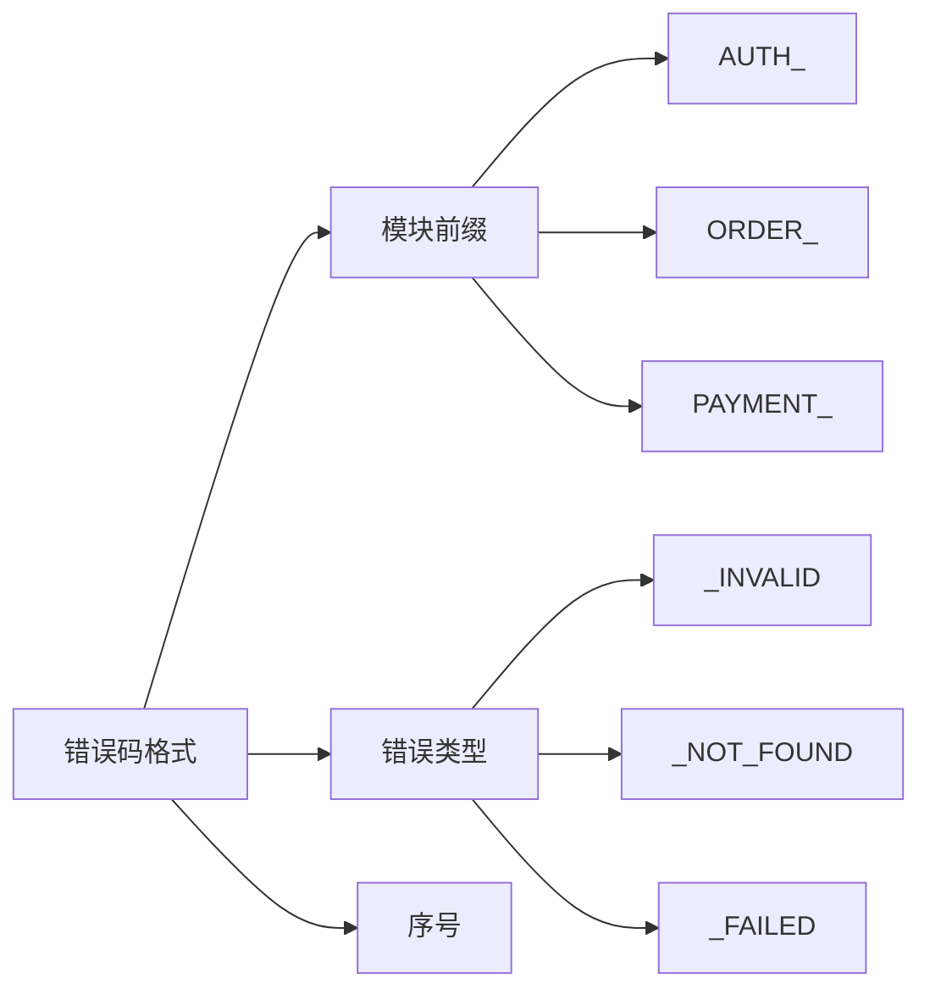

# 9.4.5 错误要记录在案——文档同步：错误码文档与处理指南

**错误码文档是前后端协作的"合同"——改了代码必须更新文档。**

## 错误码设计规范



## 错误码定义

```typescript
// lib/error-codes.ts
export const ErrorCodes = {
  // 认证错误 (1xxx)
  AUTH_INVALID_CREDENTIALS: {
    code: 'AUTH_1001',
    message: '邮箱或密码错误',
    httpStatus: 401,
  },
  AUTH_TOKEN_EXPIRED: {
    code: 'AUTH_1002',
    message: '登录已过期，请重新登录',
    httpStatus: 401,
  },
  AUTH_INSUFFICIENT_PERMISSION: {
    code: 'AUTH_1003',
    message: '没有权限执行此操作',
    httpStatus: 403,
  },
  
  // 订单错误 (2xxx)
  ORDER_NOT_FOUND: {
    code: 'ORDER_2001',
    message: '订单不存在',
    httpStatus: 404,
  },
  ORDER_ALREADY_PAID: {
    code: 'ORDER_2002',
    message: '订单已支付',
    httpStatus: 409,
  },
  ORDER_STOCK_INSUFFICIENT: {
    code: 'ORDER_2003',
    message: '库存不足',
    httpStatus: 400,
  },
  
  // 支付错误 (3xxx)
  PAYMENT_FAILED: {
    code: 'PAYMENT_3001',
    message: '支付失败，请重试',
    httpStatus: 400,
  },
  PAYMENT_TIMEOUT: {
    code: 'PAYMENT_3002',
    message: '支付超时',
    httpStatus: 408,
  },
  
  // 系统错误 (9xxx)
  SYSTEM_ERROR: {
    code: 'SYSTEM_9001',
    message: '服务暂时不可用，请稍后重试',
    httpStatus: 500,
  },
  SYSTEM_MAINTENANCE: {
    code: 'SYSTEM_9002',
    message: '系统维护中，请稍后访问',
    httpStatus: 503,
  },
} as const;

export type ErrorCode = keyof typeof ErrorCodes;
```

## 使用错误码

```typescript
// lib/errors.ts
import { ErrorCodes, ErrorCode } from './error-codes';

export class AppError extends Error {
  public code: string;
  public httpStatus: number;
  
  constructor(errorCode: ErrorCode, customMessage?: string) {
    const errorDef = ErrorCodes[errorCode];
    super(customMessage || errorDef.message);
    
    this.code = errorDef.code;
    this.httpStatus = errorDef.httpStatus;
  }
}

// 使用
throw new AppError('ORDER_STOCK_INSUFFICIENT');
throw new AppError('ORDER_NOT_FOUND', `订单 ${orderId} 不存在`);
```

## 自动生成文档

```typescript
// scripts/generate-error-docs.ts
import { ErrorCodes } from '../lib/error-codes';
import * as fs from 'fs';

function generateErrorDocs() {
  const grouped = groupByModule(ErrorCodes);
  
  let markdown = '# API 错误码文档\n\n';
  markdown += `> 更新时间: ${new Date().toISOString()}\n\n`;
  
  for (const [module, errors] of Object.entries(grouped)) {
    markdown += `## ${module}\n\n`;
    markdown += '| 错误码 | HTTP 状态 | 描述 | 处理建议 |\n';
    markdown += '|--------|----------|------|----------|\n';
    
    for (const [key, error] of Object.entries(errors)) {
      markdown += `| ${error.code} | ${error.httpStatus} | ${error.message} | ${getHandlingTip(key)} |\n`;
    }
    
    markdown += '\n';
  }
  
  fs.writeFileSync('docs/api/error-codes.md', markdown);
  console.log('错误码文档已生成');
}

function groupByModule(codes: typeof ErrorCodes) {
  const groups: Record<string, typeof ErrorCodes> = {};
  
  for (const [key, value] of Object.entries(codes)) {
    const module = key.split('_')[0];
    if (!groups[module]) groups[module] = {};
    groups[module][key] = value;
  }
  
  return groups;
}

function getHandlingTip(key: string): string {
  const tips: Record<string, string> = {
    AUTH_INVALID_CREDENTIALS: '检查邮箱和密码是否正确',
    AUTH_TOKEN_EXPIRED: '重新登录获取新 Token',
    ORDER_STOCK_INSUFFICIENT: '减少购买数量或选择其他商品',
    PAYMENT_FAILED: '检查支付信息或更换支付方式',
    SYSTEM_ERROR: '稍后重试，如持续出现请联系客服',
  };
  
  return tips[key] || '请联系客服';
}

generateErrorDocs();
```

## CI 检查文档同步

```yaml
# .github/workflows/check-error-docs.yml
name: Check Error Docs

on:
  pull_request:
    paths:
      - 'lib/error-codes.ts'

jobs:
  check:
    runs-on: ubuntu-latest
    steps:
      - uses: actions/checkout@v4
      
      - name: Setup Node
        uses: actions/setup-node@v4
        with:
          node-version: '20'
      
      - name: Install dependencies
        run: npm ci
      
      - name: Generate docs
        run: npx ts-node scripts/generate-error-docs.ts
      
      - name: Check for changes
        run: |
          if git diff --exit-code docs/api/error-codes.md; then
            echo "✅ 错误码文档已同步"
          else
            echo "❌ 错误码已更改，请更新文档"
            echo "运行: npm run generate:error-docs"
            exit 1
          fi
```

## 错误码文档模板

```markdown
# API 错误码文档

## 认证模块 (AUTH)

| 错误码 | HTTP 状态 | 描述 | 处理建议 |
|--------|----------|------|----------|
| AUTH_1001 | 401 | 邮箱或密码错误 | 检查邮箱和密码 |
| AUTH_1002 | 401 | 登录已过期 | 重新登录 |
| AUTH_1003 | 403 | 没有权限 | 联系管理员 |

## 订单模块 (ORDER)

| 错误码 | HTTP 状态 | 描述 | 处理建议 |
|--------|----------|------|----------|
| ORDER_2001 | 404 | 订单不存在 | 检查订单号 |
| ORDER_2002 | 409 | 订单已支付 | 无需重复支付 |
| ORDER_2003 | 400 | 库存不足 | 减少数量 |

## 前端处理示例

\`\`\`typescript
try {
  await api.createOrder(data);
} catch (err) {
  if (err.code === 'ORDER_2003') {
    showStockWarning(err.message);
  } else {
    showError(err.message);
  }
}
\`\`\`
```

## 版本管理

```typescript
// lib/error-codes.ts
export const ERROR_CODES_VERSION = '1.2.0';

// 更新日志
export const CHANGELOG = {
  '1.2.0': ['新增 PAYMENT_TIMEOUT 错误码'],
  '1.1.0': ['新增 ORDER_STOCK_INSUFFICIENT 错误码'],
  '1.0.0': ['初始版本'],
};
```

## 本节小结

错误码文档是前后端协作的基础。通过代码定义错误码（单一数据源），自动生成文档（保持同步），CI 检查（强制更新）。改错误码的同时必须更新文档，这是团队协作的基本纪律。
