# 9.4 出了错如何快速定位——错误处理与日志规范：级别/上下文/脱敏；修复 → 文档同步

**好的日志是生产环境的"黑匣子"——出问题时能快速定位，平时不碍事。**

## 日志系统架构

```mermaid
graph TD
    A[应用代码] --> B[日志库]
    B --> C{日志级别}
    C -->|ERROR| D[错误追踪]
    C -->|WARN| E[告警系统]
    C -->|INFO| F[运行日志]
    C -->|DEBUG| G[调试日志]
    
    D --> H[Sentry/Datadog]
    E --> I[PagerDuty/钉钉]
    F --> J[CloudWatch/ELK]
    G --> K[本地文件]
```



## 本章内容

| 小节 | 主题 | 核心内容 |
|------|------|----------|
| 9.4.1 | 日志级别 | ERROR/WARN/INFO/DEBUG 的正确使用 |
| 9.4.2 | 上下文信息 | 请求 ID、用户 ID、操作类型的注入 |
| 9.4.3 | 敏感信息脱敏 | 密码、Token、身份证号的安全处理 |
| 9.4.4 | 错误恢复 | 异常处理与用户友好提示 |
| 9.4.5 | 文档同步 | 错误码文档的维护与更新 |

## 日志库选择

| 库 | 特点 | 适用场景 |
|----|------|----------|
| pino | 高性能 JSON 日志 | 生产环境 |
| winston | 功能丰富，可扩展 | 复杂需求 |
| console | 零依赖 | 开发调试 |

## 快速配置

```typescript
// lib/logger.ts
import pino from 'pino';

export const logger = pino({
  level: process.env.LOG_LEVEL || 'info',
  transport: process.env.NODE_ENV === 'development' 
    ? { target: 'pino-pretty' } 
    : undefined,
  redact: ['password', 'token', 'authorization'],
});
```

```typescript
// 使用示例
import { logger } from '@/lib/logger';

// 记录不同级别的日志
logger.error({ err, userId }, '支付处理失败');
logger.warn({ orderId }, '库存不足，已降级处理');
logger.info({ action: 'login', userId }, '用户登录');
logger.debug({ query }, '数据库查询');
```

## 核心原则

1. **生产环境只记录 INFO 及以上**：DEBUG 日志量太大
2. **结构化日志**：使用 JSON 格式，便于搜索和聚合
3. **敏感信息必须脱敏**：密码、Token、个人信息
4. **错误要有上下文**：谁、在哪、做什么、为什么失败
5. **文档与代码同步**：错误码变更时更新文档

## 本节小结

日志是生产环境的"眼睛"。通过分级记录、结构化输出、敏感信息脱敏，让日志既能帮助排查问题，又不会泄露用户隐私。接下来的小节会详细讲解每个方面的实现细节。
