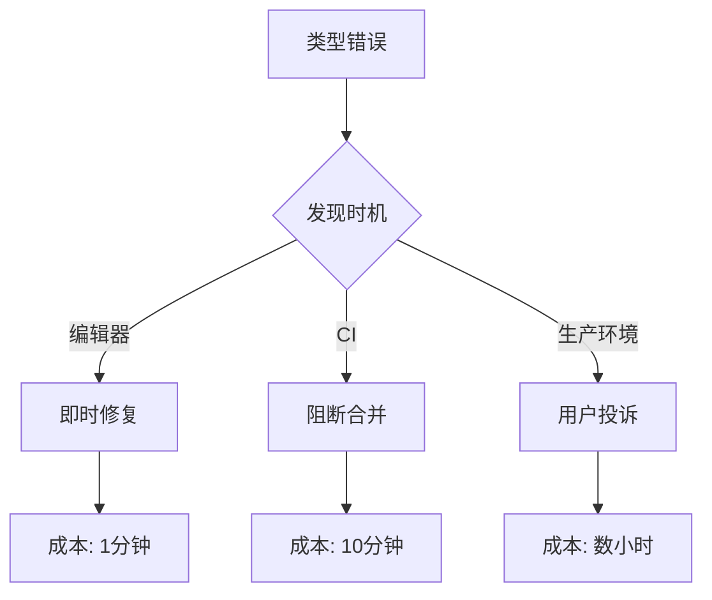

# 9.5.1 TS 编译通不过——类型检查：TypeScript 编译验证

**类型检查是 CI 的第一道防线——类型错误就是 Bug，必须在合并前消灭。**

## 类型检查的价值



## 配置 tsconfig.json

```json
{
  "compilerOptions": {
    "target": "ES2022",
    "lib": ["dom", "dom.iterable", "esnext"],
    "allowJs": true,
    "skipLibCheck": true,
    "strict": true,
    "noEmit": true,
    "esModuleInterop": true,
    "module": "esnext",
    "moduleResolution": "bundler",
    "resolveJsonModule": true,
    "isolatedModules": true,
    "jsx": "preserve",
    "incremental": true,
    "plugins": [{ "name": "next" }],
    "paths": {
      "@/*": ["./*"]
    }
  },
  "include": ["next-env.d.ts", "**/*.ts", "**/*.tsx", ".next/types/**/*.ts"],
  "exclude": ["node_modules"]
}
```

## 严格模式选项

```json
{
  "compilerOptions": {
    // strict 包含以下所有
    "strict": true,
    
    // 或单独配置
    "noImplicitAny": true,
    "strictNullChecks": true,
    "strictFunctionTypes": true,
    "strictBindCallApply": true,
    "strictPropertyInitialization": true,
    "noImplicitThis": true,
    "alwaysStrict": true,
    
    // 额外的严格检查
    "noUnusedLocals": true,
    "noUnusedParameters": true,
    "noImplicitReturns": true,
    "noFallthroughCasesInSwitch": true,
    "noUncheckedIndexedAccess": true
  }
}
```

## CI 配置

```yaml
# .github/workflows/ci.yml
jobs:
  type-check:
    runs-on: ubuntu-latest
    steps:
      - uses: actions/checkout@v4
      
      - uses: actions/setup-node@v4
        with:
          node-version: '20'
          cache: 'npm'
      
      - run: npm ci
      
      - name: Type check
        run: npx tsc --noEmit
```

## package.json 脚本

```json
{
  "scripts": {
    "type-check": "tsc --noEmit",
    "type-check:watch": "tsc --noEmit --watch"
  }
}
```

## 常见类型错误

### 1. 隐式 any

```typescript
// ❌ 错误：参数隐式 any
function greet(name) {
  return `Hello, ${name}`;
}

// ✅ 正确：显式类型
function greet(name: string): string {
  return `Hello, ${name}`;
}
```

### 2. 可能为空

```typescript
// ❌ 错误：未处理 null
const user = await prisma.user.findUnique({ where: { id } });
console.log(user.name); // user 可能为 null

// ✅ 正确：处理空值
const user = await prisma.user.findUnique({ where: { id } });
if (!user) {
  throw new NotFoundError('用户不存在');
}
console.log(user.name);
```

### 3. 类型不匹配

```typescript
// ❌ 错误：类型不匹配
interface User {
  id: string;
  name: string;
}

const user: User = {
  id: 123, // number 不能赋值给 string
  name: 'Test',
};

// ✅ 正确：类型一致
const user: User = {
  id: '123',
  name: 'Test',
};
```

## 增量类型检查

```json
{
  "compilerOptions": {
    "incremental": true,
    "tsBuildInfoFile": ".tsbuildinfo"
  }
}
```

```yaml
# CI 缓存 tsBuildInfo
- name: Cache TypeScript build info
  uses: actions/cache@v3
  with:
    path: .tsbuildinfo
    key: ${{ runner.os }}-tsbuildinfo-${{ hashFiles('**/*.ts', '**/*.tsx') }}
```

## 生成类型声明

```json
{
  "compilerOptions": {
    "declaration": true,
    "declarationDir": "./dist/types"
  }
}
```

## 调试类型错误

```bash
# 查看详细错误
npx tsc --noEmit --extendedDiagnostics

# 只检查特定文件
npx tsc --noEmit src/services/user.service.ts

# 查看类型推断
npx tsc --noEmit --generateTrace ./trace
```

## 本节小结

类型检查是最基础的质量门禁。开启 `strict` 模式，在 CI 中运行 `tsc --noEmit`，确保所有类型错误在合并前被发现。类型错误越早发现，修复成本越低。
