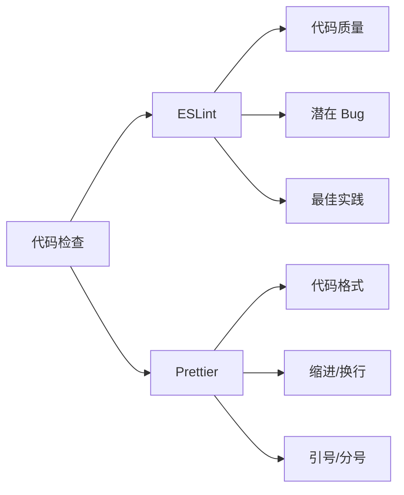

# 9.5.2 代码风格统一了吗——代码规范：ESLint/Prettier 自动检查

**代码规范不是个人偏好——团队统一的代码风格能减少 Code Review 中的摩擦。**

## ESLint vs Prettier



## ESLint 配置

```javascript
// eslint.config.js (ESLint 9 Flat Config)
import js from '@eslint/js';
import typescript from '@typescript-eslint/eslint-plugin';
import parser from '@typescript-eslint/parser';
import react from 'eslint-plugin-react';
import reactHooks from 'eslint-plugin-react-hooks';
import prettier from 'eslint-config-prettier';

export default [
  js.configs.recommended,
  {
    files: ['**/*.{ts,tsx}'],
    languageOptions: {
      parser,
      parserOptions: {
        ecmaVersion: 'latest',
        sourceType: 'module',
        ecmaFeatures: { jsx: true },
      },
    },
    plugins: {
      '@typescript-eslint': typescript,
      react,
      'react-hooks': reactHooks,
    },
    rules: {
      // TypeScript 规则
      '@typescript-eslint/no-unused-vars': ['error', { argsIgnorePattern: '^_' }],
      '@typescript-eslint/no-explicit-any': 'warn',
      '@typescript-eslint/explicit-function-return-type': 'off',
      
      // React 规则
      'react/react-in-jsx-scope': 'off',
      'react-hooks/rules-of-hooks': 'error',
      'react-hooks/exhaustive-deps': 'warn',
      
      // 通用规则
      'no-console': ['warn', { allow: ['warn', 'error'] }],
      'prefer-const': 'error',
    },
  },
  prettier,
];
```

## Prettier 配置

```json
// .prettierrc
{
  "semi": true,
  "singleQuote": true,
  "tabWidth": 2,
  "trailingComma": "es5",
  "printWidth": 100,
  "bracketSpacing": true,
  "arrowParens": "always",
  "endOfLine": "lf"
}
```

```
# .prettierignore
node_modules
.next
dist
coverage
*.min.js
```

## CI 配置

```yaml
# .github/workflows/ci.yml
jobs:
  lint:
    runs-on: ubuntu-latest
    steps:
      - uses: actions/checkout@v4
      
      - uses: actions/setup-node@v4
        with:
          node-version: '20'
          cache: 'npm'
      
      - run: npm ci
      
      - name: ESLint
        run: npm run lint
      
      - name: Prettier check
        run: npm run format:check
```

## package.json 脚本

```json
{
  "scripts": {
    "lint": "eslint . --ext .ts,.tsx --max-warnings 0",
    "lint:fix": "eslint . --ext .ts,.tsx --fix",
    "format": "prettier --write .",
    "format:check": "prettier --check ."
  }
}
```

## 常见 Lint 错误

### 1. 未使用的变量

```typescript
// ❌ 错误
const unused = 'hello';
function greet(name: string, age: number) {
  return `Hello, ${name}`;
}

// ✅ 正确
function greet(name: string, _age: number) {
  return `Hello, ${name}`;
}
```

### 2. React Hooks 依赖

```typescript
// ❌ 警告：缺少依赖
useEffect(() => {
  fetchUser(userId);
}, []); // 缺少 userId 依赖

// ✅ 正确
useEffect(() => {
  fetchUser(userId);
}, [userId]);
```

### 3. console.log 残留

```typescript
// ❌ 警告
console.log('调试信息');

// ✅ 使用 logger
logger.debug('调试信息');
```

## Pre-commit 自动修复

```bash
npm install -D husky lint-staged
npx husky init
```

```json
// package.json
{
  "lint-staged": {
    "*.{ts,tsx}": [
      "eslint --fix",
      "prettier --write"
    ],
    "*.{json,md,yml}": [
      "prettier --write"
    ]
  }
}
```

```bash
# .husky/pre-commit
npx lint-staged
```

## 自定义规则

```javascript
// eslint.config.js
{
  rules: {
    // 禁止特定导入
    'no-restricted-imports': ['error', {
      patterns: [{
        group: ['@/lib/prisma'],
        importNames: ['prisma'],
        message: '请使用 getPrisma() 获取 Prisma 实例',
      }],
    }],
    
    // 强制命名规范
    '@typescript-eslint/naming-convention': [
      'error',
      { selector: 'interface', format: ['PascalCase'] },
      { selector: 'typeAlias', format: ['PascalCase'] },
      { selector: 'enum', format: ['PascalCase'] },
    ],
  },
}
```

## 本节小结

ESLint 检查代码质量，Prettier 统一代码格式。在 CI 中运行 `--max-warnings 0` 确保零警告，使用 lint-staged 在提交前自动修复。统一的代码风格让 Code Review 更专注于逻辑而非格式。
