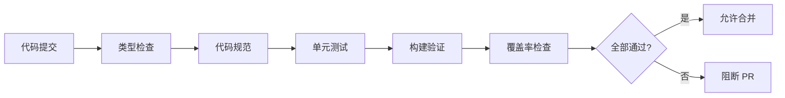

# 9.5 让机器人帮你守住质量——CI 质量门禁与 GitHub Actions

**CI 质量门禁是代码的"安检口"——不合格的代码永远进不了主分支。**

## 质量门禁流程



## 本章内容

| 小节 | 主题 | 核心内容 |
|------|------|----------|
| 9.5.1 | 类型检查 | TypeScript 编译验证 |
| 9.5.2 | 代码规范 | ESLint/Prettier 自动检查 |
| 9.5.3 | 构建验证 | 生产构建成功性检查 |
| 9.5.4 | 覆盖率 | 代码覆盖率阈值设置 |
| 9.5.5 | 门禁策略 | 失败阻断与通知机制 |

## 完整 GitHub Actions 配置

```yaml
# .github/workflows/ci.yml
name: CI

on:
  push:
    branches: [main, develop]
  pull_request:
    branches: [main, develop]

jobs:
  quality:
    runs-on: ubuntu-latest
    
    steps:
      - uses: actions/checkout@v4
      
      - name: Setup Node.js
        uses: actions/setup-node@v4
        with:
          node-version: '20'
          cache: 'npm'
      
      - name: Install dependencies
        run: npm ci
      
      - name: Type check
        run: npm run type-check
      
      - name: Lint
        run: npm run lint
      
      - name: Test
        run: npm run test:ci
      
      - name: Build
        run: npm run build
      
      - name: Upload coverage
        uses: codecov/codecov-action@v3
        with:
          fail_ci_if_error: true
```

## package.json 脚本

```json
{
  "scripts": {
    "type-check": "tsc --noEmit",
    "lint": "eslint . --ext .ts,.tsx --max-warnings 0",
    "lint:fix": "eslint . --ext .ts,.tsx --fix",
    "test": "jest",
    "test:ci": "jest --ci --coverage --maxWorkers=2",
    "build": "next build"
  }
}
```

## 质量标准

| 检查项 | 阈值 | 失败处理 |
|--------|------|----------|
| TypeScript 错误 | 0 | 阻断 |
| ESLint 警告 | 0 | 阻断 |
| 测试失败 | 0 | 阻断 |
| 覆盖率 | 80% | 阻断 |
| 构建失败 | 0 | 阻断 |

## 本地预检

在推送前运行完整检查：

```bash
# 安装 husky
npm install -D husky lint-staged
npx husky init

# .husky/pre-commit
npm run type-check && npm run lint && npm run test

# .husky/pre-push
npm run build
```

## 本节小结

CI 质量门禁是团队代码质量的守护者。通过自动化检查（类型、规范、测试、构建），确保每次合并的代码都符合标准。接下来的小节会详细讲解每个门禁的配置和最佳实践。
