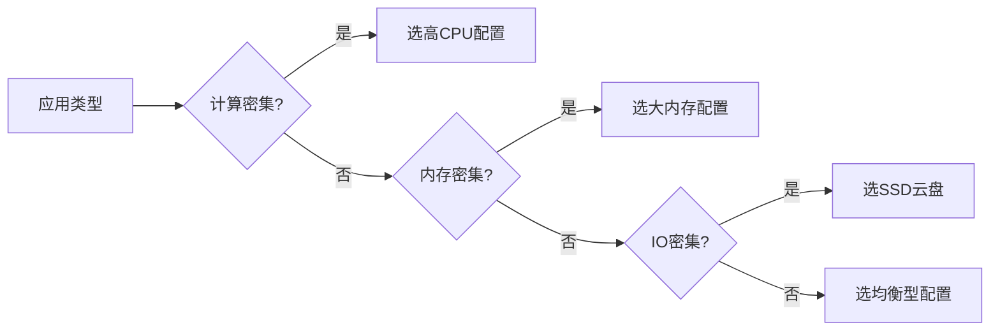

# 10.1.1 服务器放哪——云服务选择：计算/存储/网络资源规划

选对服务器，是省钱省心的第一步。

## 云服务商对比

对于个人开发者和小团队，国内主流选择如下：

| 服务商 | 产品名称 | 优势 | 适用场景 |
|--------|----------|------|----------|
| 阿里云 | ECS/轻量 | 生态完善，文档齐全 | 生产环境首选 |
| 腾讯云 | CVM/轻量 | 价格实惠，新人优惠多 | 个人项目 |
| 华为云 | ECS | 企业级稳定性 | 企业项目 |

::: tip 新手建议
刚开始推荐用**轻量应用服务器**，价格便宜（月付 50-100 元），预装镜像开箱即用。等流量上来了再升级到 ECS。
:::

## 配置选择指南

### 按项目规模选配置

| 项目规模 | CPU | 内存 | 系统盘 | 带宽 | 月成本估算 |
|----------|-----|------|--------|------|------------|
| 个人博客/演示 | 1核 | 2G | 40G | 3M | 50-80元 |
| 小型应用 | 2核 | 4G | 60G | 5M | 100-200元 |
| 生产环境 | 4核 | 8G | 100G | 10M | 300-500元 |

### 资源规划原则



## 网络配置要点

### 带宽选择

| 带宽 | 下载速度 | 适用场景 |
|------|----------|----------|
| 1M | 128KB/s | 纯API服务 |
| 3M | 384KB/s | 小型网站 |
| 5M | 640KB/s | 中等流量 |
| 10M+ | 1.25MB/s+ | 高并发/多媒体 |

::: warning 注意
云服务商的带宽指的是**出网带宽**（服务器→用户），入网带宽通常不限。1M 带宽意味着用户每秒最多只能从你服务器下载 128KB 数据。
:::

### 安全组配置

购买服务器后必须配置安全组，否则外网无法访问：

| 端口 | 协议 | 用途 |
|------|------|------|
| 22 | TCP | SSH 远程登录 |
| 80 | TCP | HTTP 网站访问 |
| 443 | TCP | HTTPS 加密访问 |
| 3000 | TCP | Next.js 开发端口 |
| 3001 | TCP | NestJS API 端口 |

## 存储规划

### 系统盘 vs 数据盘

| 类型 | 用途 | 建议大小 |
|------|------|----------|
| 系统盘 | 操作系统 + 应用程序 | 40-60G |
| 数据盘 | 数据库 + 用户文件 | 按需扩展 |

::: tip 最佳实践
数据库和用户上传文件应放在**数据盘**，方便后期扩容和备份。系统盘只装应用，保持干净。
:::

### 对象存储（OSS）

用户上传的图片、视频等静态文件建议存到对象存储：

| 优势 | 说明 |
|------|------|
| 无限扩容 | 不占服务器磁盘 |
| CDN 加速 | 全国节点分发 |
| 成本低 | 按量付费，比云盘便宜 |
| 高可用 | 11个9的数据可靠性 |

## AI 协作指南

向 AI 描述你的部署需求时，提供以下关键信息：

```
我需要部署一个 Next.js + NestJS + PostgreSQL 的应用，
预计日活用户 1000 人，需要存储用户上传的图片。
请帮我规划云服务器配置和成本估算。
```

**关键术语**：ECS、轻量应用服务器、安全组、弹性公网IP、对象存储、按量付费

## 实用建议

1. **先买轻量后升级**：轻量服务器便宜，等业务起来了再迁移
2. **选择就近地域**：用户在哪，服务器就买在哪
3. **关注促销活动**：双11、618 等大促能省一大笔
4. **设置费用预警**：避免被恶意攻击导致流量费用爆炸
