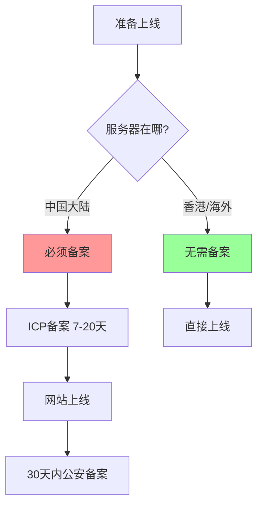

# 10.1.2 网站要备案吗——合规要求：ICP 备案与公安备案

一句话：服务器在中国大陆，就必须备案。

## 备案的本质

备案是国家对互联网信息服务的管理手段，主要包含两个部分：

| 备案类型 | 管理部门 | 时机 | 必要性 |
|----------|----------|------|--------|
| ICP 备案 | 工信部 | 网站上线前 | 强制 |
| 公安备案 | 公安部 | 网站上线后30天内 | 强制 |



## ICP 备案流程

### 准备材料

| 材料 | 个人备案 | 企业备案 |
|------|----------|----------|
| 身份证 | ✓ | ✓ (法人+网站负责人) |
| 营业执照 | ✗ | ✓ |
| 域名证书 | ✓ | ✓ |
| 幕布照/人脸核验 | ✓ | ✓ |
| 网站建设方案书 | 看情况 | 部分省份要求 |

### 备案步骤

1. **域名实名认证**：在域名注册商完成，需 3 个工作日
2. **服务商初审**：阿里云/腾讯云后台提交，1-2 天
3. **管局审核**：各省通信管理局，7-20 个工作日
4. **备案成功**：获得 ICP 备案号，如 `京ICP备12345678号`

::: warning 重要提醒
- 备案期间网站**不能访问**
- 域名必须**已实名认证 3 天以上**
- 个人备案**不能有经营性内容**
- 不同省份审核标准和时间不同
:::

## 公安备案流程

网站上线后 30 天内，需要到[全国互联网安全管理服务平台](http://www.beian.gov.cn)完成公安备案。

### 操作步骤

1. 注册账号并实名认证
2. 新办网站申请
3. 填写网站信息（名称、域名、IP、服务内容等）
4. 下载安全协议并签字盖章
5. 提交审核，等待通知

### 备案后要求

备案成功后，需要在网站底部展示：

```html
<footer>
  <a href="https://beian.miit.gov.cn/" target="_blank">
    京ICP备12345678号
  </a>
  <a href="http://www.beian.gov.cn/portal/registerSystemInfo?recordcode=11010502000000" target="_blank">
    京公网安备 11010502000000号
  </a>
</footer>
```

## 不备案的选择

如果你的项目面向海外用户，或者只是个人学习/演示项目，可以选择不备案：

| 方案 | 优点 | 缺点 |
|------|------|------|
| 香港服务器 | 无需备案，速度尚可 | 价格略贵，稳定性参差 |
| 海外服务器 | 无需备案，价格便宜 | 国内访问慢 |
| Vercel/Netlify | 免费托管，自动部署 | 国内访问不稳定 |

::: tip 什么时候必须备案
- 面向国内用户的商业网站
- 需要接入微信支付、支付宝等服务
- 需要接入微信公众号/小程序
- 需要良好的 SEO 排名
:::

## 备案常见问题

### Q: 备案要多久？

| 阶段 | 时间 |
|------|------|
| 域名实名认证 | 3 个工作日 |
| 服务商初审 | 1-2 个工作日 |
| 管局审核 | 7-20 个工作日 |
| **合计** | **10-25 个工作日** |

### Q: 个人备案能做什么网站？

个人备案只能做**非经营性网站**，如个人博客、技术分享、作品展示等。不能有：
- 购物/支付功能
- 论坛/社区功能
- 用户注册登录（有争议，看地区）
- 广告/盈利内容

### Q: 备案被驳回怎么办？

常见驳回原因：
1. **网站内容与备案信息不符** → 修改网站内容
2. **域名未完成实名认证** → 等 3 天后重新提交
3. **照片不清晰** → 重新拍摄上传
4. **网站已可访问** → 关闭网站后重新提交

## 实用建议

1. **提前备案**：项目开发阶段就开始，别等上线前临时抱佛脚
2. **用云服务商的备案系统**：流程清晰，客服响应快
3. **保持手机畅通**：管局可能会电话核实
4. **备案信息要真实**：虚假信息会被注销，甚至拉黑
