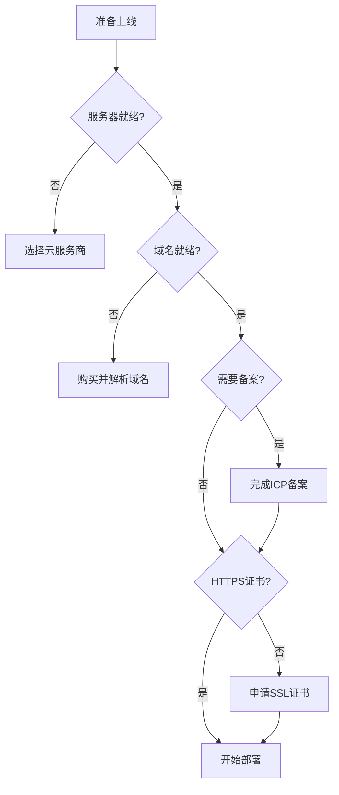

# 10.1 上线前必须知道的事——云服务/网络/域名/证书

代码能跑只是开始，上线前还有一堆"行政手续"要办。

## 为什么需要"飞行前检查"

很多开发者第一次部署时会遇到这样的困境：代码推上去了，服务起来了，但用户就是访问不了。原因往往不是技术问题，而是**域名没解析**、**端口没开放**、**备案没完成**这些前置工作没做。



## 上线前清单

| 检查项 | 说明 | 预计耗时 |
|--------|------|----------|
| 云服务器 | 购买并配置 ECS/CVM | 30分钟 |
| 域名 | 购买并完成实名认证 | 1-3天 |
| ICP 备案 | 中国大陆服务器必须 | 7-20天 |
| 公安备案 | 网站上线后30天内完成 | 3-7天 |
| SSL 证书 | 启用 HTTPS 加密 | 10分钟 |
| 安全组 | 开放必要端口 | 10分钟 |

## 核心概念速览

### 云服务的三层结构

| 层级 | 资源类型 | 对应云产品 |
|------|----------|------------|
| 计算层 | CPU + 内存 | ECS、CVM、轻量应用服务器 |
| 存储层 | 磁盘 + 对象存储 | 云盘、OSS/COS |
| 网络层 | 带宽 + IP | 弹性公网IP、负载均衡 |

### 域名解析流程

```
用户输入 www.example.com
    ↓
DNS 服务器查询
    ↓
返回 IP 地址 (如 1.2.3.4)
    ↓
浏览器访问该 IP
```

## 本节目录

- **10.1.1 服务器放哪** — 云服务商选择与资源规划
- **10.1.2 网站要备案吗** — ICP 备案与公安备案流程

## 避坑指南

::: warning 常见坑点
1. **域名备案周期长**：至少预留 2-3 周时间
2. **海外服务器不用备案**：但访问速度慢，SEO 也受影响
3. **轻量服务器有流量限制**：月流量超了会额外计费
4. **安全组默认全关**：别忘了开放 80/443 端口
:::
