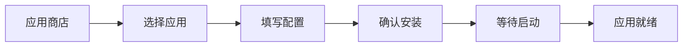
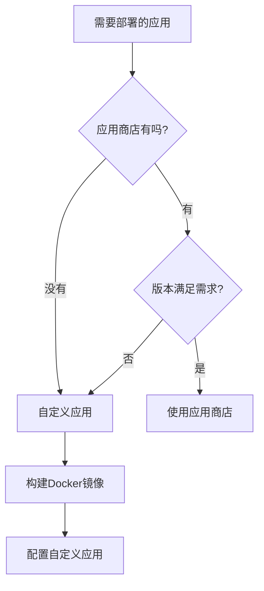

# 10.2.1 应用商店还是自定义——界面操作：应用商店 vs 自定义应用

1Panel 的精髓在于：把 Docker 的复杂命令变成了可视化表单。

## 两种部署方式对比

| 特性 | 应用商店 | 自定义应用 |
|------|----------|------------|
| 配置复杂度 | 低，表单填写 | 中，需理解 Docker |
| 可选版本 | 有限，商店提供的 | 任意，自己指定镜像 |
| 适用场景 | 标准化服务（数据库、中间件） | 自研项目、特殊需求 |
| 维护成本 | 低，一键升级 | 中，需手动更新 |

## 应用商店：开箱即用

### 应用商店能装什么

| 分类 | 常用应用 |
|------|----------|
| 数据库 | MySQL、PostgreSQL、Redis、MongoDB |
| Web服务 | Nginx、OpenResty、Caddy |
| 开发工具 | Node.js、Python、Go |
| 存储 | MinIO（对象存储） |
| 监控 | Prometheus、Grafana |

### 安装步骤

1. 进入 **应用商店** → 选择应用（如 PostgreSQL）
2. 点击 **安装**
3. 填写基本信息：
   - 应用名称（用于标识）
   - 版本选择
   - 端口映射
   - 数据库用户名/密码
4. 点击 **确认安装**

### 安装 PostgreSQL 示例

| 配置项 | 示例值 | 说明 |
|--------|--------|------|
| 应用名称 | `postgres-main` | 自定义，便于识别 |
| 版本 | `15` | 推荐使用最新稳定版 |
| 端口 | `5432` | 默认端口，可修改 |
| 用户名 | `postgres` | 超级管理员 |
| 密码 | `SecurePass123!` | 务必使用强密码 |
| 数据目录 | `/opt/1panel/apps/postgres/data` | 自动配置 |

## 自定义应用：完全掌控

当你需要部署自己开发的 Next.js 或 NestJS 项目时，就需要使用自定义应用。

### 创建自定义应用

1. 进入 **容器** → **容器管理** → **创建容器**
2. 或进入 **容器** → **编排** → **创建编排**（推荐，支持多容器）

### 自定义应用配置项

| 配置项 | 作用 | 示例 |
|--------|------|------|
| 镜像名称 | 指定 Docker 镜像 | `node:18-alpine` |
| 容器名称 | 容器标识 | `my-nextjs-app` |
| 端口映射 | 外部访问端口 | `3000:3000` |
| 卷挂载 | 持久化数据 | `/app/data:/data` |
| 环境变量 | 运行时配置 | `NODE_ENV=production` |
| 启动命令 | 覆盖默认命令 | `npm run start` |
| 重启策略 | 容器退出时行为 | `always`（自动重启） |

### 何时用自定义应用

## 实战：部署基础环境

一个典型的 Web 应用需要以下基础服务：

| 服务 | 安装方式 | 用途 |
|------|----------|------|
| PostgreSQL | 应用商店 | 主数据库 |
| Redis | 应用商店 | 缓存/会话 |
| OpenResty | 应用商店 | 反向代理 |
| Next.js 应用 | 自定义 | 前端服务 |
| NestJS 应用 | 自定义 | 后端 API |

### 推荐安装顺序

1. **先装基础服务**：PostgreSQL、Redis
2. **再装 Web 服务**：OpenResty
3. **最后部署应用**：Next.js、NestJS

::: tip 为什么要这个顺序
应用启动时会尝试连接数据库和缓存，如果这些服务还没准备好，应用会启动失败。
:::

## 避坑指南

### 常见问题

| 问题 | 原因 | 解决方案 |
|------|------|----------|
| 端口冲突 | 多个应用用同一端口 | 修改端口映射 |
| 应用无法启动 | 依赖服务未就绪 | 检查数据库/Redis 状态 |
| 数据丢失 | 未配置卷挂载 | 重新创建并挂载数据卷 |
| 无法访问 | 安全组未开放 | 云服务商后台开放端口 |

### 最佳实践

1. **统一命名规范**：如 `prod-postgres`、`prod-redis`
2. **使用强密码**：数据库密码至少 16 位，包含特殊字符
3. **定期备份**：1Panel 支持定时备份，务必开启
4. **资源监控**：关注 CPU、内存使用率，及时扩容
