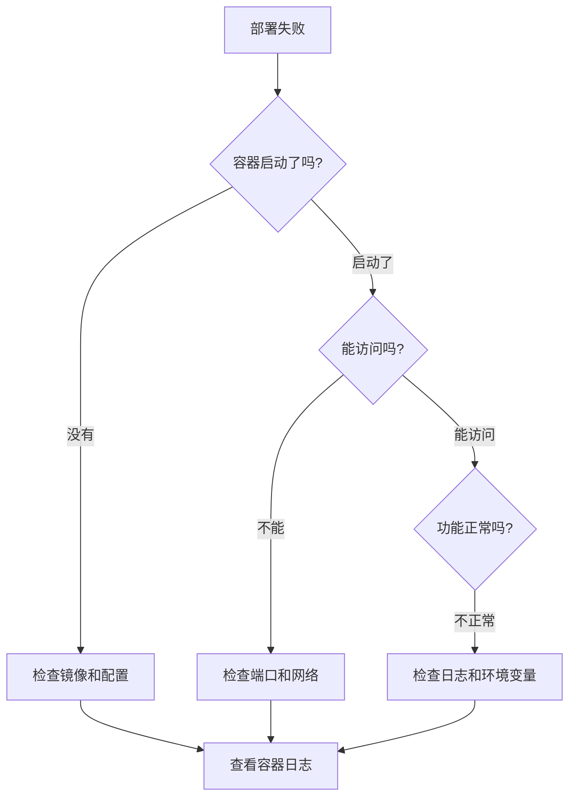

# 10.2.5 部署失败了怎么办——常见问题：端口冲突/环境变量/权限问题

部署出问题不可怕，可怕的是不知道怎么排查。

## 故障排查流程



## 第一步：查看容器日志

```bash
# 查看最近100行日志
docker logs --tail 100 容器名

# 实时跟踪日志
docker logs -f 容器名

# 在 1Panel 中
# 容器管理 → 选择容器 → 日志
```

## 常见问题及解决方案

### 问题一：端口冲突

**错误信息**：
```
Error: listen EADDRINUSE: address already in use :::3000
```

**排查步骤**：
```bash
# 查看端口占用
netstat -tlnp | grep 3000
# 或
lsof -i :3000
```

**解决方案**：

| 方案 | 操作 |
|------|------|
| 停止占用进程 | `kill -9 PID` |
| 修改端口映射 | 改为 `3001:3000` |
| 检查其他容器 | `docker ps` 查看 |

### 问题二：环境变量不生效

**排查步骤**：
```bash
# 进入容器查看环境变量
docker exec -it 容器名 sh
env | grep DATABASE
```

**常见原因**：

| 原因 | 解决方案 |
|------|----------|
| 变量名拼写错误 | 仔细检查大小写 |
| 引号问题 | 特殊字符需要转义 |
| NEXT_PUBLIC_ 前缀 | 构建时注入，非运行时 |
| 变量未传入容器 | 检查 1Panel 配置 |

### 问题三：数据库连接失败

**错误信息**：
```
Error: Can't reach database server at 'localhost:5432'
```

**常见原因与解决**：

| 原因 | 解决方案 |
|------|----------|
| 使用了 `localhost` | 改为容器名，如 `postgres` |
| 容器不在同一网络 | 将容器加入同一 Docker 网络 |
| 数据库未启动 | 检查数据库容器状态 |
| 密码错误 | 核对 DATABASE_URL |

```bash
# 检查网络
docker network ls
docker network inspect 1panel-network

# 测试连接
docker exec -it nestjs-api sh
nc -zv postgres 5432
```

### 问题四：权限问题

**错误信息**：
```
Error: EACCES: permission denied, open '/app/logs/app.log'
```

**解决方案**：
```bash
# 修改目录权限
chmod -R 755 /path/to/directory

# 修改目录所有者
chown -R 1000:1000 /path/to/directory
```

### 问题五：内存不足

**错误信息**：
```
FATAL ERROR: CALL_AND_RETRY_LAST Allocation failed - JavaScript heap out of memory
```

**解决方案**：

```bash
# 方案一：增加 Node.js 内存限制
NODE_OPTIONS=--max-old-space-size=2048

# 方案二：Docker 限制内存
docker run -m 2g ...
```

### 问题六：镜像拉取失败

**错误信息**：
```
Error response from daemon: pull access denied
```

**解决方案**：

| 原因 | 解决方案 |
|------|----------|
| 未登录私有仓库 | `docker login registry.xxx.com` |
| 镜像名错误 | 检查仓库地址和标签 |
| 网络问题 | 配置镜像加速器 |

```bash
# 配置阿里云镜像加速
sudo tee /etc/docker/daemon.json <<-'EOF'
{
  "registry-mirrors": ["https://xxx.mirror.aliyuncs.com"]
}
EOF
sudo systemctl restart docker
```

## 快速诊断命令

```bash
# 容器状态
docker ps -a

# 容器详情
docker inspect 容器名

# 容器资源使用
docker stats

# 查看容器内进程
docker top 容器名

# 进入容器调试
docker exec -it 容器名 sh
```

## 1Panel 日志位置

| 日志类型 | 位置 |
|----------|------|
| 1Panel 自身日志 | `/opt/1panel/log/` |
| 容器日志 | 容器管理 → 日志 |
| Nginx 日志 | `/opt/1panel/apps/openresty/logs/` |
| 应用日志 | 挂载的日志目录 |

## 重启策略

当应用异常退出时，正确的重启策略可以自动恢复：

| 策略 | 说明 | 适用场景 |
|------|------|----------|
| `no` | 不自动重启 | 调试阶段 |
| `on-failure` | 仅失败时重启 | 有状态服务 |
| `always` | 总是重启 | 生产环境 |
| `unless-stopped` | 除非手动停止 | 推荐使用 |

## 故障排查清单

遇到问题时，按顺序检查：

- [ ] 容器是否启动成功 (`docker ps`)
- [ ] 容器日志有无错误 (`docker logs`)
- [ ] 端口是否正确映射 (`docker port`)
- [ ] 环境变量是否正确 (`docker exec ... env`)
- [ ] 网络是否连通 (`docker network inspect`)
- [ ] 磁盘空间是否充足 (`df -h`)
- [ ] 内存是否充足 (`free -m`)
- [ ] 安全组是否开放端口

## AI 协作指南

向 AI 描述问题时，提供：

```
环境：1Panel + Docker + Next.js
现象：访问返回 502
容器状态：[docker ps 输出]
容器日志：[docker logs 输出]
Nginx 日志：[error.log 内容]
请帮我分析原因。
```

越详细的信息，越能快速定位问题。
