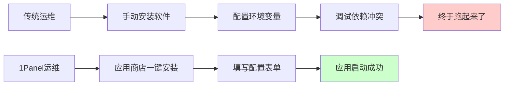
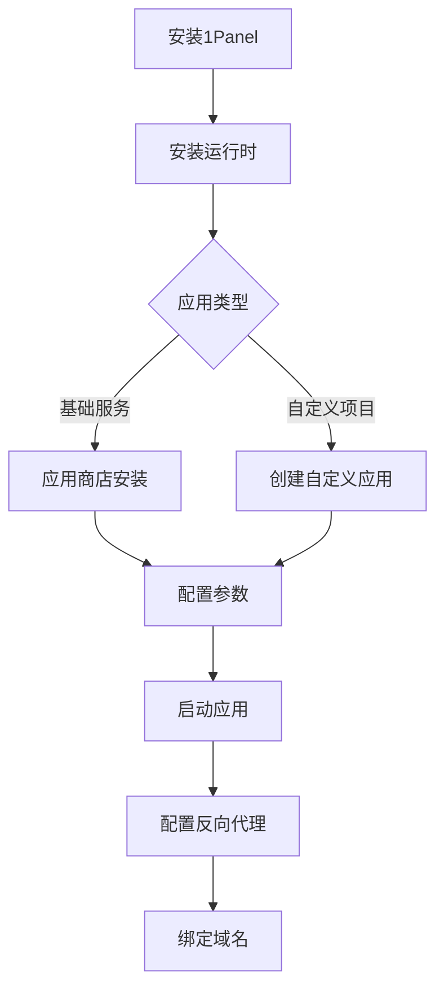

# 10.2 点点鼠标就上线——1Panel 可视化部署：从零到上线

不会敲命令？没关系，点点鼠标也能把应用部署上线。

## 什么是 1Panel

1Panel 是一个现代化的 Linux 服务器运维管理面板，它的核心理念是：**运行环境 = 预配置的 Docker 容器**。



## 核心优势

| 特性 | 说明 |
|------|------|
| 可视化界面 | 所有操作通过 Web 界面完成 |
| 应用商店 | 一键安装常用服务（MySQL、Redis、Nginx 等） |
| 容器管理 | 基于 Docker，环境隔离，互不干扰 |
| 自动备份 | 定时备份应用数据和配置 |
| 安全加固 | 内置防火墙、SSH 管理 |

## 安装 1Panel

在全新的 Linux 服务器上执行：

```bash
curl -sSL https://resource.fit2cloud.com/1panel/package/quick_start.sh -o quick_start.sh && sudo bash quick_start.sh
```

安装完成后会显示：
- 访问地址：`http://服务器IP:端口`
- 用户名和密码

::: warning 安全提醒
1. 首次登录后立即修改默认密码
2. 开启二次认证（2FA）
3. 将面板端口改为非默认值
4. 安全组中限制访问来源 IP
:::

## 本节目录

- **10.2.1 应用商店还是自定义** — 选择合适的部署方式
- **10.2.2 部署到底要填什么** — 配置要素详解
- **10.2.3 Next.js 项目怎么部署** — 前端应用部署实战
- **10.2.4 NestJS 项目怎么部署** — 后端 API 部署实战
- **10.2.5 部署失败了怎么办** — 常见问题排查

## 核心概念

### 1Panel 中的关键配置项

| 配置项 | Docker 对应 | 说明 |
|--------|-------------|------|
| 镜像 | `image` | 应用的 Docker 镜像名称 |
| 端口映射 | `-p` | 外部端口:容器内端口 |
| 卷挂载 | `-v` | 宿主机目录:容器目录 |
| 环境变量 | `-e` | 传递给应用的配置参数 |
| 启动命令 | `command` | 容器启动时执行的命令 |

### 应用商店 vs 自定义应用

| 方式 | 适用场景 | 优点 | 缺点 |
|------|----------|------|------|
| 应用商店 | MySQL、Redis、Nginx 等基础服务 | 一键安装，配置预设 | 版本选择有限 |
| 自定义应用 | 自己开发的项目 | 完全控制 | 需要自己写配置 |

## 快速上手流程



## AI 协作指南

当遇到 1Panel 部署问题时，向 AI 提供：

```
我在 1Panel 中部署 Next.js 应用遇到问题：
- 使用的镜像：node:18-alpine
- 端口映射：3000:3000
- 错误信息：[具体错误日志]
请帮我分析原因并给出解决方案。
```

**关键术语**：1Panel、Docker 容器、端口映射、卷挂载、环境变量、OpenResty
