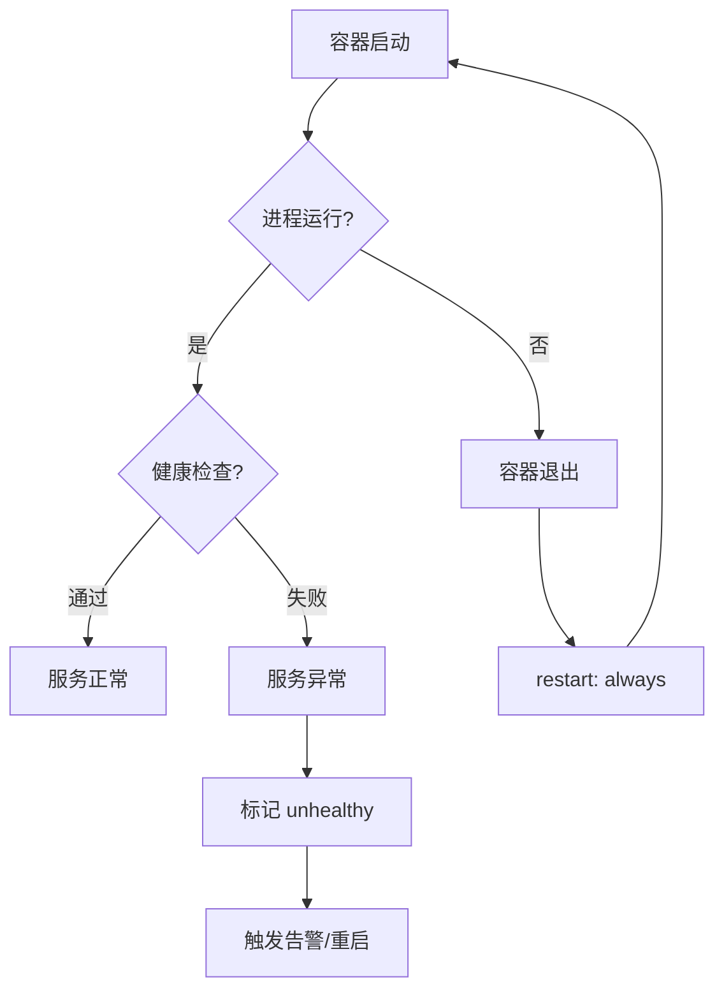
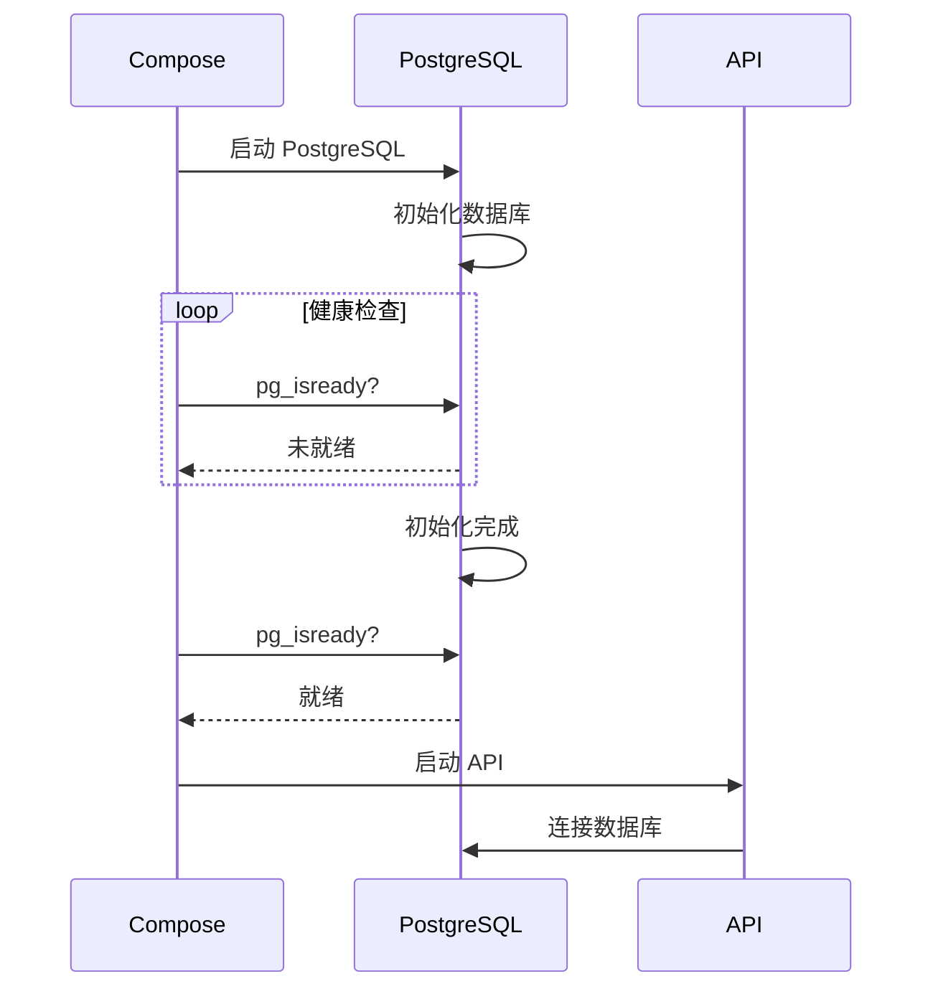

# 10.3.4 服务挂了能自动重启吗——健康检查：服务可用性监控与自动重启

进程在跑不代表服务正常，健康检查才是判断依据。

## 为什么需要健康检查



| 场景 | 进程状态 | 实际状态 | 健康检查 |
|------|----------|----------|----------|
| 正常运行 | 运行中 | 正常 | 通过 |
| 死循环 | 运行中 | 卡死 | 失败 |
| 等待依赖 | 运行中 | 未就绪 | 失败 |
| 内存泄漏 | 运行中 | 响应慢 | 可能失败 |

## 健康检查配置

### 基本语法

```yaml
services:
  api:
    healthcheck:
      test: ["CMD", "curl", "-f", "http://localhost:3001/health"]
      interval: 30s      # 检查间隔
      timeout: 10s       # 超时时间
      retries: 3         # 失败重试次数
      start_period: 40s  # 启动等待期（不计入失败）
```

### 检查方式

```yaml
# 方式一：CMD 数组格式（推荐）
healthcheck:
  test: ["CMD", "curl", "-f", "http://localhost:3001/health"]

# 方式二：CMD-SHELL 格式
healthcheck:
  test: ["CMD-SHELL", "curl -f http://localhost:3001/health || exit 1"]

# 方式三：禁用健康检查
healthcheck:
  disable: true
```

## 常见服务的健康检查

### Node.js 应用

```yaml
services:
  api:
    healthcheck:
      test: ["CMD", "curl", "-f", "http://localhost:3001/health"]
      interval: 30s
      timeout: 10s
      retries: 3
```

应用代码中添加健康检查端点：

```typescript
// NestJS
@Controller('health')
export class HealthController {
  constructor(
    private prisma: PrismaService,
    private redis: RedisService,
  ) {}

  @Get()
  async check() {
    // 检查数据库连接
    await this.prisma.$queryRaw`SELECT 1`;
    // 检查 Redis 连接
    await this.redis.ping();
    
    return { status: 'ok', timestamp: new Date().toISOString() };
  }
}
```

### PostgreSQL

```yaml
services:
  postgres:
    healthcheck:
      test: ["CMD-SHELL", "pg_isready -U postgres"]
      interval: 10s
      timeout: 5s
      retries: 5
```

### Redis

```yaml
services:
  redis:
    healthcheck:
      test: ["CMD", "redis-cli", "ping"]
      interval: 10s
      timeout: 5s
      retries: 3
```

### Nginx

```yaml
services:
  nginx:
    healthcheck:
      test: ["CMD", "curl", "-f", "http://localhost/health"]
      interval: 30s
      timeout: 10s
      retries: 3
```

## 依赖健康检查

确保服务按正确顺序启动：

```yaml
services:
  api:
    depends_on:
      postgres:
        condition: service_healthy  # 等待健康检查通过
      redis:
        condition: service_started  # 只等待容器启动

  postgres:
    healthcheck:
      test: ["CMD-SHELL", "pg_isready -U postgres"]
      interval: 5s
      timeout: 5s
      retries: 10
      start_period: 30s
```



## 自动重启策略

```yaml
services:
  api:
    restart: always  # 配合健康检查使用
    healthcheck:
      test: ["CMD", "curl", "-f", "http://localhost:3001/health"]
      interval: 30s
      timeout: 10s
      retries: 3
```

| 重启策略 | 行为 |
|----------|------|
| `no` | 不自动重启 |
| `always` | 总是重启（包括手动停止后 Docker 重启） |
| `on-failure` | 仅非正常退出时重启 |
| `unless-stopped` | 除非手动停止，否则总是重启 |

## 查看健康状态

```bash
# 查看容器健康状态
docker compose ps

# NAME        STATUS              HEALTH
# api         Up 5 minutes        healthy
# postgres    Up 5 minutes        healthy
# redis       Up 5 minutes        (none)

# 查看健康检查历史
docker inspect --format='{{json .State.Health}}' 容器名 | jq
```

## 健康检查最佳实践

### 1. 检查内容要全面

```typescript
@Get('health')
async check() {
  const checks = {
    database: await this.checkDatabase(),
    redis: await this.checkRedis(),
    diskSpace: await this.checkDiskSpace(),
  };
  
  const isHealthy = Object.values(checks).every(c => c.status === 'ok');
  
  return {
    status: isHealthy ? 'ok' : 'degraded',
    checks,
    timestamp: new Date().toISOString(),
  };
}
```

### 2. 区分存活和就绪

| 类型 | 用途 | 失败处理 |
|------|------|----------|
| Liveness | 进程是否存活 | 重启容器 |
| Readiness | 是否可接收请求 | 从负载均衡移除 |

### 3. 合理设置参数

| 参数 | 建议值 | 说明 |
|------|--------|------|
| interval | 10-30s | 太频繁会增加负担 |
| timeout | 5-10s | 要小于 interval |
| retries | 3-5 | 避免瞬时抖动触发 |
| start_period | 30-60s | 根据应用启动时间设置 |

## 故障排查

```bash
# 查看健康检查日志
docker inspect 容器名 --format='{{range .State.Health.Log}}{{.Output}}{{end}}'

# 手动执行健康检查
docker exec 容器名 curl -f http://localhost:3001/health
```
