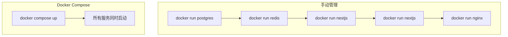

# 10.3 一键启动所有服务——Docker Compose 编排：多服务协同

一个命令，启动整个应用栈。

## 为什么需要 Docker Compose

当你的应用不只有一个容器时（前端 + 后端 + 数据库 + 缓存），手动一个个启动既繁琐又容易出错。Docker Compose 让你用一个 YAML 文件定义所有服务，然后一键启动。



## 核心优势

| 特性 | 说明 |
|------|------|
| 声明式配置 | 用 YAML 描述期望状态，而非命令序列 |
| 一键操作 | `up` 启动、`down` 停止、`restart` 重启 |
| 依赖管理 | 自动按顺序启动有依赖关系的服务 |
| 网络隔离 | 自动创建专属网络，服务间用名称通信 |
| 环境一致 | 开发和生产使用相同的编排文件 |

## 典型应用栈

```yaml
# docker-compose.yml
services:
  frontend:    # Next.js 前端
  api:         # NestJS 后端
  postgres:    # PostgreSQL 数据库
  redis:       # Redis 缓存
  nginx:       # 反向代理
```

## 本节目录

- **10.3.1 编排文件怎么写** — Compose 文件结构详解
- **10.3.2 服务之间如何对话** — 网络与数据卷配置
- **10.3.3 开发和生产用一套配置吗** — 多环境配置策略
- **10.3.4 服务挂了能自动重启吗** — 健康检查与自愈

## 常用命令速查

| 命令 | 作用 |
|------|------|
| `docker compose up -d` | 后台启动所有服务 |
| `docker compose down` | 停止并删除容器 |
| `docker compose ps` | 查看服务状态 |
| `docker compose logs -f` | 实时查看日志 |
| `docker compose restart api` | 重启指定服务 |
| `docker compose pull` | 拉取最新镜像 |
| `docker compose build` | 构建自定义镜像 |

## 快速上手

```bash
# 1. 创建 docker-compose.yml
# 2. 启动所有服务
docker compose up -d

# 3. 查看状态
docker compose ps

# 4. 查看日志
docker compose logs -f api

# 5. 停止服务
docker compose down
```

::: tip 版本说明
Docker Compose V2 已集成到 Docker CLI，命令从 `docker-compose` 变为 `docker compose`（去掉了连字符）。
:::
