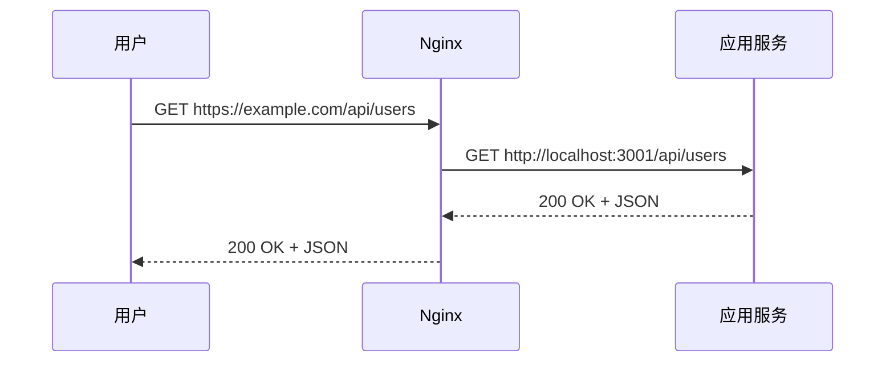

# 10.4.1 请求该转发给谁——反向代理：upstream 配置与请求转发

反向代理的核心：用户看到的是 Nginx，真正干活的是后端服务。

## 反向代理原理



用户不知道后端服务的存在，所有请求都通过 Nginx 中转。

## 基础配置

### 最简单的反向代理

```nginx
server {
    listen 80;
    server_name www.example.com;
    
    location / {
        proxy_pass http://127.0.0.1:3000;
    }
}
```

### 完整的反向代理配置

```nginx
server {
    listen 80;
    server_name www.example.com;
    
    location / {
        proxy_pass http://127.0.0.1:3000;
        
        # 传递原始请求信息
        proxy_set_header Host $host;
        proxy_set_header X-Real-IP $remote_addr;
        proxy_set_header X-Forwarded-For $proxy_add_x_forwarded_for;
        proxy_set_header X-Forwarded-Proto $scheme;
        
        # HTTP 版本和连接
        proxy_http_version 1.1;
        proxy_set_header Upgrade $http_upgrade;
        proxy_set_header Connection "upgrade";
        
        # 超时设置
        proxy_connect_timeout 60s;
        proxy_send_timeout 60s;
        proxy_read_timeout 60s;
    }
}
```

## 关键配置说明

### proxy_set_header 详解

| Header | 作用 |
|--------|------|
| `Host` | 传递原始域名 |
| `X-Real-IP` | 传递用户真实 IP |
| `X-Forwarded-For` | 传递代理链路 |
| `X-Forwarded-Proto` | 传递原始协议（http/https） |
| `Upgrade` | 支持 WebSocket |
| `Connection` | 支持连接升级 |

### 后端获取真实 IP

在 NestJS 中获取用户真实 IP：

```typescript
@Get()
getUsers(@Req() req: Request) {
  const realIP = req.headers['x-real-ip'] || req.ip;
  console.log('User IP:', realIP);
}
```

## 多服务代理

### 按路径分发

```nginx
server {
    listen 80;
    server_name example.com;
    
    # 前端应用
    location / {
        proxy_pass http://127.0.0.1:3000;
    }
    
    # 后端 API
    location /api/ {
        proxy_pass http://127.0.0.1:3001;
    }
    
    # 静态资源
    location /_next/static/ {
        alias /var/www/static/;
        expires 1y;
    }
}
```

### 按子域名分发

```nginx
# 前端 www.example.com
server {
    listen 80;
    server_name www.example.com;
    
    location / {
        proxy_pass http://127.0.0.1:3000;
    }
}

# API api.example.com
server {
    listen 80;
    server_name api.example.com;
    
    location / {
        proxy_pass http://127.0.0.1:3001;
    }
}
```

## upstream 配置

当后端有多个实例时，使用 `upstream` 定义服务组：

```nginx
upstream frontend {
    server 127.0.0.1:3000;
}

upstream backend {
    server 127.0.0.1:3001;
    server 127.0.0.1:3002;  # 多实例
}

server {
    listen 80;
    server_name example.com;
    
    location / {
        proxy_pass http://frontend;
    }
    
    location /api/ {
        proxy_pass http://backend;
    }
}
```

## 路径重写

### 去掉路径前缀

```nginx
# 请求 /api/users → 转发到 /users
location /api/ {
    proxy_pass http://127.0.0.1:3001/;  # 注意末尾的 /
}
```

### 保留路径前缀

```nginx
# 请求 /api/users → 转发到 /api/users
location /api/ {
    proxy_pass http://127.0.0.1:3001;  # 没有末尾的 /
}
```

## 1Panel 中配置反向代理

1. 网站 → 创建网站 → 反向代理
2. 填写配置：
   - 主域名：`www.example.com`
   - 代理地址：`http://127.0.0.1:3000`

系统会自动生成配置文件，可在"配置文件"中查看和修改。

## 常见问题

| 问题 | 原因 | 解决方案 |
|------|------|----------|
| 502 Bad Gateway | 后端服务未启动 | 检查应用是否运行 |
| 504 Gateway Timeout | 后端响应超时 | 增加 `proxy_read_timeout` |
| 获取不到真实 IP | 未设置 header | 添加 `X-Real-IP` 配置 |
| WebSocket 断开 | 未配置 Upgrade | 添加 `Upgrade` 和 `Connection` |

## AI 协作指南

向 AI 描述需求时：

```
请帮我配置 Nginx 反向代理：
- 域名：www.example.com 代理到 localhost:3000
- api.example.com 代理到 localhost:3001
- 需要支持 WebSocket
- 需要传递用户真实 IP
```

**关键术语**：proxy_pass、upstream、proxy_set_header、location
