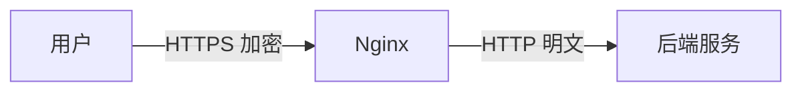
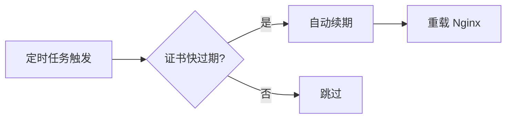

# 10.4.2 HTTPS 证书怎么配——SSL 终止：HTTPS 证书配置与自动续期

2024 年了，没有 HTTPS 的网站会被浏览器标记为"不安全"。

## SSL 终止原理



Nginx 负责 HTTPS 的加密/解密，后端服务只需处理 HTTP，简化架构。

## 证书获取方式

| 方式 | 费用 | 有效期 | 适用场景 |
|------|------|--------|----------|
| Let's Encrypt | 免费 | 90 天 | 个人/小型项目 |
| 阿里云免费证书 | 免费 | 1 年 | 单域名 |
| 付费证书 | 收费 | 1-2 年 | 企业/高安全需求 |

## 1Panel 一键申请

1Panel 支持一键申请 Let's Encrypt 免费证书：

1. 网站 → 选择站点 → HTTPS
2. 选择"申请证书"
3. 选择 Let's Encrypt
4. 验证方式：DNS 验证 或 HTTP 验证
5. 点击申请

::: tip 验证方式选择
- **HTTP 验证**：需要域名已解析到当前服务器
- **DNS 验证**：可申请泛域名证书（*.example.com）
:::

## 手动配置 SSL

### 基本 HTTPS 配置

```nginx
server {
    listen 80;
    server_name example.com;
    # HTTP 重定向到 HTTPS
    return 301 https://$server_name$request_uri;
}

server {
    listen 443 ssl http2;
    server_name example.com;
    
    # 证书文件
    ssl_certificate /etc/nginx/ssl/example.com.pem;
    ssl_certificate_key /etc/nginx/ssl/example.com.key;
    
    # SSL 配置
    ssl_protocols TLSv1.2 TLSv1.3;
    ssl_ciphers ECDHE-ECDSA-AES128-GCM-SHA256:ECDHE-RSA-AES128-GCM-SHA256;
    ssl_prefer_server_ciphers on;
    
    # 安全头
    add_header Strict-Transport-Security "max-age=31536000" always;
    
    location / {
        proxy_pass http://127.0.0.1:3000;
    }
}
```

### 配置说明

| 配置 | 作用 |
|------|------|
| `listen 443 ssl http2` | 启用 HTTPS 和 HTTP/2 |
| `ssl_certificate` | 证书文件路径 |
| `ssl_certificate_key` | 私钥文件路径 |
| `ssl_protocols` | 支持的 TLS 版本 |
| `ssl_ciphers` | 加密套件 |
| `HSTS` | 强制浏览器使用 HTTPS |

## 证书自动续期

### Let's Encrypt 自动续期

1Panel 会自动处理 Let's Encrypt 证书的续期。手动配置时：

```bash
# 安装 certbot
apt install certbot python3-certbot-nginx

# 申请证书
certbot --nginx -d example.com -d www.example.com

# 测试自动续期
certbot renew --dry-run

# 添加定时任务
crontab -e
# 每天凌晨 2 点检查续期
0 2 * * * certbot renew --quiet
```

### 续期流程



## 多域名证书

### 主域名 + www

```nginx
server {
    listen 443 ssl http2;
    server_name example.com www.example.com;
    
    ssl_certificate /etc/nginx/ssl/example.com.pem;
    ssl_certificate_key /etc/nginx/ssl/example.com.key;
}
```

### 泛域名证书

```nginx
server {
    listen 443 ssl http2;
    server_name *.example.com;
    
    ssl_certificate /etc/nginx/ssl/wildcard.example.com.pem;
    ssl_certificate_key /etc/nginx/ssl/wildcard.example.com.key;
}
```

::: warning 泛域名证书
泛域名证书（*.example.com）只能匹配一级子域名，不能匹配 `a.b.example.com`。
:::

## SSL 优化

### 启用 OCSP Stapling

```nginx
ssl_stapling on;
ssl_stapling_verify on;
ssl_trusted_certificate /etc/nginx/ssl/chain.pem;
resolver 8.8.8.8 8.8.4.4 valid=300s;
```

### 启用 Session 缓存

```nginx
ssl_session_cache shared:SSL:10m;
ssl_session_timeout 1d;
ssl_session_tickets off;
```

## 安全检测

配置完成后，使用在线工具检测 SSL 配置：

- [SSL Labs](https://www.ssllabs.com/ssltest/) - 评分 A+ 为最佳
- [Security Headers](https://securityheaders.com/) - 检测安全头

## 常见问题

| 问题 | 原因 | 解决方案 |
|------|------|----------|
| 证书不受信任 | 证书链不完整 | 使用包含中间证书的 fullchain.pem |
| 混合内容警告 | 页面包含 HTTP 资源 | 将所有资源改为 HTTPS |
| 证书过期 | 续期失败 | 检查 certbot 日志 |
| ERR_SSL_PROTOCOL_ERROR | 配置错误 | 检查 ssl_protocols 和 ssl_ciphers |

## 最佳实践

1. **使用 HTTP/2**：`listen 443 ssl http2`
2. **禁用旧协议**：只允许 TLS 1.2 和 1.3
3. **启用 HSTS**：强制浏览器使用 HTTPS
4. **定期检查**：监控证书过期时间
5. **证书备份**：备份私钥和证书文件
