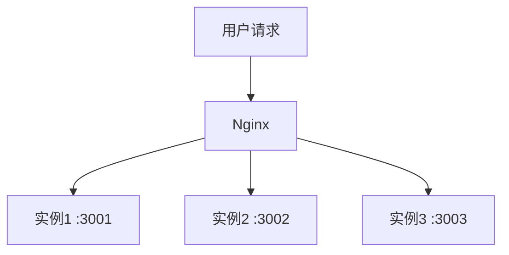
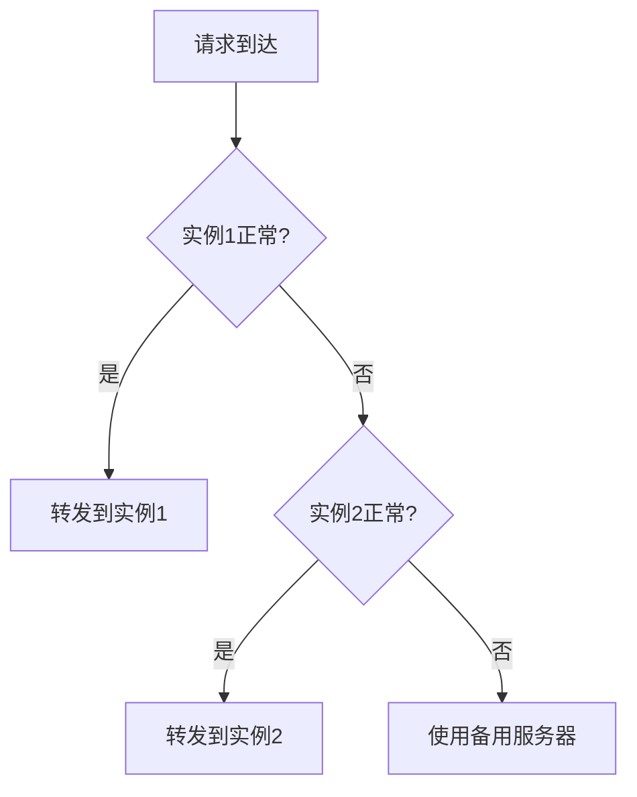

# 10.4.3 用户太多了怎么办——负载均衡：多实例分发策略

单台服务器扛不住？那就多来几台。

## 负载均衡原理



Nginx 将请求分发到多个后端实例，提升处理能力和可用性。

## 基础配置

```nginx
upstream backend {
    server 127.0.0.1:3001;
    server 127.0.0.1:3002;
    server 127.0.0.1:3003;
}

server {
    listen 80;
    server_name api.example.com;
    
    location / {
        proxy_pass http://backend;
    }
}
```

## 负载均衡策略

### 轮询（默认）

请求按顺序分发到每个服务器：

```nginx
upstream backend {
    server 127.0.0.1:3001;
    server 127.0.0.1:3002;
    server 127.0.0.1:3003;
}
```

### 权重分配

根据服务器性能分配不同权重：

```nginx
upstream backend {
    server 127.0.0.1:3001 weight=3;  # 处理 3/6 请求
    server 127.0.0.1:3002 weight=2;  # 处理 2/6 请求
    server 127.0.0.1:3003 weight=1;  # 处理 1/6 请求
}
```

### IP Hash

同一用户始终访问同一服务器（解决 Session 问题）：

```nginx
upstream backend {
    ip_hash;
    server 127.0.0.1:3001;
    server 127.0.0.1:3002;
    server 127.0.0.1:3003;
}
```

### 最少连接

请求发送到当前连接数最少的服务器：

```nginx
upstream backend {
    least_conn;
    server 127.0.0.1:3001;
    server 127.0.0.1:3002;
    server 127.0.0.1:3003;
}
```

## 策略对比

| 策略 | 特点 | 适用场景 |
|------|------|----------|
| 轮询 | 简单均匀 | 服务器配置相同 |
| 权重 | 按性能分配 | 服务器配置不同 |
| IP Hash | 会话保持 | 有状态应用 |
| 最少连接 | 动态均衡 | 请求处理时间差异大 |

## 健康检查

### 被动健康检查

```nginx
upstream backend {
    server 127.0.0.1:3001 max_fails=3 fail_timeout=30s;
    server 127.0.0.1:3002 max_fails=3 fail_timeout=30s;
    server 127.0.0.1:3003 backup;  # 备用服务器
}
```

| 参数 | 作用 |
|------|------|
| `max_fails` | 失败次数阈值 |
| `fail_timeout` | 失败后暂停时间 |
| `backup` | 仅在其他服务器不可用时使用 |
| `down` | 标记服务器为下线 |

### 健康检查流程



## Docker Compose 多实例

```yaml
services:
  api:
    image: my-api:latest
    deploy:
      replicas: 3  # 3个实例
    # 不映射端口，通过 Nginx 访问
    
  nginx:
    image: nginx:alpine
    ports:
      - "80:80"
    depends_on:
      - api
```

配合 Docker 内部 DNS：

```nginx
upstream backend {
    server api:3001;  # Docker 会自动负载均衡到所有实例
}
```

## 会话保持

当使用负载均衡时，用户可能被分发到不同服务器，导致会话丢失。

### 解决方案

| 方案 | 实现 | 优缺点 |
|------|------|--------|
| IP Hash | Nginx 配置 | 简单，但 IP 变化会失效 |
| Session 共享 | Redis 存储 | 推荐，无状态应用 |
| JWT Token | 客户端存储 | 推荐，完全无状态 |

### Redis Session 存储

```typescript
// NestJS 配置
import * as session from 'express-session';
import * as RedisStore from 'connect-redis';

app.use(
  session({
    store: new RedisStore({ client: redisClient }),
    secret: 'your-secret',
    resave: false,
    saveUninitialized: false,
  }),
);
```

## 监控与调优

### 查看 upstream 状态

```nginx
# 启用状态页面
location /nginx_status {
    stub_status on;
    allow 127.0.0.1;
    deny all;
}
```

### 连接池配置

```nginx
upstream backend {
    server 127.0.0.1:3001;
    
    keepalive 32;  # 保持连接数
}

server {
    location / {
        proxy_pass http://backend;
        proxy_http_version 1.1;
        proxy_set_header Connection "";  # 启用 keepalive
    }
}
```

## 常见问题

| 问题 | 原因 | 解决方案 |
|------|------|----------|
| Session 丢失 | 请求分发到不同实例 | 使用 IP Hash 或 Redis Session |
| 单点故障 | 某实例挂掉 | 配置健康检查和备用服务器 |
| 负载不均 | 请求处理时间差异大 | 使用 least_conn 策略 |

## 最佳实践

1. **无状态设计**：应用不依赖本地 Session
2. **健康检查**：配置 max_fails 和 fail_timeout
3. **备用服务器**：至少一个 backup 服务器
4. **监控**：关注各实例的负载情况
5. **渐进式扩容**：根据监控数据逐步增加实例
