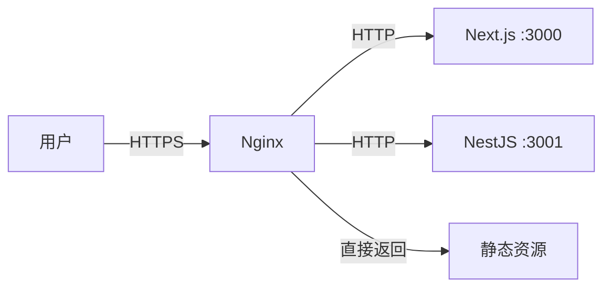
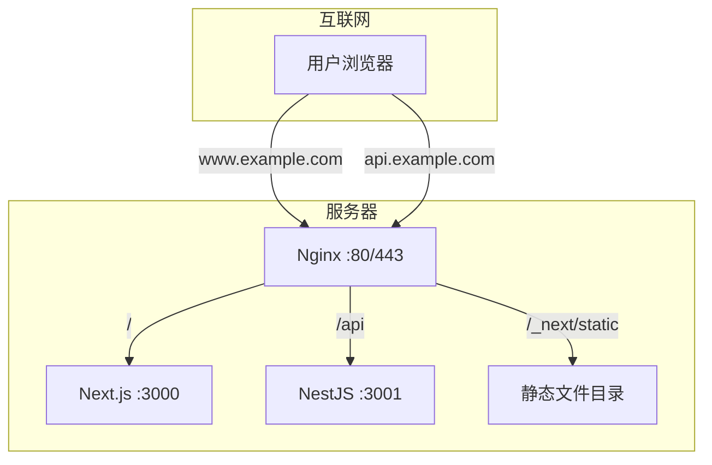

# 10.4 网站的交通指挥官——反向代理与负载均衡：Nginx 配置实战

用户访问的是域名，Nginx 决定请求去哪。

## 为什么需要 Nginx

Nginx 在现代 Web 架构中扮演着"门卫"角色：



## 核心功能

| 功能 | 说明 |
|------|------|
| 反向代理 | 将请求转发到后端服务 |
| SSL 终止 | 处理 HTTPS 加密/解密 |
| 负载均衡 | 将请求分发到多个实例 |
| 静态文件 | 直接返回静态资源 |
| 缓存 | 缓存响应，减少后端压力 |
| 压缩 | Gzip 压缩响应内容 |

## 1Panel 中的 Nginx

1Panel 默认使用 **OpenResty**（Nginx 的增强版），通过 **网站** 功能管理：

| 操作 | 路径 |
|------|------|
| 创建网站 | 网站 → 网站 → 创建网站 |
| 配置反向代理 | 网站 → 选择站点 → 反向代理 |
| SSL 证书 | 网站 → 选择站点 → HTTPS |
| 查看配置 | 网站 → 选择站点 → 配置文件 |

## 本节目录

- **10.4.1 请求该转发给谁** — 反向代理基础配置
- **10.4.2 HTTPS 证书怎么配** — SSL 配置与自动续期
- **10.4.3 用户太多了怎么办** — 负载均衡策略
- **10.4.4 图片如何加速访问** — 静态资源与 CDN

## 典型配置架构



## 常用命令

```bash
# 测试配置语法
nginx -t

# 重载配置（不中断服务）
nginx -s reload

# 查看 Nginx 状态
systemctl status nginx

# 查看访问日志
tail -f /var/log/nginx/access.log

# 查看错误日志
tail -f /var/log/nginx/error.log
```

## 配置文件结构

```nginx
# /etc/nginx/nginx.conf 主配置
http {
    # 全局设置
    include /etc/nginx/conf.d/*.conf;  # 包含站点配置
}

# /etc/nginx/conf.d/example.conf 站点配置
server {
    listen 80;
    server_name example.com;
    
    location / {
        proxy_pass http://localhost:3000;
    }
}
```
