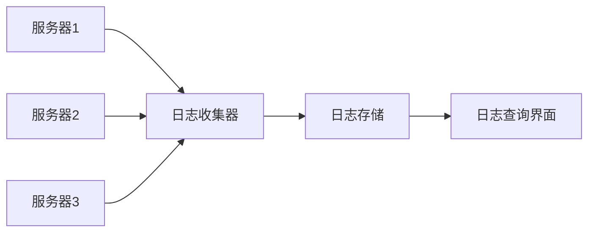

# 10.5.2 日志太多了怎么办——日志管理：结构化日志与日志轮转

日志是排查问题的第一手资料，但太多了也是灾难。

## 日志级别

| 级别 | 用途 | 生产环境 |
|------|------|----------|
| ERROR | 错误，需要处理 | 必须记录 |
| WARN | 警告，可能有问题 | 建议记录 |
| INFO | 重要信息 | 选择性记录 |
| DEBUG | 调试信息 | 不记录 |
| VERBOSE | 详细信息 | 不记录 |

## 结构化日志

### 为什么要结构化

```bash
# 非结构化日志 - 难以搜索和分析
[2024-01-15 10:30:00] User login failed: invalid password for user@example.com

# 结构化日志 - 易于查询和聚合
{"timestamp":"2024-01-15T10:30:00Z","level":"warn","event":"login_failed","reason":"invalid_password","email":"user@example.com"}
```

### NestJS 日志配置

```typescript
// logger.service.ts
import { Injectable, Logger } from '@nestjs/common';

@Injectable()
export class AppLogger extends Logger {
  private formatLog(level: string, message: string, context?: object) {
    return JSON.stringify({
      timestamp: new Date().toISOString(),
      level,
      message,
      ...context,
    });
  }

  log(message: string, context?: object) {
    console.log(this.formatLog('info', message, context));
  }

  error(message: string, trace?: string, context?: object) {
    console.error(this.formatLog('error', message, { trace, ...context }));
  }

  warn(message: string, context?: object) {
    console.warn(this.formatLog('warn', message, context));
  }
}
```

### 使用示例

```typescript
// 业务日志
this.logger.log('Order created', {
  orderId: order.id,
  userId: user.id,
  amount: order.total,
});

// 错误日志
this.logger.error('Payment failed', error.stack, {
  orderId: order.id,
  gateway: 'stripe',
  errorCode: error.code,
});
```

## Docker 日志管理

### 查看日志

```bash
# 实时查看日志
docker logs -f container-name

# 查看最近 100 行
docker logs --tail 100 container-name

# 查看特定时间段
docker logs --since 2024-01-15T10:00:00 container-name
```

### 日志驱动配置

```yaml
# docker-compose.yml
services:
  api:
    image: my-api
    logging:
      driver: "json-file"
      options:
        max-size: "10m"    # 单个日志文件最大 10MB
        max-file: "5"      # 最多保留 5 个文件
```

## 日志轮转

### 为什么需要轮转

| 问题 | 后果 |
|------|------|
| 日志文件过大 | 磁盘空间耗尽 |
| 单文件太大 | 打开/搜索困难 |
| 历史日志堆积 | 无法有效管理 |

### logrotate 配置

```bash
# /etc/logrotate.d/app
/var/log/app/*.log {
    daily           # 每天轮转
    rotate 7        # 保留 7 天
    compress        # 压缩旧日志
    delaycompress   # 延迟压缩
    missingok       # 日志不存在不报错
    notifempty      # 空文件不轮转
    create 0644 root root
}
```

### Docker 自动管理

Docker 配置 `max-size` 和 `max-file` 后自动轮转：

```json
// /etc/docker/daemon.json
{
  "log-driver": "json-file",
  "log-opts": {
    "max-size": "10m",
    "max-file": "5"
  }
}
```

## 日志最佳实践

### 该记什么

```typescript
// 1. 请求入口
this.logger.log('Request received', {
  method: req.method,
  path: req.path,
  userId: req.user?.id,
});

// 2. 关键业务操作
this.logger.log('Order status changed', {
  orderId,
  from: oldStatus,
  to: newStatus,
});

// 3. 外部调用
this.logger.log('API call', {
  service: 'payment',
  duration: 150,
  success: true,
});

// 4. 错误和异常
this.logger.error('Database query failed', error.stack, {
  query: 'findUser',
  userId,
});
```

### 不该记什么

```typescript
// 敏感信息 - 绝对不要记录！
this.logger.log('User login', {
  password: user.password,  // 永远不要！
  creditCard: card.number,  // 永远不要！
  token: jwt,               // 避免记录完整 token
});

// 应该脱敏
this.logger.log('User login', {
  email: maskEmail(user.email),  // u***@example.com
  cardLast4: card.number.slice(-4),  // 1234
});
```

## 日志查询技巧

### 使用 grep 搜索

```bash
# 搜索错误日志
docker logs api 2>&1 | grep -i error

# 搜索特定用户
docker logs api | grep "userId\":\"123"

# 搜索时间范围
docker logs api --since 1h | grep error
```

### 使用 jq 解析 JSON

```bash
# 只显示错误级别的日志
docker logs api | jq 'select(.level == "error")'

# 提取特定字段
docker logs api | jq '{time: .timestamp, msg: .message}'

# 统计错误数量
docker logs api | jq 'select(.level == "error")' | wc -l
```

## 集中化日志（可选）

对于多服务器场景，考虑日志集中管理：



### 简单方案

| 工具 | 费用 | 特点 |
|------|------|------|
| Better Stack | 免费起步 | 简单易用 |
| Papertrail | 免费起步 | 实时搜索 |
| Loki + Grafana | 免费 | 自托管 |

## 常见问题

| 问题 | 原因 | 解决方案 |
|------|------|----------|
| 磁盘空间不足 | 日志未轮转 | 配置日志轮转 |
| 日志太多找不到 | 缺少结构化 | 使用 JSON 格式 |
| 性能影响 | 同步写日志 | 异步写入/批量写入 |
| 敏感信息泄露 | 日志记录不当 | 审查日志内容，脱敏处理 |
