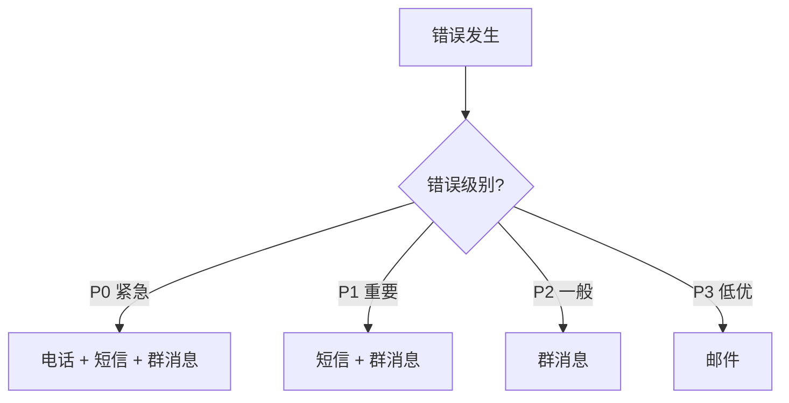

# 10.5.3 一出错就通知我——错误追踪：异常捕获与告警机制

错误发生了不可怕，可怕的是你不知道。

## 错误追踪 vs 日志

| 对比项 | 日志 | 错误追踪 |
|--------|------|----------|
| 信息量 | 一行文本 | 完整上下文 |
| 堆栈 | 可能有 | 完整堆栈 |
| 聚合 | 无 | 相同错误自动聚合 |
| 通知 | 需要额外配置 | 内置告警 |
| 用户信息 | 手动记录 | 自动关联 |

## Sentry 集成

Sentry 是最流行的错误追踪服务，免费版够用。

### 后端集成（NestJS）

```bash
npm install @sentry/node
```

```typescript
// main.ts
import * as Sentry from '@sentry/node';

Sentry.init({
  dsn: process.env.SENTRY_DSN,
  environment: process.env.NODE_ENV,
  tracesSampleRate: 0.1,  // 采样 10% 的请求
});

// 全局异常过滤器
@Catch()
export class SentryExceptionFilter implements ExceptionFilter {
  catch(exception: any, host: ArgumentsHost) {
    Sentry.captureException(exception);
    
    const ctx = host.switchToHttp();
    const response = ctx.getResponse<Response>();
    
    response.status(500).json({
      message: 'Internal server error',
    });
  }
}
```

### 前端集成（Next.js）

```bash
npm install @sentry/nextjs
npx @sentry/wizard@latest -i nextjs
```

```typescript
// sentry.client.config.ts
import * as Sentry from '@sentry/nextjs';

Sentry.init({
  dsn: process.env.NEXT_PUBLIC_SENTRY_DSN,
  tracesSampleRate: 0.1,
});
```

### 捕获自定义错误

```typescript
try {
  await processPayment(order);
} catch (error) {
  Sentry.captureException(error, {
    extra: {
      orderId: order.id,
      amount: order.total,
    },
    tags: {
      payment_gateway: 'stripe',
    },
    user: {
      id: user.id,
      email: user.email,
    },
  });
  throw error;
}
```

## 告警配置

### 告警渠道

| 渠道 | 优点 | 缺点 |
|------|------|------|
| 邮件 | 详细、可追溯 | 容易被忽略 |
| 钉钉/飞书 | 即时、团队可见 | 可能打扰 |
| 短信 | 紧急通知 | 成本高 |
| 电话 | 最紧急 | 成本最高 |

### 钉钉机器人告警

```typescript
async function sendDingTalkAlert(message: string) {
  const webhook = process.env.DINGTALK_WEBHOOK;
  
  await fetch(webhook, {
    method: 'POST',
    headers: { 'Content-Type': 'application/json' },
    body: JSON.stringify({
      msgtype: 'markdown',
      markdown: {
        title: '服务告警',
        text: `## 服务告警\n\n${message}\n\n时间：${new Date().toLocaleString()}`,
      },
    }),
  });
}
```

### 飞书机器人告警

```typescript
async function sendFeishuAlert(title: string, content: string) {
  const webhook = process.env.FEISHU_WEBHOOK;
  
  await fetch(webhook, {
    method: 'POST',
    headers: { 'Content-Type': 'application/json' },
    body: JSON.stringify({
      msg_type: 'interactive',
      card: {
        header: {
          title: { content: title, tag: 'plain_text' },
          template: 'red',
        },
        elements: [{
          tag: 'div',
          text: { content, tag: 'plain_text' },
        }],
      },
    }),
  });
}
```

## 告警规则设计

### 分级告警



| 级别 | 定义 | 响应时间 |
|------|------|----------|
| P0 | 服务完全不可用 | 5 分钟 |
| P1 | 核心功能受损 | 30 分钟 |
| P2 | 非核心功能问题 | 4 小时 |
| P3 | 用户可接受的问题 | 1 天 |

### 避免告警疲劳

```typescript
// 错误聚合 - 相同错误 5 分钟内只告警一次
const alertCache = new Map<string, number>();

function shouldAlert(errorKey: string): boolean {
  const lastAlert = alertCache.get(errorKey);
  const now = Date.now();
  
  if (lastAlert && now - lastAlert < 5 * 60 * 1000) {
    return false;
  }
  
  alertCache.set(errorKey, now);
  return true;
}
```

## UptimeRobot 告警

### 配置告警联系人

1. 设置 → Alert Contacts
2. 添加联系方式：
   - Email
   - Webhook（推荐，可集成钉钉/飞书）
   - Slack/Discord

### Webhook 转发到钉钉

```javascript
// 接收 UptimeRobot webhook，转发到钉钉
app.post('/webhook/uptime', async (req, res) => {
  const { monitorFriendlyName, alertType, alertDetails } = req.body;
  
  const isDown = alertType === '1';
  const message = isDown 
    ? `🔴 服务宕机：${monitorFriendlyName}\n${alertDetails}`
    : `🟢 服务恢复：${monitorFriendlyName}`;
  
  await sendDingTalkAlert(message);
  res.send('ok');
});
```

## 错误处理最佳实践

### 全局异常处理

```typescript
// NestJS 全局异常过滤器
@Catch()
export class GlobalExceptionFilter implements ExceptionFilter {
  catch(exception: any, host: ArgumentsHost) {
    const ctx = host.switchToHttp();
    const response = ctx.getResponse();
    const request = ctx.getRequest();
    
    // 记录错误
    console.error(JSON.stringify({
      level: 'error',
      message: exception.message,
      stack: exception.stack,
      path: request.url,
      method: request.method,
      userId: request.user?.id,
    }));
    
    // 发送到 Sentry
    Sentry.captureException(exception);
    
    // 返回用户友好的错误
    response.status(500).json({
      statusCode: 500,
      message: 'Something went wrong',
    });
  }
}
```

### 不要暴露敏感信息

```typescript
// 错误的做法
res.status(500).json({ error: exception.message }); // 可能泄露数据库信息

// 正确的做法
res.status(500).json({ message: 'Internal server error' });
```

## 常见问题

| 问题 | 原因 | 解决方案 |
|------|------|----------|
| 告警太多 | 阈值太敏感 | 调整阈值，错误聚合 |
| 告警太少 | 错误未捕获 | 完善全局异常处理 |
| 告警延迟 | 检查间隔太长 | 缩短检查间隔 |
| 重复告警 | 未做去重 | 添加告警聚合逻辑 |
