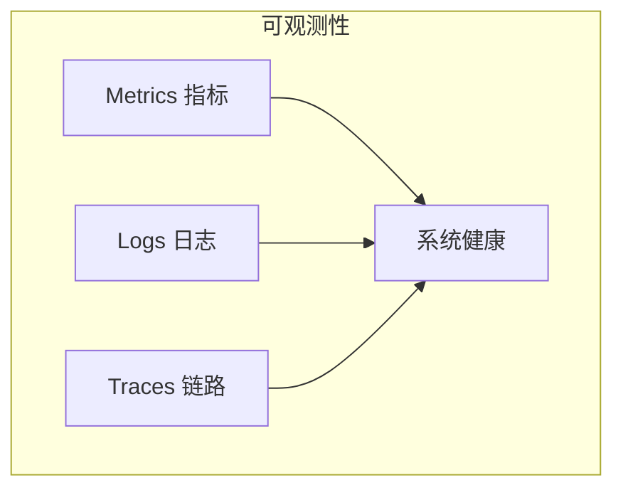
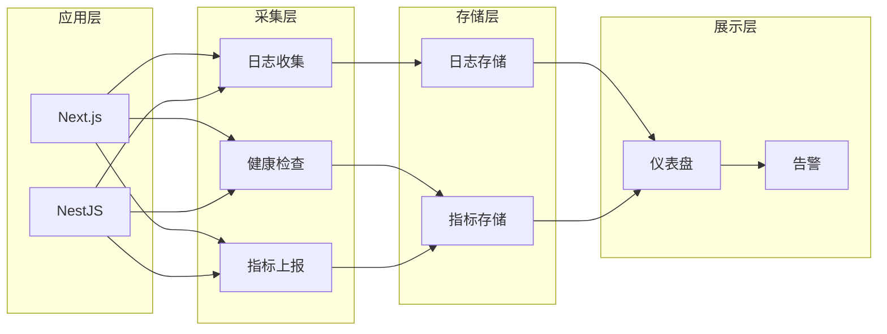

# 10.5 网站生病了怎么办——监控与日志：可观测性体系

用户告诉你网站挂了？那你已经晚了。

## 可观测性三支柱



| 支柱 | 说明 | 回答的问题 |
|------|------|------------|
| Metrics | 数字化指标 | 发生了什么？多严重？ |
| Logs | 事件记录 | 为什么发生？ |
| Traces | 请求链路 | 在哪里发生？ |

## 为什么需要监控

| 场景 | 没有监控 | 有监控 |
|------|----------|--------|
| 网站挂了 | 用户投诉才知道 | 自动告警，快速响应 |
| 性能下降 | 凭感觉猜测 | 数据定位瓶颈 |
| 错误追踪 | 翻日志找半天 | 一键定位问题 |
| 容量规划 | 拍脑袋扩容 | 基于数据决策 |

## 监控体系架构



## 本节目录

- **10.5.1 网站还活着吗** — 健康检查与基础指标
- **10.5.2 日志太多了怎么办** — 结构化日志与管理
- **10.5.3 一出错就通知我** — 错误追踪与告警
- **10.5.4 性能瓶颈在哪** — 性能分析与优化

## 适合独立开发者的方案

不需要复杂的 ELK Stack，简单方案也够用：

| 工具 | 用途 | 费用 |
|------|------|------|
| 1Panel 监控 | 服务器资源监控 | 免费 |
| UptimeRobot | 网站可用性监控 | 免费/付费 |
| Sentry | 错误追踪 | 免费/付费 |
| Better Stack | 日志 + 告警 | 免费/付费 |
| Docker 日志 | 容器日志查看 | 免费 |

## 快速开始

### 1. 健康检查端点

```typescript
// NestJS
@Get('health')
healthCheck() {
  return { status: 'ok', timestamp: new Date() };
}
```

### 2. 查看 Docker 日志

```bash
# 查看应用日志
docker logs -f --tail 100 app-container

# 查看所有服务日志
docker-compose logs -f
```

### 3. 配置告警

在 UptimeRobot 创建监控：
- 监控地址：`https://example.com/api/health`
- 检查间隔：5 分钟
- 告警方式：邮件/Webhook
