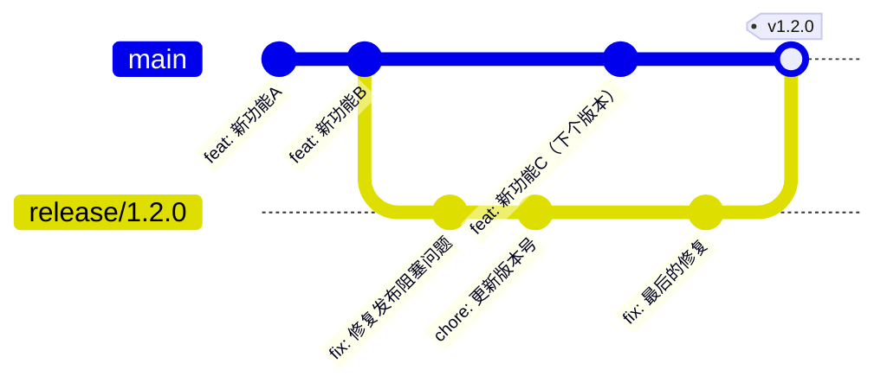

# 11.1.2 Release 分支：发布准备与稳定化

## 一句话破题

**Release 分支**是从开发分支切出的临时分支，专门用于发布前的稳定化工作，确保发布版本的质量。

## 核心价值

使用 Release 分支能让你：
- 在稳定化期间继续开发新功能
- 隔离发布相关的修复和调整
- 确保发布版本经过充分测试

## Release 分支工作流



## 快速上手

### 步骤一：创建 Release 分支

```bash
# 从 develop 或 main 分支创建 release 分支
git checkout develop
git checkout -b release/1.2.0
```

### 步骤二：稳定化工作

在 Release 分支上只做以下工作：

```bash
# 修复发布阻塞问题
git commit -m "fix: 修复登录页面样式问题"

# 更新版本号
npm version 1.2.0 --no-git-tag-version
git commit -am "chore: bump version to 1.2.0"

# 更新 CHANGELOG
git commit -m "docs: update CHANGELOG for 1.2.0"
```

### 步骤三：合并回主分支

```bash
# 合并到 main
git checkout main
git merge release/1.2.0 --no-ff

# 打标签
git tag -a v1.2.0 -m "Release version 1.2.0"

# 同步回 develop（如果使用 Git Flow）
git checkout develop
git merge release/1.2.0 --no-ff

# 删除 release 分支
git branch -d release/1.2.0
```

## 发布检查清单

在合并 Release 分支前，确保完成以下检查：

```markdown
## 发布检查清单

### 代码质量
- [ ] 所有测试通过
- [ ] 无 ESLint/TypeScript 错误
- [ ] 代码已经过 Review

### 版本信息
- [ ] package.json 版本号已更新
- [ ] CHANGELOG 已更新
- [ ] 文档已同步更新

### 环境验证
- [ ] 在 staging 环境验证通过
- [ ] 关键功能手动测试通过
- [ ] 性能无明显退化

### 发布准备
- [ ] 数据库迁移脚本就绪
- [ ] 环境变量配置检查
- [ ] 回滚方案准备好
```

## 避坑指南

::: danger 新手最容易犯的错
1. 在 Release 分支上开发新功能
2. 忘记将 Release 分支的修复同步回开发分支
3. 发布前没有在类生产环境验证
4. 没有准备回滚方案就发布
:::
