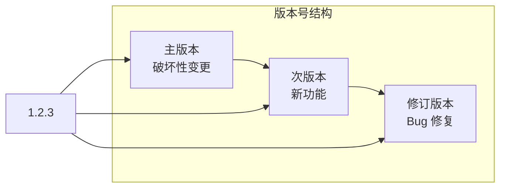
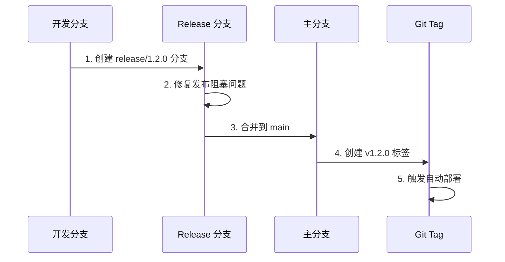

# 11.1 语义化版本与发布流

## 认知重构

版本号不是随便写的数字，而是一种**与用户沟通的语言**。通过版本号，用户可以判断这次更新是否会破坏现有功能、是否需要立即升级。

## 本节内容

| 小节 | 核心问题 | 你将学会 |
|------|----------|----------|
| 11.1.1 SemVer 规范 | 版本号怎么定？ | 主版本/次版本/修订版本的含义 |
| 11.1.2 Release 分支 | 发布前做什么？ | 发布准备与稳定化流程 |
| 11.1.3 Git Tag | 如何标记版本？ | 版本标签的创建与管理 |
| 11.1.4 发布公告 | 如何通知用户？ | CHANGELOG 与升级指南 |

## 发布流程全景

## AI 协作提示

在进行版本发布时，可以这样与 AI 协作：

- "根据最近的提交记录，判断应该发布什么版本"
- "帮我生成这个版本的 CHANGELOG"
- "检查这次变更是否有破坏性更新"

::: tip 版本号的承诺
版本号是你对用户的承诺。`1.0.0` 到 `2.0.0` 意味着"有东西会坏"，用户需要谨慎升级；`1.0.0` 到 `1.1.0` 意味着"只会变得更好"，用户可以放心更新。
:::
