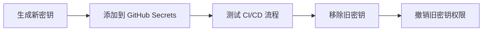

# 11.2.4 密钥管理：CI/CD 环境配置与安全存储

## 一句话破题

敏感信息（API Key、数据库密码、SSH 密钥等）**绝不能写在代码中**，应使用 GitHub Secrets 安全存储。

## 核心价值

正确管理密钥能让你：
- 避免敏感信息泄露
- 安全地在 CI/CD 中使用密钥
- 便于密钥轮换和权限管理

## 配置 GitHub Secrets

### 在仓库设置中添加

```
Settings → Secrets and variables → Actions → New repository secret

添加：
- DATABASE_URL
- VERCEL_TOKEN
- SSH_PRIVATE_KEY
```

### 在 Workflow 中使用

```yaml
jobs:
  deploy:
    runs-on: ubuntu-latest
    steps:
      - name: Use secret
        env:
          DATABASE_URL: ${{ secrets.DATABASE_URL }}
        run: |
          echo "Database configured"  # 不要打印实际值！
```

## 环境级别的 Secrets

不同环境使用不同的密钥：

```yaml
jobs:
  deploy-staging:
    environment: staging  # 使用 staging 环境的 secrets
    steps:
      - env:
          API_KEY: ${{ secrets.API_KEY }}  # staging 的 API_KEY

  deploy-production:
    environment: production  # 使用 production 环境的 secrets
    steps:
      - env:
          API_KEY: ${{ secrets.API_KEY }}  # production 的 API_KEY
```

在 GitHub 中配置：
```
Settings → Environments → New environment
→ 创建 staging 和 production
→ 在各自环境中添加对应的 secrets
```

## 常见密钥类型及使用

### SSH 密钥

```yaml
- name: Setup SSH
  run: |
    mkdir -p ~/.ssh
    echo "${{ secrets.SSH_PRIVATE_KEY }}" > ~/.ssh/id_rsa
    chmod 600 ~/.ssh/id_rsa
    ssh-keyscan github.com >> ~/.ssh/known_hosts
```

### Docker Registry 认证

```yaml
- name: Login to Docker Hub
  uses: docker/login-action@v3
  with:
    username: ${{ secrets.DOCKER_USERNAME }}
    password: ${{ secrets.DOCKER_PASSWORD }}
```

### 云服务商凭证

```yaml
- name: Configure AWS Credentials
  uses: aws-actions/configure-aws-credentials@v4
  with:
    aws-access-key-id: ${{ secrets.AWS_ACCESS_KEY_ID }}
    aws-secret-access-key: ${{ secrets.AWS_SECRET_ACCESS_KEY }}
    aws-region: us-east-1
```

## 密钥轮换最佳实践



## 安全检查

在 PR 中防止意外提交密钥：

```yaml
- name: Check for secrets
  run: |
    # 简单的敏感信息检查
    if grep -rE "(password|secret|api.key)\s*=\s*['\"][^'\"]+['\"]" --include="*.ts" .; then
      echo "Potential secret found in code!"
      exit 1
    fi
```

或使用专业工具：

```yaml
- name: Scan for secrets
  uses: trufflesecurity/trufflehog@main
  with:
    path: ./
    base: main
    head: HEAD
```

## 避坑指南

::: danger 新手最容易犯的错
1. 在日志中打印密钥值（即使是 debug）
2. 在 PR 评论或错误消息中暴露密钥
3. 使用过于宽泛的权限
4. 长期不轮换密钥
:::
