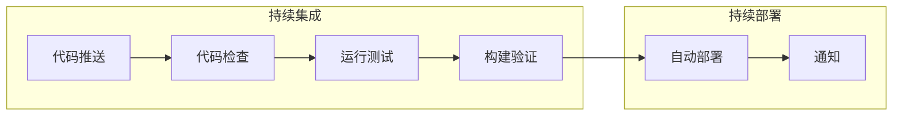

# 11.2 GitHub Actions 质量门禁与生产部署

## 认知重构

CI/CD 不是大公司的专利。通过 GitHub Actions，即使是个人项目也能实现**代码提交后自动检查、自动测试、自动部署**的完整流水线。



## 本节内容

| 小节 | 核心问题 | 你将学会 |
|------|----------|----------|
| 11.2.1 Workflow 配置 | 自动化流程怎么写？ | 触发条件与执行环境 |
| 11.2.2 质量检查 | 如何自动检查代码？ | 测试、构建、安全扫描 |
| 11.2.3 部署流水线 | 如何自动部署？ | 生产环境自动发布 |
| 11.2.4 密钥管理 | 密码怎么存？ | CI/CD 环境配置与安全 |

## GitHub Actions 核心概念

| 概念 | 说明 |
|------|------|
| **Workflow** | 自动化流程，定义在 `.github/workflows/*.yml` |
| **Event** | 触发工作流的事件，如 push、pull_request |
| **Job** | 工作流中的一组步骤，可并行或串行执行 |
| **Step** | Job 中的单个任务，可以是命令或 Action |
| **Action** | 可复用的自动化单元 |

## 最小可用配置

```yaml
# .github/workflows/ci.yml
name: CI

on:
  push:
    branches: [main]
  pull_request:
    branches: [main]

jobs:
  build:
    runs-on: ubuntu-latest
    steps:
      - uses: actions/checkout@v4
      - uses: actions/setup-node@v4
        with:
          node-version: '20'
      - run: npm ci
      - run: npm run lint
      - run: npm run build
```

## AI 协作提示

在配置 CI/CD 时，可以这样与 AI 协作：

- "帮我写一个 Next.js 项目的 GitHub Actions 配置"
- "如何在 GitHub Actions 中缓存 node_modules"
- "配置 PR 合并前必须通过测试的门禁"

::: tip CI/CD 的价值
自动化的价值不仅在于节省时间，更在于**消除人为失误**。每次发布都经过相同的检查流程，保证一致性。
:::
