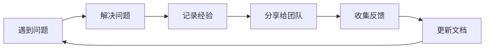

# 11.3.2 知识沉淀：经验总结与最佳实践

## 一句话破题

**最佳实践**是从多次踩坑中提炼出的可复用经验，写下来才能避免团队反复犯同样的错误。

## 核心价值

沉淀最佳实践能让你：
- 把个人经验变成团队资产
- 新人快速获得"老司机"的智慧
- 形成持续改进的知识库

## 最佳实践文档模板

```markdown
# [实践名称]

## 适用场景
描述在什么情况下应该使用这个实践

## 问题背景
我们遇到了什么问题？为什么需要这个实践？

## 推荐做法
✅ 这样做

```代码示例```

## 不推荐做法
❌ 不要这样做

```反例代码```

## 原因解释
为什么推荐做法更好？

## 相关资源
- 链接到相关文档
- 参考资料
```

## 实践示例：API 错误处理

```markdown
# API 错误处理最佳实践

## 适用场景
所有 Next.js API Routes 的错误处理

## 问题背景
不统一的错误处理导致前端难以解析，
调试困难，用户看到不友好的错误信息

## 推荐做法
✅ 使用统一的错误响应格式：

```typescript
// lib/api-error.ts
export class ApiError extends Error {
  constructor(
    public statusCode: number,
    public code: string,
    message: string
  ) {
    super(message)
  }
}

// 使用方式
throw new ApiError(404, 'USER_NOT_FOUND', '用户不存在')
```

## 不推荐做法
❌ 直接抛出原始错误：

```typescript
throw new Error('用户不存在')  // 状态码和错误类型都丢失了
```

## 原因解释
- 统一格式让前端处理更简单
- 错误码便于追踪和国际化
- 结构化错误便于日志分析
```

## 知识沉淀的时机

| 时机 | 行动 |
|------|------|
| **解决了一个棘手问题** | 记录问题和解决方案 |
| **发现一个更好的做法** | 更新或新增最佳实践 |
| **Code Review 中反复提到** | 总结成规范文档 |
| **新人问了同样的问题** | 写成 FAQ 或入门指南 |

## 知识库的持续维护



## 避坑指南

::: danger 新手最容易犯的错
1. 只记录"做什么"不记录"为什么"
2. 文档写完就扔，不持续更新
3. 最佳实践太理论化，没有代码示例
4. 不收集团队反馈，闭门造车
:::
