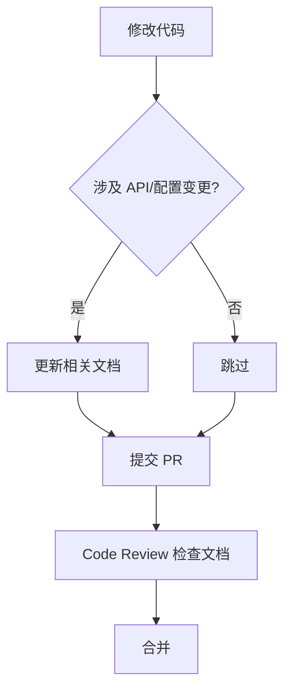

# 11.3.4 版本控制：文档与代码的同步更新

## 一句话破题

**过时的文档比没有文档更糟糕**——它会误导人。文档必须和代码一起更新。

## 核心价值

保持文档同步能让你：
- 避免新人被过时信息误导
- 保证文档的可信度
- 形成文档更新的习惯

## 文档与代码同仓库

```
project/
├── docs/           # 文档和代码在同一个仓库
│   └── api.md
├── src/
│   └── api/
└── package.json
```

好处：
- 改代码时顺手改文档
- PR 可以同时 Review 代码和文档
- 版本历史一目了然

## 在 PR 模板中强制检查

```markdown
<!-- .github/pull_request_template.md -->
## Checklist

- [ ] 代码已测试
- [ ] 类型检查通过
- [ ] **相关文档已更新**
```

## 自动检测文档过时

```yaml
# .github/workflows/docs-check.yml
name: Check Docs

on:
  pull_request:
    paths:
      - 'src/api/**'

jobs:
  check:
    runs-on: ubuntu-latest
    steps:
      - uses: actions/checkout@v4
      
      - name: Check if docs updated
        run: |
          if ! git diff --name-only origin/main | grep -q "docs/api"; then
            echo "::warning::API 代码有变更，请确认是否需要更新 docs/api 文档"
          fi
```

## 文档版本标记

在文档中标注适用的代码版本：

```markdown
<!-- docs/api/users.md -->
# 用户 API

> 适用版本: v2.0.0+
> 最后更新: 2024-01-15

## 接口说明
...
```

## 使用 TypeDoc 自动生成 API 文档

```bash
# 安装
npm install -D typedoc

# 生成文档
npx typedoc --entryPoints src/index.ts --out docs/api
```

配置文件：

```json
// typedoc.json
{
  "entryPoints": ["./src/index.ts"],
  "out": "./docs/api",
  "excludePrivate": true,
  "excludeInternal": true
}
```

## 文档更新流程



## 文档废弃处理

当功能废弃时，不要直接删除文档：

```markdown
# 旧版登录 API

::: warning 已废弃
此 API 将在 v3.0.0 移除，请迁移到 [新版登录 API](./login-v2.md)
:::

## 迁移指南
1. 将 `/api/login` 改为 `/api/v2/login`
2. 请求体增加 `clientId` 字段
```

## 避坑指南

::: danger 新手最容易犯的错
1. 改了代码忘了改文档
2. 文档放在单独的仓库，维护困难
3. 删除功能时直接删文档，没有迁移指引
4. 文档没有版本标记，不知道适用哪个版本
:::
