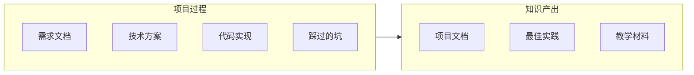

# 11.3 知识沉淀：课程化产出

## 认知重构

项目结束不是终点，**把过程中的经验变成可复用的知识**才是真正的收获。好的知识沉淀能让团队避免重复踩坑，加速新人上手。



## 本节内容

| 小节 | 核心问题 | 你将学会 |
|------|----------|----------|
| 11.3.1 文档结构 | 文档放哪里？ | 项目文档的组织方式 |
| 11.3.2 知识沉淀 | 经验如何传承？ | 最佳实践总结方法 |
| 11.3.3 教学材料 | 如何教别人？ | 案例研究与练习题 |
| 11.3.4 版本控制 | 文档怎么更新？ | 文档与代码同步 |

## 为什么要做知识沉淀

1. **避免重复踩坑**：把问题和解决方案记录下来
2. **加速新人上手**：有据可查比口耳相传更可靠
3. **形成团队资产**：知识不会因人员流动而丢失
4. **促进持续改进**：复盘总结推动流程优化

## 文档即代码

```
project/
├── docs/
│   ├── prd/           # 产品需求文档
│   ├── design/        # 技术设计方案
│   ├── api/           # API 文档
│   ├── deploy/        # 部署指南
│   └── postmortem/    # 复盘报告
├── src/
└── package.json
```

## AI 协作提示

在进行知识沉淀时，可以这样与 AI 协作：

- "根据这段代码生成 API 文档"
- "把这次排查问题的过程写成复盘报告"
- "将这个项目的架构整理成技术方案文档"

::: tip 写文档的原则
好的文档不是写给现在的自己看的，而是写给**三个月后的自己**或**新加入的同事**看的。写完后问自己：一个完全不了解背景的人能看懂吗？
:::
