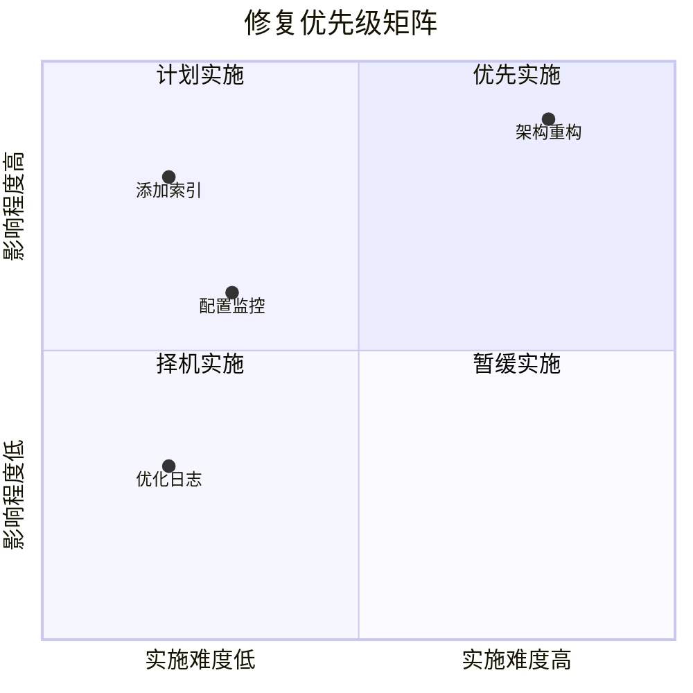

# 11.4.3 修复方案：临时修复与根本解决

## 一句话破题

修复分两步：先**止血**（临时方案快速恢复服务），再**根治**（根本方案彻底解决问题）。

## 核心价值

区分临时和根本方案能让你：
- 快速恢复服务，减少影响
- 不因赶时间而留下技术债
- 有计划地彻底解决问题

## 临时方案 vs 根本方案

| 对比项 | 临时方案 | 根本方案 |
|--------|----------|----------|
| **目标** | 快速恢复服务 | 彻底解决问题 |
| **时间** | 分钟级 | 天/周级 |
| **风险** | 可能有副作用 | 经过充分测试 |
| **适用** | 紧急止血 | 长期稳定 |

## 临时方案示例

```typescript
// 问题：数据库连接池耗尽

// 临时方案1：重启服务（最快）
pm2 restart all

// 临时方案2：增加连接数（快速配置）
DATABASE_URL="...?connection_limit=50"

// 临时方案3：降级处理（保核心功能）
async function login(credentials: LoginCredentials) {
  try {
    return await normalLogin(credentials)
  } catch (error) {
    if (isDatabaseOverload(error)) {
      // 临时降级：使用缓存验证
      return await fallbackLogin(credentials)
    }
    throw error
  }
}
```

## 根本方案示例

```typescript
// 根本方案1：添加数据库索引
// prisma/migrations/xxx_add_user_email_index.sql
CREATE INDEX idx_user_email ON users(email);

// 根本方案2：优化查询
const user = await prisma.user.findFirst({
  where: { email },
  select: { id: true, email: true, passwordHash: true }
})

// 根本方案3：添加连接池监控
const pool = new Pool({
  connectionString: DATABASE_URL,
  max: 20,
  idleTimeoutMillis: 30000,
  connectionTimeoutMillis: 2000,
})

pool.on('error', (err) => {
  logger.error('Database pool error', err)
  metrics.increment('db.pool.error')
})
```

## 修复方案模板

```markdown
## 修复方案

### 临时方案（已执行）
**操作**：重启数据库服务
**时间**：10:25
**效果**：服务恢复正常
**风险**：可能再次发生

### 根本方案（待实施）

| 措施 | 负责人 | 完成时间 | 验证方式 |
|------|--------|----------|----------|
| 添加 email 字段索引 | 张三 | 1月20日 | 查询时间 < 100ms |
| 配置连接池监控 | 李四 | 1月22日 | Grafana 看板 |
| 添加慢查询告警 | 王五 | 1月25日 | 告警触发测试 |
```

## 修复优先级矩阵



## 回滚计划

每个修复方案都应该有回滚计划：

```markdown
## 回滚计划

### 索引修复
- 回滚命令：`DROP INDEX idx_user_email;`
- 回滚时间：< 1 分钟
- 回滚影响：查询变慢

### 配置变更
- 回滚方式：恢复旧的环境变量
- 回滚命令：`kubectl rollout undo deployment/api`
```

## 避坑指南

::: danger 新手最容易犯的错
1. 只做临时方案，忘了根本方案
2. 根本方案太激进，引入新问题
3. 没有准备回滚计划
4. 修复后没有验证效果
:::
