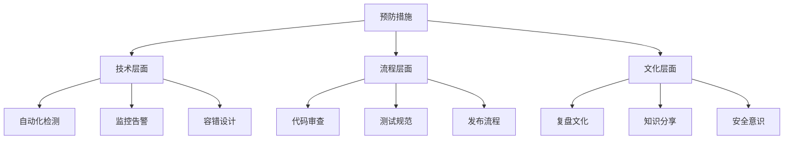
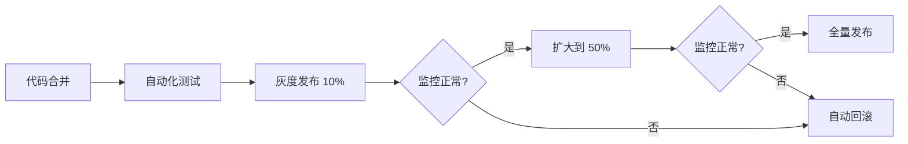

# 11.4.4 预防措施：流程改进与监控加强

## 一句话破题

好的预防措施要让**同类问题无法再次发生**，而不只是"下次小心点"。

## 核心价值

制定预防措施能让你：
- 把故障转化为系统改进
- 建立防御性的工程文化
- 持续提高系统可靠性

## 预防措施的层次



## 技术层面的预防

### 添加监控告警

```yaml
# prometheus/rules/database.yml
groups:
  - name: database
    rules:
      - alert: HighConnectionPoolUsage
        expr: db_pool_active / db_pool_max > 0.8
        for: 5m
        labels:
          severity: warning
        annotations:
          summary: "数据库连接池使用率过高"
          
      - alert: SlowQuery
        expr: db_query_duration_seconds > 1
        for: 1m
        labels:
          severity: warning
        annotations:
          summary: "检测到慢查询"
```

### 添加自动化测试

```typescript
// __tests__/performance/login.test.ts
describe('Login Performance', () => {
  it('should complete login within 500ms', async () => {
    const start = Date.now()
    await login({ email: 'test@example.com', password: 'password' })
    const duration = Date.now() - start
    
    expect(duration).toBeLessThan(500)
  })
  
  it('should handle 100 concurrent logins', async () => {
    const requests = Array(100).fill(null).map(() => 
      login({ email: 'test@example.com', password: 'password' })
    )
    
    const results = await Promise.allSettled(requests)
    const failures = results.filter(r => r.status === 'rejected')
    
    expect(failures.length).toBeLessThan(5) // 允许 5% 失败率
  })
})
```

### 添加容错设计

```typescript
// lib/database.ts
import { retry } from '@lifeomic/attempt'

export async function queryWithRetry<T>(
  queryFn: () => Promise<T>,
  options = { maxAttempts: 3, delay: 1000 }
): Promise<T> {
  return retry(queryFn, {
    maxAttempts: options.maxAttempts,
    delay: options.delay,
    factor: 2, // 指数退避
    handleError: (error, context) => {
      logger.warn(`Query failed, attempt ${context.attemptNum}`, error)
    }
  })
}
```

## 流程层面的预防

### 代码审查清单

```markdown
## PR Review Checklist

### 性能
- [ ] 数据库查询是否有索引？
- [ ] 是否有 N+1 查询问题？
- [ ] 是否设置了超时时间？

### 可观测性
- [ ] 是否添加了必要的日志？
- [ ] 是否添加了监控指标？
- [ ] 错误是否有足够的上下文？

### 容错
- [ ] 外部依赖失败时如何处理？
- [ ] 是否有降级方案？
```

### 发布流程改进



## 预防措施跟踪表

```markdown
## 改进措施跟踪

| 措施 | 类型 | 负责人 | 截止日期 | 状态 | 验证方式 |
|------|------|--------|----------|------|----------|
| 添加连接池监控 | 技术 | 张三 | 1月20日 | ✅ 完成 | Grafana 看板 |
| 添加性能测试 | 流程 | 李四 | 1月25日 | 🔄 进行中 | CI 集成 |
| 更新 Review 清单 | 流程 | 王五 | 1月22日 | ⏳ 待开始 | 文档更新 |
| 复盘分享会 | 文化 | 赵六 | 1月30日 | ⏳ 待开始 | 会议记录 |
```

## 避坑指南

::: danger 新手最容易犯的错
1. 预防措施太空泛（如"加强监控"）
2. 没有明确负责人和截止日期
3. 制定了措施但没有跟踪落实
4. 只关注技术措施，忽略流程和文化
:::
