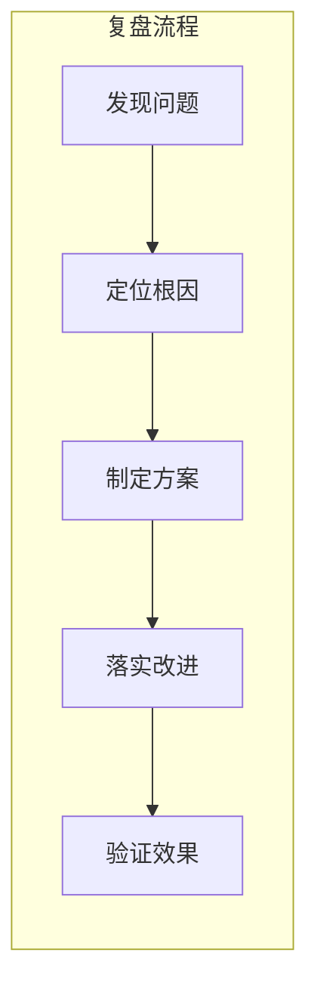

# 11.4 复盘模板：问题分析与闭环改进

## 认知重构

复盘不是追责大会，而是**从错误中学习的机会**。好的复盘能让团队越来越强，坏的复盘只会让人互相甩锅。



## 本节内容

| 小节 | 核心问题 | 你将学会 |
|------|----------|----------|
| 11.4.1 问题识别 | 出了什么问题？ | 故障现象与影响范围 |
| 11.4.2 根因分析 | 为什么会出问题？ | 5-Why 分析法 |
| 11.4.3 修复方案 | 怎么解决？ | 临时方案与根本方案 |
| 11.4.4 预防措施 | 如何避免再次发生？ | 流程改进与监控加强 |

## 复盘会议原则

1. **对事不对人**：讨论系统和流程，不追究个人责任
2. **假设每个人都是善意的**：当时的决策基于当时的信息
3. **聚焦改进**：目标是让系统更强，而不是找替罪羊
4. **公开透明**：复盘报告全员可见，促进知识共享

## 复盘报告模板

```markdown
# [事件名称] 复盘报告

## 事件概述
- 发生时间：
- 持续时长：
- 影响范围：
- 严重程度：P0/P1/P2/P3

## 时间线
| 时间 | 事件 | 操作人 |
|------|------|--------|
| 10:00 | 用户反馈无法登录 | - |
| 10:05 | 确认问题存在 | 张三 |
| 10:15 | 定位到数据库连接问题 | 李四 |
| 10:30 | 重启数据库，服务恢复 | 李四 |

## 根因分析
（使用 5-Why 分析法）

## 改进措施
| 措施 | 负责人 | 完成时间 | 状态 |
|------|--------|----------|------|
| 添加数据库连接池监控 | 张三 | 2024-01-20 | 待开始 |

## 经验教训
1. ...
2. ...
```

## AI 协作提示

在复盘时，可以这样与 AI 协作：

- "帮我用 5-Why 分析法分析这个问题的根因"
- "根据这个时间线，帮我整理成复盘报告"
- "这个问题有哪些可能的预防措施"

::: tip 复盘的价值
每一次故障都是一次学习机会。不复盘的团队会反复踩同样的坑，善于复盘的团队会越来越强。
:::
