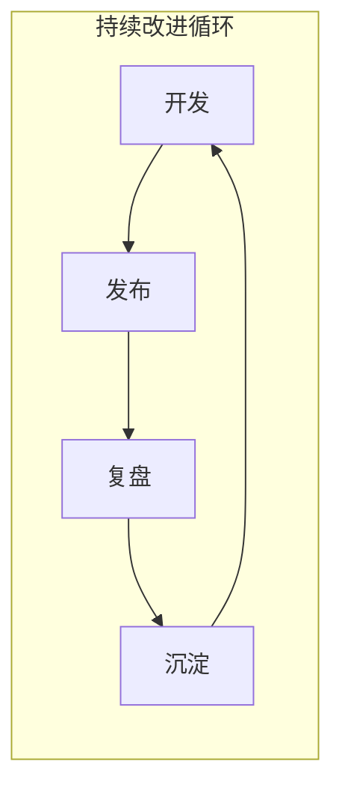

# 11 ｜发布、复盘与教学沉淀

## 认知重构

代码写完不是终点，**发布出去、从中学习、把经验传承下去**才是完整的闭环。本章将带你掌握从个人项目到团队协作都适用的发布与复盘方法论。

## 本章内容

| 小节 | 核心问题 | 你将学会 |
|------|----------|----------|
| 11.1 语义化版本与发布流 | 版本号怎么定？ | SemVer 规范、Release 流程、Git Tag |
| 11.2 GitHub Actions 部署 | 如何自动上线？ | CI/CD 配置、质量门禁、自动部署 |
| 11.3 知识沉淀 | 经验如何传承？ | 文档结构、最佳实践、教学材料 |
| 11.4 复盘模板 | 问题如何闭环？ | 根因分析、修复方案、预防措施 |

## 为什么这一章很重要

对于 Vibe Coding 而言，这一章是把**个人能力转化为团队资产**的关键：

1. **版本管理**：让你的发布可追溯、可回滚
2. **自动化部署**：减少人为失误，提升发布效率
3. **知识沉淀**：踩过的坑变成地图，下次不再重蹈覆辙
4. **复盘机制**：从每次事故中提炼出可复用的经验

## AI 协作提示

在进行发布和复盘工作时，可以这样与 AI 协作：

- "帮我分析这次发布的风险点"
- "根据这次事故写一份复盘报告"
- "把这个项目的经验总结成文档模板"
- "生成这个版本的 CHANGELOG"

::: warning 本章检查清单
1. [ ] 理解 SemVer 版本号规范
2. [ ] 能够配置基本的 GitHub Actions
3. [ ] 掌握文档组织的最佳实践
4. [ ] 会使用复盘模板进行问题分析
:::
