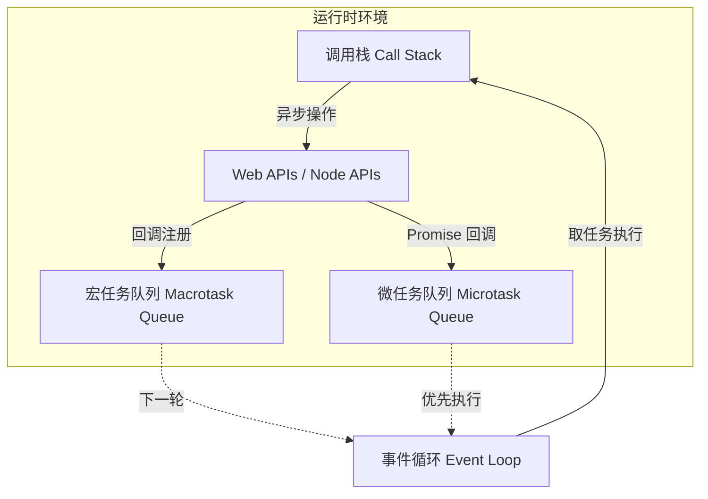
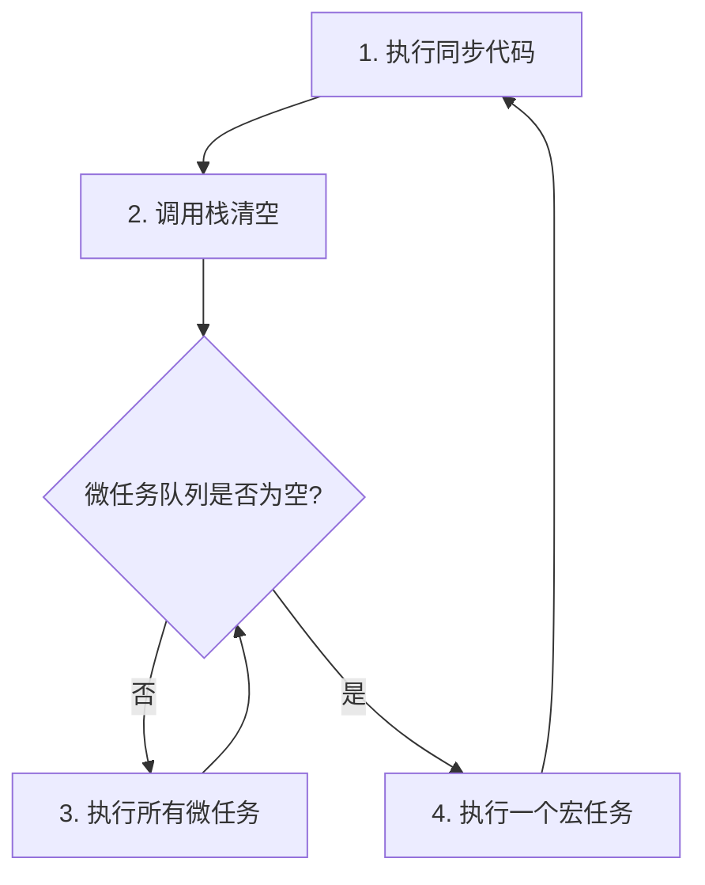

# 12.1.1 JS 的心脏——事件循环机制：Call Stack/Event Queue/Callback Queue

### 一句话破题

事件循环是 JavaScript 引擎的"心脏"，它不断地从任务队列中取出任务，放到调用栈中执行，如此循环往复，让单线程的 JS 也能处理并发操作。

### 认知重构：单线程 ≠ 一次只能做一件事

很多人误以为"单线程"意味着 JavaScript 一次只能处理一件事。实际上，JavaScript **运行时**是单线程的，但它背后有一整套异步机制（由浏览器或 Node.js 提供），让它可以"同时"发起多个操作。

真正的限制是：**JavaScript 一次只能执行一段代码**。但在执行的间隙，其他操作（如网络请求、定时器）可以在后台进行，完成后再"排队"等待执行。

### 本质还原：事件循环的核心组件



#### 1. 调用栈 (Call Stack)

调用栈是一个 LIFO（后进先出）的数据结构，记录当前正在执行的函数。

```javascript
function multiply(a, b) {
    return a * b;
}

function square(n) {
    return multiply(n, n);
}

console.log(square(5)); // 调用栈：main → square → multiply → 返回 → 返回 → 输出
```

**关键点**：如果调用栈中有正在执行的代码，事件循环就会等待，不会取新任务。这就是为什么"同步阻塞代码"会卡死页面。

#### 2. 宏任务与微任务

异步任务分为两类，它们的执行优先级不同：

| 类型 | 示例 | 优先级 |
|------|------|--------|
| **微任务 Microtask** | `Promise.then/catch/finally`、`queueMicrotask`、`MutationObserver` | 高（当前宏任务结束后立即执行） |
| **宏任务 Macrotask** | `setTimeout`、`setInterval`、`setImmediate`、I/O 操作、UI 渲染 | 低（下一轮事件循环） |

#### 3. 事件循环的执行顺序



**黄金法则**：每执行完一个宏任务，都会清空所有微任务，然后才执行下一个宏任务。

### 经典面试题：预测输出顺序

```javascript
console.log('1'); // 同步

setTimeout(() => {
    console.log('2'); // 宏任务
}, 0);

Promise.resolve().then(() => {
    console.log('3'); // 微任务
});

console.log('4'); // 同步
```

**输出**：`1 → 4 → 3 → 2`

**分析**：
1. 同步代码先执行：`1`、`4`
2. 调用栈清空，执行微任务队列：`3`
3. 进入下一轮事件循环，执行宏任务：`2`

### 觉知：审查 AI 生成代码的要点

当 AI 帮你写异步代码时，你需要检查：

1. **执行顺序**：代码的实际执行顺序是否符合业务预期？
2. **阻塞风险**：是否有大量同步计算阻塞事件循环？
3. **资源竞争**：多个异步操作是否会竞争同一资源？

### 避坑指南

- **不要在主线程做重计算**：循环百万次的计算会阻塞事件循环，导致页面卡顿。可用 Web Worker 或分片处理。
- **`setTimeout(fn, 0)` 不是"立即执行"**：它只是把回调放入宏任务队列，至少要等当前同步代码和所有微任务执行完。
- **微任务可以"无限套娃"**：如果在微任务中不断创建新的微任务，会阻塞宏任务，导致 UI 无法响应。
