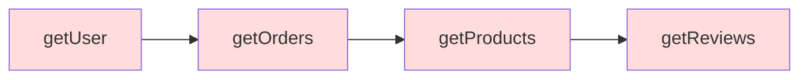

# 12.1.2 套娃式回调——异步编程模式：回调函数与回调地狱

### 一句话破题

回调函数是 JavaScript 异步编程的"原始形态"——简单直接，但当异步操作层层嵌套时，代码就会变成一场"套娃噩梦"。

### 核心价值

回调是理解所有异步模式的基础。即使你已经习惯了 `async/await`，在阅读老项目代码、使用某些 Node.js API 或调试底层问题时，回调模式仍然无处不在。

### 本质还原：什么是回调函数

回调函数的本质是：**把一个函数作为参数传给另一个函数，等某个操作完成后再调用它**。

```javascript
// 最简单的回调示例
function fetchData(callback) {
    setTimeout(() => {
        const data = { name: 'Vibe Coder' };
        callback(data); // 操作完成，调用回调
    }, 1000);
}

fetchData((result) => {
    console.log(result); // { name: 'Vibe Coder' }
});
```

**执行流程**：
1. 调用 `fetchData`，传入一个匿名函数作为回调
2. `setTimeout` 注册一个 1 秒后执行的任务
3. 主线程继续执行后续代码（不阻塞）
4. 1 秒后，回调被放入宏任务队列
5. 事件循环取出回调并执行

### 回调地狱：当套娃失控

当多个异步操作存在依赖关系时，回调会层层嵌套：

```javascript
// 回调地狱示例：读取用户 → 获取订单 → 查询商品
getUser(userId, (user) => {
    getOrders(user.id, (orders) => {
        getProducts(orders[0].productId, (product) => {
            getReviews(product.id, (reviews) => {
                // 终于拿到了评论...
                console.log(reviews);
            });
        });
    });
});
```



**这种代码的问题**：

1. **可读性差**：缩进越来越深，逻辑难以追踪
2. **错误处理复杂**：每一层都需要单独处理错误
3. **难以复用**：逻辑耦合在嵌套结构中
4. **难以测试**：无法单独测试某一层的逻辑

### Node.js 的错误优先回调

Node.js 社区约定了一种回调风格：**第一个参数永远是错误对象**。

```javascript
const fs = require('fs');

fs.readFile('/path/to/file', 'utf8', (err, data) => {
    if (err) {
        console.error('读取失败:', err);
        return;
    }
    console.log('文件内容:', data);
});
```

这种约定虽然统一了错误处理方式，但并没有解决嵌套问题：

```javascript
fs.readFile('config.json', 'utf8', (err, config) => {
    if (err) return handleError(err);
    
    fs.readFile('data.json', 'utf8', (err, data) => {
        if (err) return handleError(err);
        
        fs.writeFile('output.json', merge(config, data), (err) => {
            if (err) return handleError(err);
            console.log('完成');
        });
    });
});
```

### 早期解决方案：命名函数

在 Promise 出现之前，开发者会用命名函数来"扁平化"代码：

```javascript
function handleUser(user) {
    getOrders(user.id, handleOrders);
}

function handleOrders(orders) {
    getProducts(orders[0].productId, handleProducts);
}

function handleProducts(product) {
    getReviews(product.id, handleReviews);
}

function handleReviews(reviews) {
    console.log(reviews);
}

// 入口
getUser(userId, handleUser);
```

这种方式虽然减少了嵌套，但逻辑被分散到多个函数中，上下文也难以共享。

### AI 协作指南

当遇到老项目中的回调代码时，可以这样与 AI 协作：

- **核心意图**：告诉 AI 你想把回调风格的代码重构为现代的 `async/await` 形式。
- **需求定义公式**：`"请将这段回调风格的代码重构为 async/await，保持相同的功能，并添加适当的错误处理。"`
- **关键术语**：`回调地狱 (callback hell)`、`错误优先回调 (error-first callback)`、`promisify`、`util.promisify`

**示例对话**：

> "请帮我把这个 Node.js 风格的回调代码转换成 Promise 版本。我希望能用 `async/await` 来调用它。"

AI 通常会使用 `util.promisify` 或手动封装 Promise：

```javascript
const { promisify } = require('util');
const readFile = promisify(fs.readFile);

async function processFiles() {
    const config = await readFile('config.json', 'utf8');
    const data = await readFile('data.json', 'utf8');
    await fs.promises.writeFile('output.json', merge(config, data));
    console.log('完成');
}
```

### 避坑指南

- **避免"回调金字塔"**：如果嵌套超过 3 层，考虑重构为 Promise 或 async/await。
- **始终处理错误**：回调中的错误如果不处理，会被静默吞掉。
- **注意 `this` 绑定**：回调函数中的 `this` 可能不是你期望的对象，尤其是在类方法中。
