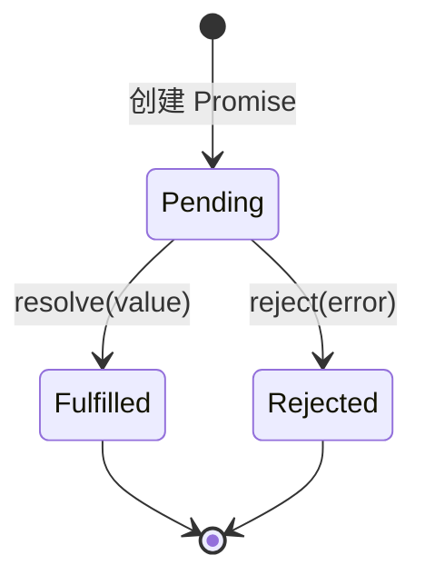
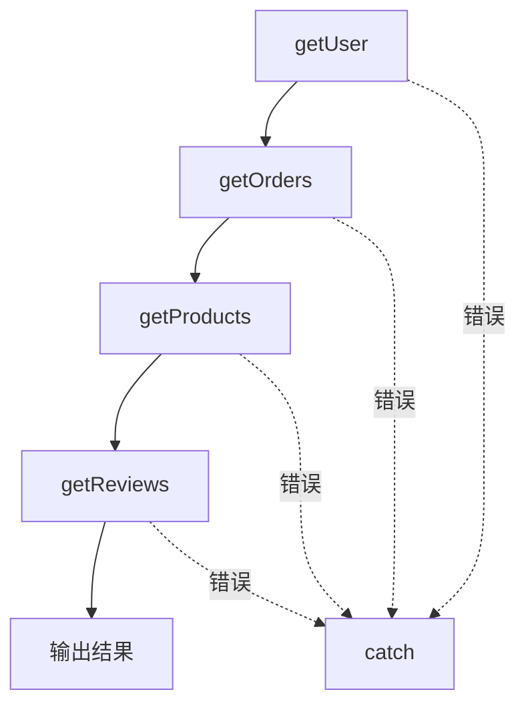

# 12.1.3 链式调用——Promise 链式调用：then/catch/finally

### 一句话破题

Promise 是 JavaScript 对"未来会发生的事"的抽象——它代表一个异步操作的最终结果，可能成功，也可能失败，但无论如何都会有个交代。

### 核心价值

Promise 解决了回调地狱的问题，它带来了：

1. **链式调用**：用 `.then()` 串联多个异步操作，告别嵌套
2. **统一错误处理**：用 `.catch()` 集中捕获整条链上的错误
3. **状态不可变**：一旦 resolve 或 reject，状态就固定了，避免回调被多次调用的问题
4. **为 async/await 铺路**：async 函数本质上就是 Promise 的语法糖

### 本质还原：Promise 的三种状态



- **Pending（待定）**：初始状态，既没成功也没失败
- **Fulfilled（已兑现）**：操作成功完成，有了结果值
- **Rejected（已拒绝）**：操作失败，有了失败原因

**关键点**：状态只能从 Pending 转变为 Fulfilled 或 Rejected，且**不可逆**。

### 创建和使用 Promise

```javascript
// 创建一个 Promise
const fetchData = new Promise((resolve, reject) => {
    setTimeout(() => {
        const success = Math.random() > 0.5;
        if (success) {
            resolve({ data: '获取成功' });
        } else {
            reject(new Error('获取失败'));
        }
    }, 1000);
});

// 使用 Promise
fetchData
    .then((result) => {
        console.log('成功:', result.data);
    })
    .catch((error) => {
        console.error('失败:', error.message);
    })
    .finally(() => {
        console.log('无论成功失败，都会执行');
    });
```

### 链式调用的魔力

每个 `.then()` 都会返回一个新的 Promise，因此可以无限串联：

```javascript
getUser(userId)
    .then((user) => getOrders(user.id))        // 返回 Promise
    .then((orders) => getProducts(orders[0].productId))  // 返回 Promise
    .then((product) => getReviews(product.id)) // 返回 Promise
    .then((reviews) => {
        console.log(reviews);
    })
    .catch((error) => {
        // 统一处理链上任何一环的错误
        console.error('出错了:', error);
    });
```

对比回调地狱，代码从"横向嵌套"变成了"纵向流水"：



### 常用的 Promise 静态方法

| 方法 | 用途 | 示例场景 |
|------|------|----------|
| `Promise.all([...])` | 等待所有 Promise 完成，任一失败则整体失败 | 同时请求多个 API，全部成功后渲染页面 |
| `Promise.allSettled([...])` | 等待所有 Promise 完成，无论成功失败都返回结果 | 批量操作，需要知道每个的状态 |
| `Promise.race([...])` | 返回第一个完成的 Promise | 请求超时控制 |
| `Promise.any([...])` | 返回第一个成功的 Promise | 多源取数，取最快的一个 |

```javascript
// Promise.all 示例：并行请求
const [users, products, orders] = await Promise.all([
    fetch('/api/users'),
    fetch('/api/products'),
    fetch('/api/orders')
]);

// Promise.race 示例：超时控制
const timeout = new Promise((_, reject) => 
    setTimeout(() => reject(new Error('超时')), 5000)
);

const result = await Promise.race([
    fetch('/api/slow-endpoint'),
    timeout
]);
```

### 常见陷阱

#### 1. 忘记 return

```javascript
// ❌ 错误：then 中没有 return，下一个 then 收到 undefined
getUser(userId)
    .then((user) => {
        getOrders(user.id); // 忘记 return
    })
    .then((orders) => {
        console.log(orders); // undefined!
    });

// ✅ 正确：
getUser(userId)
    .then((user) => {
        return getOrders(user.id);
    })
    .then((orders) => {
        console.log(orders);
    });
```

#### 2. 错误被静默吞掉

```javascript
// ❌ 错误：没有 catch，错误会被静默忽略
fetchData.then((data) => {
    throw new Error('处理出错');
});

// ✅ 正确：始终添加 catch
fetchData
    .then((data) => {
        throw new Error('处理出错');
    })
    .catch((error) => {
        console.error(error);
    });
```

### AI 协作指南

- **核心意图**：告诉 AI 你需要处理多个异步操作，并指明它们是串行还是并行。
- **需求定义公式**：`"请用 Promise 实现：先获取用户信息，再根据用户 ID 获取订单列表，最后返回合并后的数据。"`
- **关键术语**：`Promise.all`、`Promise.race`、`链式调用 (chaining)`、`错误处理 (error handling)`

**审查要点**：
1. 每个 `.then()` 是否正确 `return`？
2. 是否有 `.catch()` 处理错误？
3. 并行操作是否使用了 `Promise.all`？
4. 是否有不必要的嵌套 Promise？

### 避坑指南

- **避免 Promise 嵌套**：如果在 `.then()` 里又创建新的 Promise 链，说明你没有正确使用链式调用。
- **`.finally()` 不能改变结果**：它只用于清理操作，不能修改 resolve 或 reject 的值。
- **注意 `Promise.all` 的失败策略**：任一 Promise 失败，整体就失败。如果需要容错，使用 `Promise.allSettled`。
