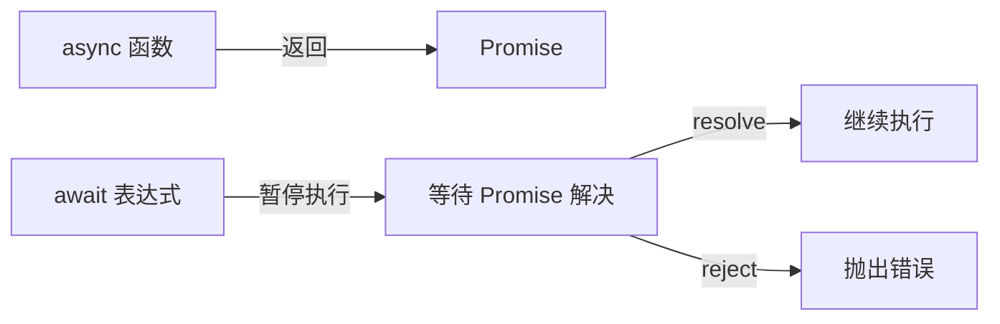
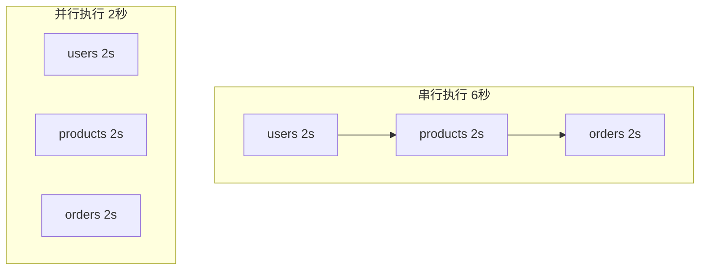

# 12.1.4 像写同步一样写异步——async/await 语法：同步风格的异步编程

### 一句话破题

`async/await` 是 Promise 的语法糖，它让异步代码看起来像同步代码，读起来像散文，调起来不想死。

### 核心价值

`async/await` 是现代 JavaScript 异步编程的首选方式：

1. **可读性极佳**：代码从上往下读，逻辑一目了然
2. **错误处理简单**：用熟悉的 `try/catch` 替代 `.catch()`
3. **调试友好**：可以像同步代码一样设置断点
4. **与 Promise 完全兼容**：`async` 函数返回 Promise，`await` 解包 Promise

### 本质还原：async/await 的底层机制



**关键理解**：
- `async` 函数**总是**返回一个 Promise
- `await` 会**暂停**函数执行，直到 Promise 解决
- 暂停期间，事件循环可以执行其他任务（非阻塞）

### 从 Promise 到 async/await

```javascript
// Promise 风格
function getUserData(userId) {
    return getUser(userId)
        .then((user) => getOrders(user.id))
        .then((orders) => getProducts(orders[0].productId))
        .then((product) => {
            return { product };
        });
}

// async/await 风格（完全等价）
async function getUserData(userId) {
    const user = await getUser(userId);
    const orders = await getOrders(user.id);
    const product = await getProducts(orders[0].productId);
    return { product };
}
```

两者在功能上完全等价，但 `async/await` 版本明显更易读。

### 错误处理：try/catch 的回归

```javascript
async function fetchData() {
    try {
        const user = await getUser(userId);
        const orders = await getOrders(user.id);
        return { user, orders };
    } catch (error) {
        // 统一处理任何一步的错误
        console.error('获取数据失败:', error);
        throw error; // 可选：继续向上抛出
    } finally {
        // 清理操作
        console.log('请求结束');
    }
}
```

### 并行执行：不要过度 await

**常见错误**：串行执行本可并行的操作

```javascript
// ❌ 串行执行，总耗时 = 各操作耗时之和
async function fetchAll() {
    const users = await fetch('/api/users');       // 2s
    const products = await fetch('/api/products'); // 2s
    const orders = await fetch('/api/orders');     // 2s
    // 总耗时：6s
}

// ✅ 并行执行，总耗时 = 最慢操作的耗时
async function fetchAll() {
    const [users, products, orders] = await Promise.all([
        fetch('/api/users'),      // 2s
        fetch('/api/products'),   // 2s ← 并行
        fetch('/api/orders')      // 2s
    ]);
    // 总耗时：2s
}
```



### 在循环中使用 async/await

```javascript
// ❌ 错误：forEach 不会等待 async 回调
const ids = [1, 2, 3];
ids.forEach(async (id) => {
    const data = await fetchData(id);
    console.log(data);
});
console.log('完成'); // 这行会先执行！

// ✅ 正确：串行处理
for (const id of ids) {
    const data = await fetchData(id);
    console.log(data);
}
console.log('完成'); // 所有请求完成后执行

// ✅ 正确：并行处理
const results = await Promise.all(
    ids.map((id) => fetchData(id))
);
console.log('完成');
```

### 顶层 await

在 ES 模块中，可以直接使用顶层 `await`：

```javascript
// config.mjs
const response = await fetch('/api/config');
export const config = await response.json();

// app.mjs
import { config } from './config.mjs';
console.log(config); // 已经是解析后的数据
```

**注意**：顶层 `await` 只能在 ES 模块中使用，不能在 CommonJS 或普通脚本中使用。

### AI 协作指南

与 AI 协作编写异步代码时：

- **核心意图**：明确告诉 AI 操作之间的依赖关系——哪些必须串行，哪些可以并行。
- **需求定义公式**：`"请实现一个 async 函数，先获取用户信息，然后并行获取用户的订单和收藏列表，最后合并返回。"`
- **关键术语**：`async/await`、`Promise.all`、`串行 (sequential)`、`并行 (parallel)`、`try/catch`

**审查要点**：

1. 有无不必要的串行 `await`？能否用 `Promise.all` 优化？
2. 错误处理是否完整？是否有未捕获的 Promise rejection？
3. 循环中的 `await` 是否符合预期（串行 vs 并行）？
4. 是否正确理解了 `async` 函数的返回值是 Promise？

### 避坑指南

- **不要在 `forEach` 中使用 `await`**：`forEach` 不会等待 async 回调完成。使用 `for...of` 或 `Promise.all` + `map`。
- **记住 `async` 函数返回 Promise**：调用 `async` 函数后，如果不 `await`，代码会继续执行而不等待结果。
- **避免 `await` 嵌套**：如果发现自己在写 `await (await ...)`，说明代码结构可能有问题。
- **Top-level await 需要 ES 模块**：在 Node.js 中，需要使用 `.mjs` 扩展名或在 `package.json` 中设置 `"type": "module"`。
