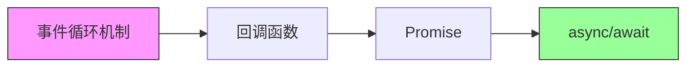

# 12.1 为什么 JS 能一心多用——Node 进程与事件循环：回调/Promise/async-await

### 一句话破题

JavaScript 是**单线程**语言，却能同时处理网络请求、文件读写、用户交互——这一切的秘密，都藏在**事件循环**这个"任务调度员"身上。

### 核心价值

理解事件循环，是从"会写异步代码"到"能调试异步 Bug"的分水岭。当你遇到以下问题时，事件循环就是你的诊断工具：

- 为什么 `setTimeout(fn, 0)` 不会立即执行？
- 为什么 `Promise.then` 比 `setTimeout` 先执行？
- 为什么页面会"卡死"？
- 为什么数据库查询后拿到的是 `undefined`？

### 本章导览

本节将从底层机制出发，带你理解 JavaScript 异步编程的演进之路：

1. **事件循环机制**：理解 Call Stack、Event Queue、微任务与宏任务的调度规则。
2. **回调函数**：异步编程的起点，以及它带来的"回调地狱"问题。
3. **Promise**：用链式调用解决嵌套问题，并引入统一的错误处理。
4. **async/await**：让异步代码"看起来像同步"，提升可读性和可维护性。

### 为什么 Vibe Coder 必须懂这些？

在 AI 辅助编程的时代，你可以让 AI 帮你写异步代码。但当代码出问题时，AI 给出的解释往往是"照本宣科"的。**只有你真正理解事件循环，才能在 AI 的建议中识别出正确的方向，而非盲目接受一个"看起来合理"的答案。**

> 面对 AI 生成的异步代码，你的核心审查点是：
> - 这段代码的执行顺序是否符合预期？
> - 是否存在竞态条件？
> - 错误是否被正确捕获？
