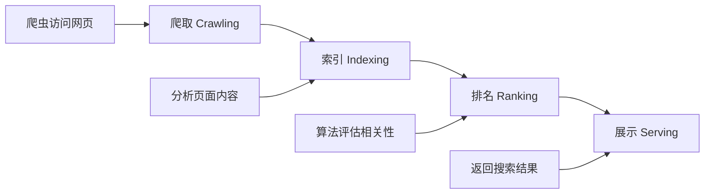
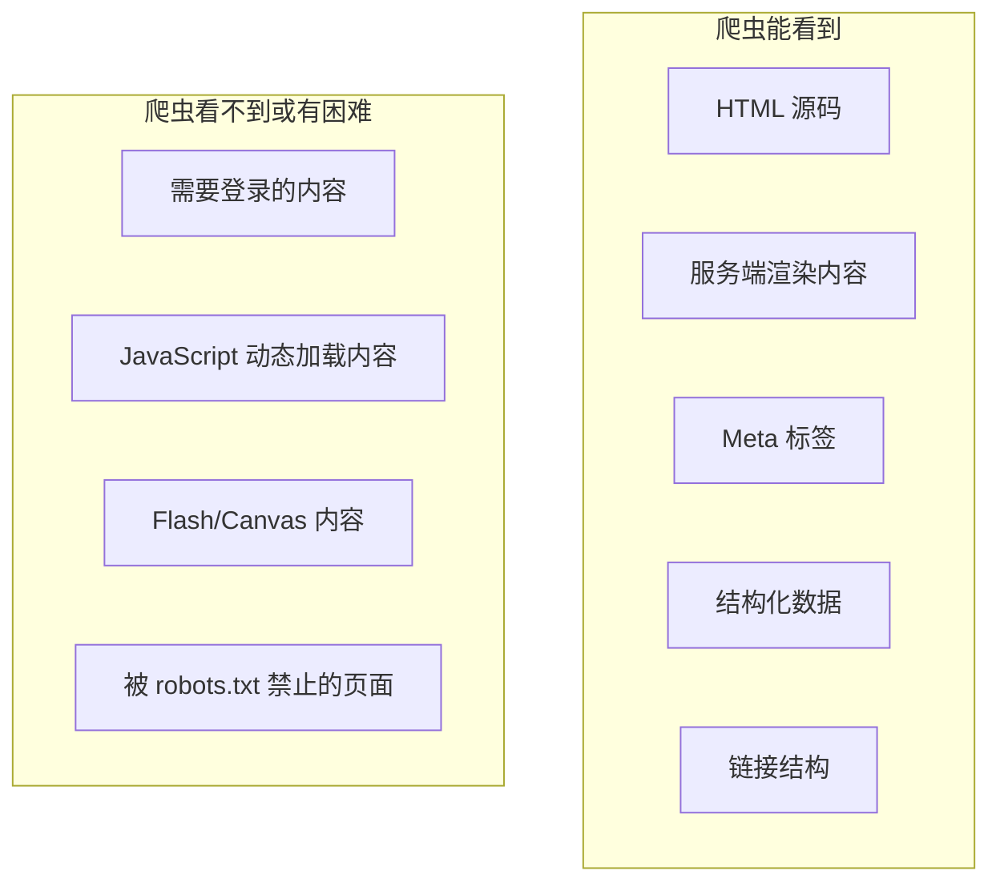

# 12.2.1 搜索引擎如何工作——搜索引擎优化基础：爬虫与索引原理

### 一句话破题

搜索引擎通过"爬虫"抓取网页、"索引"整理内容、"排名"决定展示顺序——理解这三步，就掌握了 SEO 优化的底层逻辑。

### 本质还原：搜索引擎的工作流程



#### 1. 爬取阶段

搜索引擎的"爬虫"（如 Googlebot、Baiduspider）是一个自动化程序，它会：

1. 从已知页面的链接出发，发现新页面
2. 请求页面的 HTML 内容
3. 解析 HTML，提取文本、链接、图片等信息
4. 将发现的新链接加入待爬取队列

**关键点**：
- 爬虫主要看的是 **HTML 源码**，而不是渲染后的页面
- 现代爬虫（如 Googlebot）可以执行 JavaScript，但有延迟和限制
- 爬虫会遵守 `robots.txt` 的规则

#### 2. 索引阶段

爬取到的内容会被处理并存入"索引库"：

- **内容分析**：提取关键词、识别页面主题
- **去重处理**：识别并过滤重复内容
- **质量评估**：判断页面的权威性、原创性
- **关系建立**：理解页面之间的链接关系

#### 3. 排名阶段

当用户搜索时，搜索引擎会从索引库中找出相关页面，并根据数百个因素进行排名：

- **内容相关性**：页面内容与搜索词的匹配程度
- **页面质量**：内容的深度、原创性、更新频率
- **用户体验**：加载速度、移动端适配、交互体验
- **外部信号**：其他网站的链接（外链）、社交分享

### 爬虫眼中的你的网页



### robots.txt：与爬虫的"君子协定"

`robots.txt` 是放在网站根目录的文件，用于告诉爬虫哪些内容可以抓取：

```txt
# 允许所有爬虫访问所有内容
User-agent: *
Allow: /

# 禁止爬虫访问管理后台
Disallow: /admin/

# 指定站点地图位置
Sitemap: https://example.com/sitemap.xml
```

### AI 协作指南

- **核心意图**：让 AI 帮你生成 `robots.txt` 或检查现有配置是否合理。
- **需求定义公式**：`"请帮我生成一个 robots.txt 文件，允许搜索引擎抓取所有公开页面，但禁止抓取 /api/ 和 /admin/ 目录。"`
- **关键术语**：`robots.txt`、`User-agent`、`Disallow`、`Sitemap`、`noindex`

### 避坑指南

- **不要屏蔽 CSS 和 JS**：现代爬虫需要这些资源来正确渲染页面。
- **注意 noindex 和 Disallow 的区别**：`Disallow` 阻止爬取，`noindex` 阻止索引。被 Disallow 的页面如果有外链指向，仍可能被索引。
- **定期检查爬取状态**：使用 Google Search Console 或百度站长工具监控爬虫行为。
