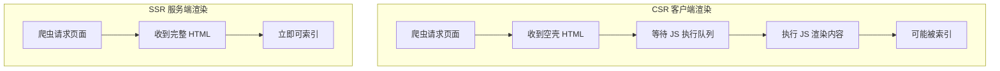

# 12.2.2 SSR 对 SEO 的好处——SSR 优势：首屏渲染与 SEO 友好

### 一句话破题

SSR 让搜索引擎爬虫"一眼就能看到"页面的完整内容，而不是一堆等待 JavaScript 执行的空标签。

### 认知重构：爬虫不是浏览器

虽然现代搜索引擎（如 Google）的爬虫已经能执行 JavaScript，但这个过程存在显著的**延迟和不确定性**：

1. **两阶段爬取**：先抓取 HTML，稍后才执行 JS 并重新处理
2. **渲染队列**：JS 渲染需要排队，可能延迟数小时甚至数天
3. **资源限制**：爬虫对 JS 执行时间和资源有限制
4. **兼容性问题**：某些 JS 特性可能不被完全支持

### 本质还原：CSR vs SSR 的 SEO 差异



**CSR 返回的 HTML**：

```html
<!DOCTYPE html>
<html>
<body>
  <div id="root"></div>
  <script src="/bundle.js"></script>
</body>
</html>
```

爬虫第一时间看到的只是一个空的 `<div>`。

**SSR 返回的 HTML**：

```html
<!DOCTYPE html>
<html>
<body>
  <div id="root">
    <h1>欢迎来到我的博客</h1>
    <article>
      <h2>如何学习 Next.js</h2>
      <p>Next.js 是一个强大的 React 框架...</p>
    </article>
  </div>
</body>
</html>
```

爬虫立即就能看到完整的内容结构。

### Next.js 中的 SEO 友好实践

Next.js 的 App Router 默认使用服务器组件，天然对 SEO 友好：

```tsx
// app/blog/[slug]/page.tsx
import { Metadata } from 'next';

// 动态生成 Meta 信息
export async function generateMetadata({ params }): Promise<Metadata> {
  const post = await getPost(params.slug);
  return {
    title: post.title,
    description: post.excerpt,
    openGraph: {
      title: post.title,
      images: [post.coverImage],
    },
  };
}

// 服务端渲染页面内容
export default async function BlogPost({ params }) {
  const post = await getPost(params.slug);
  
  return (
    <article>
      <h1>{post.title}</h1>
      <div dangerouslySetInnerHTML={{ __html: post.content }} />
    </article>
  );
}
```

### 什么时候用 SSR，什么时候用 CSR？

| 场景 | 推荐方案 | 原因 |
|------|----------|------|
| 博客、新闻、产品页 | SSR/SSG | 需要被搜索引擎索引 |
| 用户仪表盘 | CSR | 无需 SEO，需要登录 |
| 电商商品页 | SSR + ISR | 需要 SEO，内容定期更新 |
| 实时聊天 | CSR | 高度动态，无需索引 |

### AI 协作指南

- **核心意图**：让 AI 帮你判断页面应该使用哪种渲染策略，并生成相应的代码。
- **需求定义公式**：`"这是一个博客文章页面，需要对 SEO 友好。请使用 Next.js App Router 的服务器组件实现，并包含动态 Meta 标签。"`
- **关键术语**：`SSR`、`generateMetadata`、`服务器组件`、`静态生成 (SSG)`、`ISR`

**审查要点**：

1. 页面的核心内容是否在服务端渲染？
2. `'use client'` 指令是否只用在真正需要客户端交互的组件上？
3. 动态 Meta 标签是否正确反映页面内容？

### 避坑指南

- **不要过度使用 `'use client'`**：这会让组件变成客户端渲染，影响 SEO。
- **注意数据获取时机**：在服务器组件中获取数据，确保内容在首次渲染时就存在。
- **测试爬虫视角**：使用 Google Search Console 的"URL 检查"工具查看页面在爬虫眼中的样子。
