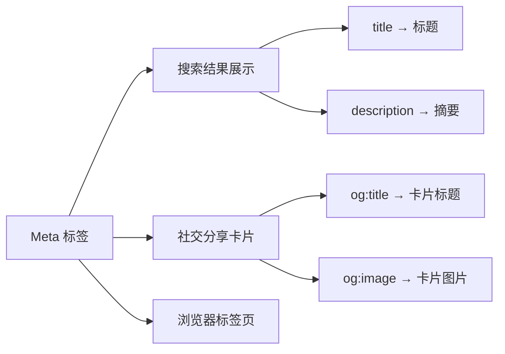

# 12.2.3 网页的身份证——Meta 标签：title/description/keywords

### 一句话破题

Meta 标签是网页的"身份证"，它告诉搜索引擎和社交平台"我是谁、我有什么内容"，直接影响搜索结果的展示和点击率。

### 核心价值

Meta 标签虽然不直接影响排名权重，但它决定了用户在搜索结果中看到什么：

1. **Title 标签**：显示在搜索结果的标题位置，是用户第一眼看到的内容
2. **Description 标签**：显示在标题下方的描述文字，影响用户是否点击
3. **Open Graph 标签**：控制在社交媒体分享时的展示效果

### 本质还原：Meta 标签的工作原理



### 核心 Meta 标签详解

```html
<head>
  <!-- 基础 Meta 标签 -->
  <title>如何学习 Next.js - Vibe Coding 教程</title>
  <meta name="description" content="从零开始学习 Next.js，掌握服务端渲染、App Router 等核心概念。适合前端开发者的进阶教程。">
  <meta name="keywords" content="Next.js,React,SSR,前端开发">
  
  <!-- Open Graph 标签（社交分享） -->
  <meta property="og:title" content="如何学习 Next.js">
  <meta property="og:description" content="从零开始学习 Next.js 的完整教程">
  <meta property="og:image" content="https://example.com/og-image.jpg">
  <meta property="og:type" content="article">
  
  <!-- Twitter 卡片 -->
  <meta name="twitter:card" content="summary_large_image">
  <meta name="twitter:title" content="如何学习 Next.js">
  <meta name="twitter:image" content="https://example.com/twitter-image.jpg">
</head>
```

### 最佳实践：Title 标签

| 要素 | 建议 | 示例 |
|------|------|------|
| 长度 | 50-60 字符（中文约 25-30 字） | ✅ 适中 |
| 结构 | 核心关键词 - 补充信息 - 品牌名 | `Next.js 入门教程 - 从零到一 | Vibe Coding` |
| 唯一性 | 每个页面的 title 必须不同 | ❌ 不要所有页面用同一个 title |
| 关键词 | 核心关键词靠前 | ✅ `Next.js 教程` 而非 `教程 Next.js` |

### 最佳实践：Description 标签

| 要素 | 建议 |
|------|------|
| 长度 | 120-160 字符（中文约 60-80 字） |
| 内容 | 简洁概括页面核心内容，包含 1-2 个关键词 |
| 行动召唤 | 可以包含引导性语言，如"了解更多"、"立即学习" |
| 唯一性 | 每个页面应有独特的描述 |

### Next.js 中的 Meta 标签管理

```tsx
// app/layout.tsx - 全局默认 Meta
import { Metadata } from 'next';

export const metadata: Metadata = {
  title: {
    default: 'Vibe Coding 教程',
    template: '%s | Vibe Coding', // 子页面会自动套用此模板
  },
  description: '从零开始学习全栈开发',
  openGraph: {
    siteName: 'Vibe Coding',
    locale: 'zh_CN',
    type: 'website',
  },
};

// app/blog/[slug]/page.tsx - 动态页面 Meta
export async function generateMetadata({ params }): Promise<Metadata> {
  const post = await getPost(params.slug);
  
  return {
    title: post.title, // 会变成 "文章标题 | Vibe Coding"
    description: post.excerpt,
    openGraph: {
      title: post.title,
      description: post.excerpt,
      images: [
        {
          url: post.coverImage,
          width: 1200,
          height: 630,
          alt: post.title,
        },
      ],
    },
  };
}
```

### AI 协作指南

- **核心意图**：让 AI 为特定页面生成合适的 Meta 标签。
- **需求定义公式**：`"请为这篇关于 [主题] 的博客文章生成 SEO 友好的 Meta 标签，包括 title、description 和 Open Graph 标签。目标关键词是 [关键词]。"`
- **关键术语**：`Metadata`、`generateMetadata`、`Open Graph`、`Twitter Card`

**审查要点**：

1. title 是否简洁且包含核心关键词？
2. description 是否准确概括页面内容？
3. og:image 是否设置且尺寸正确（建议 1200x630）？
4. 每个页面的 Meta 是否唯一？

### 避坑指南

- **不要堆砌关键词**：`keywords` 标签已被大多数搜索引擎忽略，堆砌关键词可能被视为作弊。
- **Description 不要复制正文**：应该是精心编写的摘要，而非直接截取正文。
- **注意特殊字符**：引号、尖括号等需要正确转义。
- **测试社交分享**：使用 Facebook Sharing Debugger 或 Twitter Card Validator 测试分享效果。
