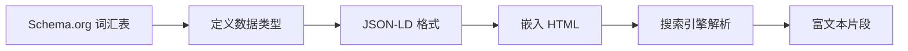

# 12.2.5 帮爬虫看懂内容——结构化数据：Schema.org 与 JSON-LD

### 一句话破题

结构化数据是一种"语义标记"，它用搜索引擎能理解的格式描述页面内容，从而让你的网站在搜索结果中展示富文本片段，获得更高的点击率。

### 核心价值

结构化数据可以让搜索结果变得更"丰富"：

1. **富文本片段**：显示评分、价格、作者等额外信息
2. **知识面板**：在搜索结果右侧展示详细信息卡片
3. **精选摘要**：内容被直接展示在搜索结果顶部
4. **语音搜索**：更容易被语音助手引用

### 本质还原：Schema.org 与 JSON-LD

**Schema.org** 是由 Google、Bing、Yahoo 等搜索引擎共同维护的词汇表，定义了数百种内容类型和属性。

**JSON-LD** 是在 HTML 中嵌入结构化数据的推荐格式，它是一段 JSON 脚本，放在 `<script type="application/ld+json">` 标签中。



### 常见结构化数据类型

#### 文章

```json
{
  "@context": "https://schema.org",
  "@type": "Article",
  "headline": "如何学习 Next.js",
  "author": {
    "@type": "Person",
    "name": "Vibe Coder"
  },
  "datePublished": "2024-01-15",
  "dateModified": "2024-01-20",
  "image": "https://example.com/images/nextjs-cover.jpg",
  "publisher": {
    "@type": "Organization",
    "name": "Vibe Coding",
    "logo": {
      "@type": "ImageObject",
      "url": "https://example.com/logo.png"
    }
  }
}
```

#### 产品

```json
{
  "@context": "https://schema.org",
  "@type": "Product",
  "name": "Next.js 实战课程",
  "image": "https://example.com/course.jpg",
  "description": "从零到一学习 Next.js 全栈开发",
  "offers": {
    "@type": "Offer",
    "price": "99.00",
    "priceCurrency": "CNY",
    "availability": "https://schema.org/InStock"
  },
  "aggregateRating": {
    "@type": "AggregateRating",
    "ratingValue": "4.8",
    "reviewCount": "256"
  }
}
```

#### FAQ

```json
{
  "@context": "https://schema.org",
  "@type": "FAQPage",
  "mainEntity": [
    {
      "@type": "Question",
      "name": "Next.js 是什么？",
      "acceptedAnswer": {
        "@type": "Answer",
        "text": "Next.js 是一个基于 React 的全栈 Web 框架，支持服务端渲染、静态生成等多种渲染模式。"
      }
    }
  ]
}
```

### Next.js 中添加结构化数据

```tsx
// app/blog/[slug]/page.tsx
export default async function BlogPost({ params }) {
  const post = await getPost(params.slug);
  
  const jsonLd = {
    '@context': 'https://schema.org',
    '@type': 'Article',
    headline: post.title,
    author: {
      '@type': 'Person',
      name: post.author.name,
    },
    datePublished: post.publishedAt,
    dateModified: post.updatedAt,
    image: post.coverImage,
  };

  return (
    <>
      <script
        type="application/ld+json"
        dangerouslySetInnerHTML={{ __html: JSON.stringify(jsonLd) }}
      />
      <article>
        <h1>{post.title}</h1>
        {/* ... */}
      </article>
    </>
  );
}
```

### 验证结构化数据

使用 Google 的工具验证你的结构化数据：

1. **Rich Results Test**：测试是否能生成富文本片段
2. **Schema Markup Validator**：验证语法是否正确

### AI 协作指南

- **核心意图**：让 AI 为特定页面类型生成合适的结构化数据。
- **需求定义公式**：`"请为这个博客文章页面生成 JSON-LD 格式的结构化数据，类型是 Article，需要包含作者、发布时间、封面图片等信息。"`
- **关键术语**：`Schema.org`、`JSON-LD`、`@type`、`Rich Snippets`、`结构化数据`

**审查要点**：

1. `@context` 和 `@type` 是否正确？
2. 必填字段是否完整？
3. 数据与页面实际内容是否一致？
4. 日期格式是否正确（ISO 8601）？

### 避坑指南

- **数据必须与页面内容一致**：虚假的结构化数据可能导致惩罚。
- **不要过度标记**：只标记页面的核心内容，不要标记广告或无关内容。
- **测试后再上线**：使用验证工具确保没有语法错误。
- **关注警告信息**：即使验证通过，也要注意警告信息，它们可能影响富文本片段的展示。
