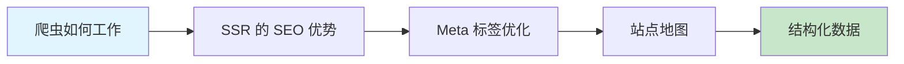

# 12.2 如何让谷歌/百度搜到你——SEO：SSR/Meta/站点地图/结构化数据

### 一句话破题

SEO 是让搜索引擎"读懂"你的网站、并愿意把它推荐给用户的技术。对于想要获得自然流量的产品来说，这是一项必修课。

### 核心价值

在流量越来越贵的今天，SEO 是少数"免费"的流量来源之一。做好 SEO 意味着：

1. **自然曝光**：用户主动搜索时找到你，转化意向更强
2. **长期收益**：一次优化，持续获客
3. **品牌可信度**：排名靠前的网站更容易获得用户信任
4. **降低获客成本**：相比付费广告，SEO 的边际成本趋近于零

### 本章导览

1. **搜索引擎爬虫**：理解爬虫的工作原理和"看页面"的方式
2. **SSR 与 SEO**：为什么服务端渲染对 SEO 至关重要
3. **Meta 标签**：网页的"身份证"——title、description、keywords
4. **站点地图**：给爬虫画一张网站的"导游图"
5. **结构化数据**：用 Schema.org 帮爬虫"深度理解"你的内容

### 为什么 Vibe Coder 需要关注 SEO？

AI 可以帮你生成技术上正确的代码，但 SEO 是一门需要**理解搜索引擎和用户意图**的学问。你需要：

- 知道哪些内容应该被索引，哪些不应该
- 理解不同渲染策略对 SEO 的影响
- 能够审查 AI 生成的 Meta 标签是否恰当

> **核心审查点**：AI 生成的页面是否对搜索引擎友好？首屏内容是服务端渲染还是客户端渲染？Meta 信息是否准确反映页面内容？
