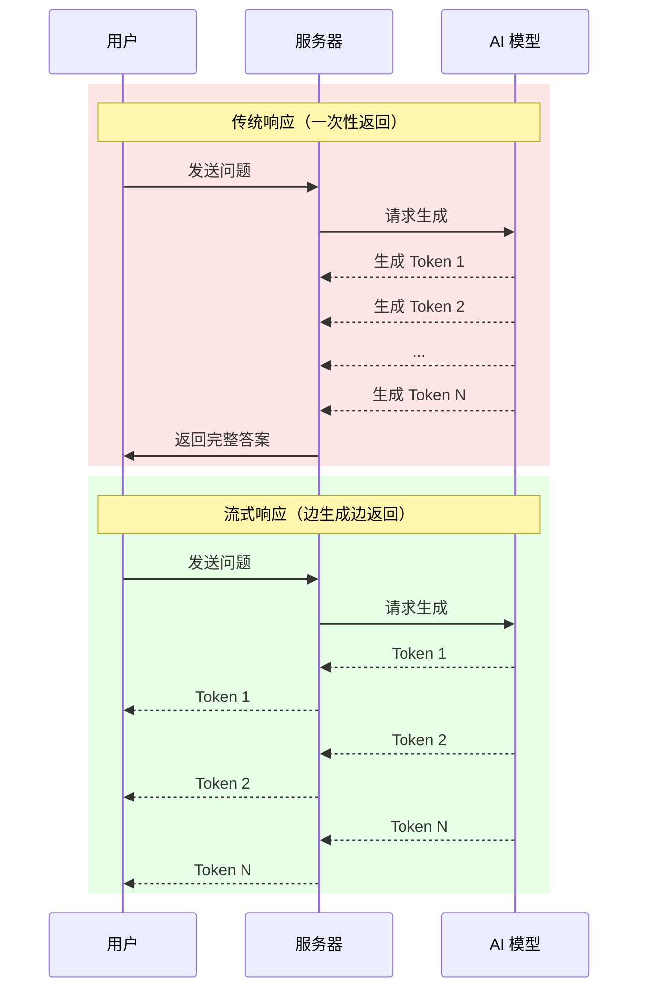

# 12.3.1 AI 应用的核心模式——流式响应原理：为什么需要 Streaming UI

### 一句话破题

流式响应让 AI 的回答像"打字机"一样逐字出现，将用户的等待焦虑转化为阅读体验，这是现代 AI 应用的核心交互模式。

### 认知重构：为什么等待 5 秒感觉像 50 秒

当你向 ChatGPT 提问时，模型实际上是**逐个 Token 生成**答案的。传统的 HTTP 请求会等待所有 Token 生成完毕后才返回，这意味着：

- 用户需要盯着空白屏幕等待数秒
- 如果回答很长，等待时间可能超过 10 秒
- 用户无法判断请求是否卡住了

流式响应的做法是：**一边生成，一边返回**。

### 本质还原：传统响应 vs 流式响应



### 技术实现：Server-Sent Events

流式响应通常基于 **Server-Sent Events (SSE)** 或 **WebSocket** 实现。Vercel AI SDK 默认使用 SSE：

```javascript
// 服务端发送的格式
data: {"content": "你"}
data: {"content": "好"}
data: {"content": "！"}
data: [DONE]
```

客户端通过 `EventSource` 或 `fetch` + `ReadableStream` 接收：

```javascript
const response = await fetch('/api/chat', {
  method: 'POST',
  body: JSON.stringify({ message: 'Hello' }),
});

const reader = response.body.getReader();
const decoder = new TextDecoder();

while (true) {
  const { done, value } = await reader.read();
  if (done) break;
  
  const text = decoder.decode(value);
  console.log(text); // 逐步输出
}
```

### 用户体验的质变

| 指标 | 传统响应 | 流式响应 |
|------|----------|----------|
| 首字节时间 | 5-10 秒 | < 1 秒 |
| 感知等待时间 | 很长 | 几乎无感 |
| 中断能力 | 无法中断 | 可随时停止 |
| 错误反馈 | 超时后才知道 | 实时感知 |

### 流式响应的挑战

虽然流式响应体验更好，但也带来了一些技术挑战：

1. **状态管理**：需要追踪"正在生成"、"已完成"、"发生错误"等状态
2. **错误处理**：流式传输中途出错如何恢复？
3. **渲染性能**：频繁更新 DOM 可能导致卡顿
4. **取消机制**：用户中途取消如何优雅处理？

这些问题，Vercel AI SDK 都提供了解决方案。

### AI 协作指南

- **核心意图**：让 AI 帮你理解或实现流式响应的底层机制。
- **需求定义公式**：`"请解释 Server-Sent Events 如何工作，并给出一个 Next.js 中实现流式 AI 响应的基础示例。"`
- **关键术语**：`SSE`、`ReadableStream`、`TextDecoder`、`流式传输 (streaming)`

### 避坑指南

- **不要忘记处理连接中断**：网络不稳定时，流可能意外关闭。
- **注意内存管理**：长时间的流式响应可能累积大量数据。
- **测试弱网环境**：流式响应在弱网下可能表现异常。
