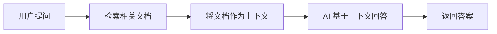

# 12.3.5 高级应用场景——RAG 与多模态：检索增强生成与图文混合

### 一句话破题

RAG 让 AI 能"查阅资料"后回答问题，多模态让 AI 能"看图说话"——这两项技术大幅扩展了 AI 应用的能力边界。

### RAG：检索增强生成

#### 什么是 RAG？



RAG 的核心思想是：**先搜索，再回答**。这解决了 AI 知识过时、无法访问私有数据等问题。

#### 基础实现

```typescript
// app/api/chat/route.ts
import { openai } from '@ai-sdk/openai';
import { streamText } from 'ai';
import { searchDocuments } from '@/lib/search'; // 你的搜索逻辑

export async function POST(req: Request) {
  const { messages } = await req.json();
  
  // 获取用户最新问题
  const lastMessage = messages[messages.length - 1];
  
  // 检索相关文档
  const relevantDocs = await searchDocuments(lastMessage.content);
  
  // 构建上下文
  const context = relevantDocs
    .map((doc) => `---\n${doc.title}\n${doc.content}\n---`)
    .join('\n');

  const result = streamText({
    model: openai('gpt-4o'),
    system: `你是一个知识助手。请根据以下资料回答用户问题。如果资料中没有相关信息，请诚实地说不知道。

参考资料：
${context}`,
    messages,
  });

  return result.toDataStreamResponse();
}
```

#### 向量搜索

更高级的 RAG 实现会使用向量数据库进行语义搜索：

```typescript
import { embed } from 'ai';
import { openai } from '@ai-sdk/openai';

// 生成文本嵌入
async function getEmbedding(text: string) {
  const { embedding } = await embed({
    model: openai.embedding('text-embedding-3-small'),
    value: text,
  });
  return embedding;
}

// 在向量数据库中搜索
async function semanticSearch(query: string) {
  const queryEmbedding = await getEmbedding(query);
  
  // 使用 Pinecone、Supabase Vector 等进行相似度搜索
  const results = await vectorDB.search(queryEmbedding, { topK: 5 });
  
  return results;
}
```

### 多模态：图文混合

#### 发送图片给 AI

```typescript
// app/api/vision/route.ts
import { openai } from '@ai-sdk/openai';
import { streamText } from 'ai';

export async function POST(req: Request) {
  const { messages } = await req.json();

  const result = streamText({
    model: openai('gpt-4o'), // 支持视觉的模型
    messages: messages.map((m) => ({
      role: m.role,
      content: m.image
        ? [
            { type: 'text', text: m.content },
            { type: 'image', image: m.image }, // base64 或 URL
          ]
        : m.content,
    })),
  });

  return result.toDataStreamResponse();
}
```

#### 前端上传图片

```tsx
'use client';

import { useChat } from 'ai/react';
import { useState } from 'react';

export default function VisionChat() {
  const { messages, append, isLoading } = useChat();
  const [input, setInput] = useState('');
  const [image, setImage] = useState<string | null>(null);

  const handleImageUpload = (e: React.ChangeEvent<HTMLInputElement>) => {
    const file = e.target.files?.[0];
    if (file) {
      const reader = new FileReader();
      reader.onloadend = () => {
        setImage(reader.result as string);
      };
      reader.readAsDataURL(file);
    }
  };

  const handleSubmit = () => {
    if (!input.trim() && !image) return;
    
    append({
      role: 'user',
      content: input,
      // 扩展字段，需要在 API 端处理
      data: { image },
    });
    
    setInput('');
    setImage(null);
  };

  return (
    <div>
      {/* 消息列表 */}
      
      <div className="flex gap-2 p-4">
        <input
          type="file"
          accept="image/*"
          onChange={handleImageUpload}
          className="hidden"
          id="image-upload"
        />
        <label htmlFor="image-upload" className="cursor-pointer">
          📎
        </label>
        
        {image && (
          
        )}
        
        <input
          value={input}
          onChange={(e) => setInput(e.target.value)}
          placeholder="描述这张图片..."
          className="flex-1 p-2 border rounded"
        />
        
        <button onClick={handleSubmit} disabled={isLoading}>
          发送
        </button>
      </div>
    </div>
  );
}
```

### AI 协作指南

- **核心意图**：让 AI 帮你实现 RAG 或多模态功能。
- **需求定义公式**：
  - RAG：`"请帮我实现一个基于向量搜索的 RAG 系统，使用 Supabase 作为向量数据库，用户可以上传 PDF 文档并进行问答。"`
  - 多模态：`"请帮我实现一个支持图片上传的 AI 聊天界面，用户可以上传图片并询问图片内容。"`
- **关键术语**：`RAG`、`embedding`、`向量搜索`、`多模态 (multimodal)`、`vision`

### 避坑指南

- **RAG 的检索质量决定回答质量**：垃圾进，垃圾出。
- **图片大小限制**：大图片会消耗大量 Token，建议压缩后上传。
- **向量数据库选择**：考虑成本、性能和易用性的平衡。
- **上下文窗口限制**：检索的文档不能太长，否则会超出模型限制。
