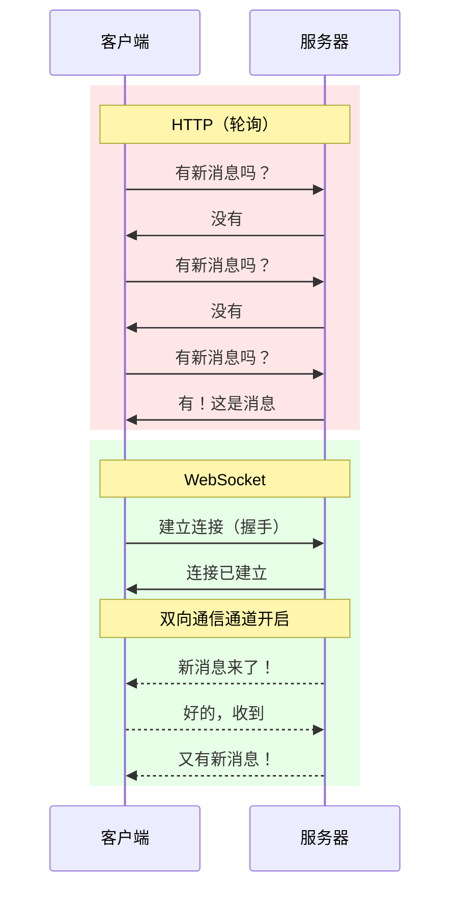

# 12.4.1 为什么需要实时通信——WebSocket vs HTTP：长连接的优势

### 一句话破题

HTTP 是"你问我答"，WebSocket 是"保持通话"——后者让服务器能在任何时候主动给你发消息。

### 本质还原：两种通信模式



### HTTP 轮询的问题

```javascript
// 轮询：每秒询问一次有没有新消息
setInterval(async () => {
  const response = await fetch('/api/messages');
  const messages = await response.json();
  updateUI(messages);
}, 1000);
```

问题：
- **浪费资源**：大多数请求返回"没有新消息"
- **延迟高**：最坏情况下延迟 = 轮询间隔
- **服务器压力**：1000 用户 × 每秒 1 次 = 1000 QPS

### WebSocket 的优势

```javascript
// WebSocket：建立一次连接，持续接收消息
const ws = new WebSocket('wss://example.com/socket');

ws.onmessage = (event) => {
  const message = JSON.parse(event.data);
  updateUI(message);
};

// 发送消息也很简单
ws.send(JSON.stringify({ text: 'Hello!' }));
```

| 特性 | HTTP 轮询 | WebSocket |
|------|----------|-----------|
| 连接方式 | 每次请求新连接 | 持久连接 |
| 通信方向 | 单向（客户端发起） | 双向 |
| 实时性 | 取决于轮询间隔 | 毫秒级 |
| 资源消耗 | 高 | 低 |
| 服务器推送 | 不支持 | 原生支持 |

### WebSocket 握手过程

WebSocket 连接从 HTTP 升级开始：

```
// 客户端请求
GET /socket HTTP/1.1
Host: example.com
Upgrade: websocket
Connection: Upgrade
Sec-WebSocket-Key: dGhlIHNhbXBsZSBub25jZQ==
Sec-WebSocket-Version: 13

// 服务器响应
HTTP/1.1 101 Switching Protocols
Upgrade: websocket
Connection: Upgrade
Sec-WebSocket-Accept: s3pPLMBiTxaQ9kYGzzhZRbK+xOo=
```

握手完成后，连接从 HTTP 升级为 WebSocket，双方可以自由发送数据帧。

### 何时使用 WebSocket

| 场景 | 推荐方案 |
|------|----------|
| 即时通讯、聊天 | WebSocket |
| 实时协作编辑 | WebSocket |
| 股票行情、体育比分 | WebSocket / SSE |
| 表单提交、API 调用 | HTTP |
| 文件下载 | HTTP |
| 偶尔获取数据（间隔 > 30s） | HTTP |

### AI 协作指南

- **核心意图**：让 AI 帮你理解何时以及如何使用 WebSocket。
- **需求定义公式**：`"请解释 WebSocket 和 HTTP 长轮询的区别，并说明在什么场景下应该选择哪种方案。"`
- **关键术语**：`WebSocket`、`握手 (handshake)`、`全双工 (full-duplex)`、`持久连接 (persistent connection)`

### 避坑指南

- **不要为所有场景都用 WebSocket**：简单的 CRUD 操作用 HTTP 更合适。
- **注意连接限制**：浏览器对单个域名的 WebSocket 连接数有限制。
- **考虑负载均衡**：WebSocket 的长连接对负载均衡有特殊要求（需要 sticky session）。
