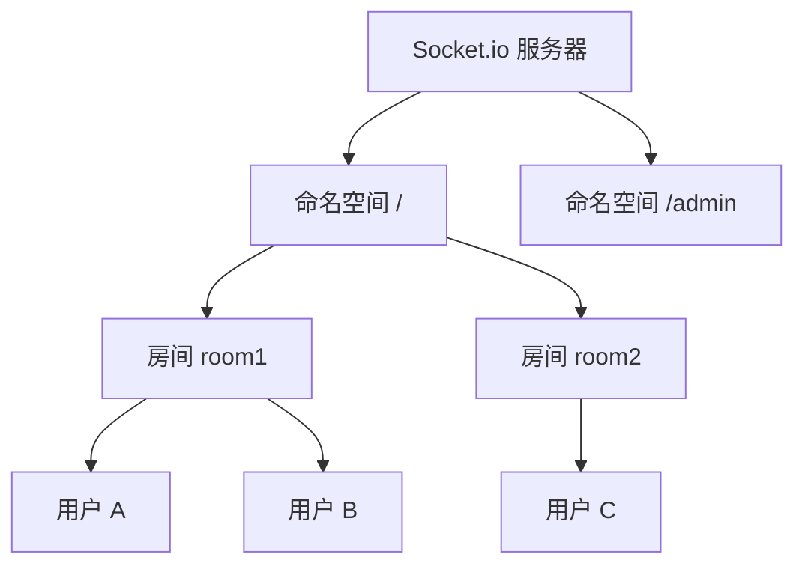

# 12.4.2 建立实时连接——Socket.io 基础：服务端与客户端配置

### 一句话破题

Socket.io 是 WebSocket 的"超级版"——它不仅封装了 WebSocket，还自动处理降级、重连和跨平台兼容性。

### 为什么选择 Socket.io

原生 WebSocket 很底层，Socket.io 提供了：

- **自动降级**：不支持 WebSocket 时自动使用 HTTP 长轮询
- **自动重连**：断线后自动尝试重新连接
- **房间和命名空间**：轻松管理用户分组
- **事件机制**：基于事件名而非原始消息
- **跨平台**：浏览器、Node.js、Python、Java 都有客户端

### 快速上手

#### 安装依赖

```bash
pnpm add socket.io socket.io-client
```

#### 服务端配置

```typescript
// server.ts
import { createServer } from 'http';
import { Server } from 'socket.io';

const httpServer = createServer();
const io = new Server(httpServer, {
  cors: {
    origin: 'http://localhost:3000',
    methods: ['GET', 'POST'],
  },
});

io.on('connection', (socket) => {
  console.log('用户连接:', socket.id);

  // 监听自定义事件
  socket.on('message', (data) => {
    console.log('收到消息:', data);
    // 广播给所有人（除了发送者）
    socket.broadcast.emit('message', data);
  });

  // 断开连接
  socket.on('disconnect', () => {
    console.log('用户断开:', socket.id);
  });
});

httpServer.listen(3001, () => {
  console.log('Socket.io 服务运行在 http://localhost:3001');
});
```

#### 客户端配置

```tsx
// React 组件
'use client';

import { useEffect, useState } from 'react';
import { io, Socket } from 'socket.io-client';

export default function Chat() {
  const [socket, setSocket] = useState<Socket | null>(null);
  const [messages, setMessages] = useState<string[]>([]);
  const [input, setInput] = useState('');

  useEffect(() => {
    const newSocket = io('http://localhost:3001');
    setSocket(newSocket);

    newSocket.on('message', (data: string) => {
      setMessages((prev) => [...prev, data]);
    });

    return () => {
      newSocket.close();
    };
  }, []);

  const sendMessage = () => {
    if (socket && input.trim()) {
      socket.emit('message', input);
      setMessages((prev) => [...prev, `我: ${input}`]);
      setInput('');
    }
  };

  return (
    <div>
      <div>
        {messages.map((msg, i) => (
          <div key={i}>{msg}</div>
        ))}
      </div>
      <input
        value={input}
        onChange={(e) => setInput(e.target.value)}
        onKeyPress={(e) => e.key === 'Enter' && sendMessage()}
      />
      <button onClick={sendMessage}>发送</button>
    </div>
  );
}
```

### 在 Next.js 中集成

Next.js 使用自定义服务器来支持 Socket.io：

```typescript
// server.ts
import { createServer } from 'http';
import { parse } from 'url';
import next from 'next';
import { Server } from 'socket.io';

const dev = process.env.NODE_ENV !== 'production';
const app = next({ dev });
const handle = app.getRequestHandler();

app.prepare().then(() => {
  const server = createServer((req, res) => {
    const parsedUrl = parse(req.url!, true);
    handle(req, res, parsedUrl);
  });

  const io = new Server(server);

  io.on('connection', (socket) => {
    console.log('连接成功');
    // ... 事件处理
  });

  server.listen(3000, () => {
    console.log('> Ready on http://localhost:3000');
  });
});
```

### Socket.io 核心概念



- **命名空间 (Namespace)**：隔离不同功能的连接
- **房间 (Room)**：同一命名空间内的用户分组
- **Socket**：单个用户的连接实例

### AI 协作指南

- **核心意图**：让 AI 帮你搭建 Socket.io 服务。
- **需求定义公式**：`"请帮我在 Next.js 项目中集成 Socket.io，实现一个简单的实时消息功能。"`
- **关键术语**：`emit`、`on`、`broadcast`、`room`、`namespace`

### 避坑指南

- **CORS 配置**：跨域时需要正确配置 CORS，否则连接会失败。
- **客户端复用**：不要在每次渲染时创建新的 socket 连接。
- **清理连接**：组件卸载时记得关闭 socket 连接。
