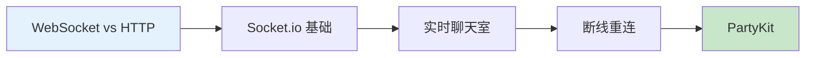

# 12.4 超越 HTTP 的实时世界——WebSockets 实时通信：在线聊天与协作功能

### 一句话破题

WebSocket 是让服务器能"主动"给客户端推送消息的技术，是构建聊天、协作、游戏等实时应用的基石。

### 核心价值

传统 HTTP 是"请求-响应"模式：客户端问，服务器才答。但很多场景需要服务器主动通知客户端：

- **即时通讯**：微信、Slack 的消息推送
- **协作编辑**：Google Docs、Figma 的多人同步
- **实时数据**：股票行情、体育比分
- **在线游戏**：玩家动作同步

WebSocket 建立后，双方可以随时发送消息，实现真正的"双向通信"。

### 本章导览

1. **WebSocket vs HTTP**：理解为什么需要 WebSocket
2. **Socket.io 基础**：快速搭建 WebSocket 服务
3. **实时聊天室**：构建房间和消息广播功能
4. **断线重连**：处理网络不稳定的情况
5. **PartyKit**：现代化的边缘实时通信方案

### 为什么 Vibe Coder 要学这个？

实时功能正在成为用户体验的"基础设施"：

- 用户期望看到"实时"的反馈，而不是刷新页面
- AI 应用的流式输出本质上也是实时通信
- 协作功能是 SaaS 产品的差异化竞争力

> **关键洞察**：WebSocket 不难学，难的是处理好各种边缘情况（断线、重连、状态同步）。Socket.io 和 PartyKit 帮你封装了大量复杂性。
