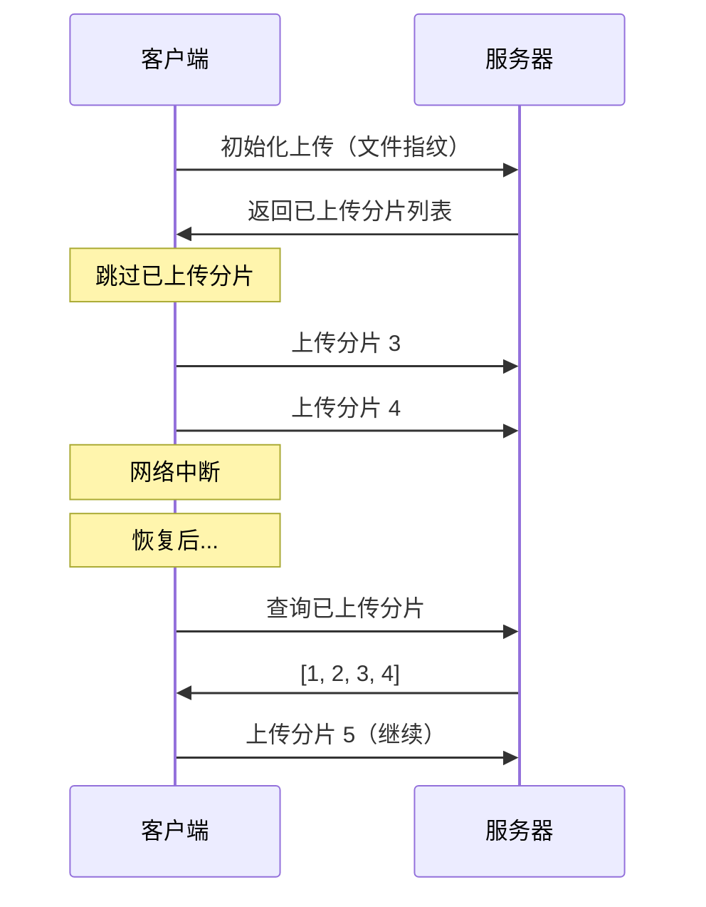

# 12.5.2 网断了接着传——断点续传：上传进度保存与恢复

### 一句话破题

断点续传的核心是"记住已传的"——客户端记录已上传的分片，服务端记录已接收的分片，重新上传时跳过已完成的部分。

### 本质还原



### 文件指纹生成

用文件内容生成唯一标识，相同文件会得到相同指纹：

```typescript
async function getFileFingerprint(file: File): Promise<string> {
  // 取文件头尾各 2MB + 中间 2MB 计算 hash
  const sliceSize = 2 * 1024 * 1024;
  const chunks = [
    file.slice(0, sliceSize),
    file.slice(Math.floor(file.size / 2) - sliceSize / 2, Math.floor(file.size / 2) + sliceSize / 2),
    file.slice(-sliceSize),
  ];

  const data = await Promise.all(chunks.map((c) => c.arrayBuffer()));
  const combined = new Uint8Array(data.reduce((acc, d) => acc + d.byteLength, 0));
  let offset = 0;
  data.forEach((d) => {
    combined.set(new Uint8Array(d), offset);
    offset += d.byteLength;
  });

  const hashBuffer = await crypto.subtle.digest('SHA-256', combined);
  const hashArray = Array.from(new Uint8Array(hashBuffer));
  return hashArray.map((b) => b.toString(16).padStart(2, '0')).join('');
}
```

### 客户端实现

```typescript
interface UploadState {
  fileId: string;
  uploadedChunks: number[];
  totalChunks: number;
}

class ResumableUploader {
  private storageKey(fingerprint: string) {
    return `upload_${fingerprint}`;
  }

  private saveState(fingerprint: string, state: UploadState) {
    localStorage.setItem(this.storageKey(fingerprint), JSON.stringify(state));
  }

  private loadState(fingerprint: string): UploadState | null {
    const data = localStorage.getItem(this.storageKey(fingerprint));
    return data ? JSON.parse(data) : null;
  }

  async upload(file: File, onProgress: (percent: number) => void) {
    const fingerprint = await getFileFingerprint(file);
    let state = this.loadState(fingerprint);

    // 检查服务端状态
    if (state) {
      const serverState = await this.checkServerState(state.fileId);
      state.uploadedChunks = serverState.uploadedChunks;
    } else {
      // 新上传
      const { fileId } = await this.initUpload(file, fingerprint);
      state = { fileId, uploadedChunks: [], totalChunks: 0 };
    }

    const chunks = createChunks(file);
    state.totalChunks = chunks.length;

    // 过滤已上传的分片
    const pendingChunks = chunks.filter((c) => !state!.uploadedChunks.includes(c.index));

    for (const chunk of pendingChunks) {
      await this.uploadChunk(chunk, state.fileId);
      state.uploadedChunks.push(chunk.index);
      this.saveState(fingerprint, state);
      onProgress((state.uploadedChunks.length / chunks.length) * 100);
    }

    // 完成后清理本地状态
    localStorage.removeItem(this.storageKey(fingerprint));
    await this.mergeChunks(state.fileId, chunks.length);
  }

  // ... 其他方法
}
```

### 秒传实现

如果文件指纹已存在，直接返回已上传的文件：

```typescript
// 服务端检查
export async function POST(req: Request) {
  const { fingerprint, fileName, fileSize } = await req.json();

  // 检查是否已存在相同文件
  const existingFile = await db.file.findUnique({
    where: { fingerprint },
  });

  if (existingFile) {
    return Response.json({
      status: 'exists',
      fileUrl: existingFile.url,
    });
  }

  // 创建新上传任务
  const fileId = crypto.randomUUID();
  await db.uploadTask.create({
    data: { fileId, fingerprint, fileName, fileSize },
  });

  return Response.json({ status: 'new', fileId });
}
```

### AI 协作指南

- **核心意图**：让 AI 帮你实现断点续传功能。
- **需求定义公式**：`"请帮我实现一个支持断点续传和秒传的文件上传组件，使用文件指纹识别重复文件。"`
- **关键术语**：`断点续传 (resumable upload)`、`文件指纹 (fingerprint)`、`秒传`、`SHA-256`

### 避坑指南

- **指纹计算性能**：不要对整个大文件计算 hash，取样计算即可。
- **存储清理**：定期清理过期的上传任务和临时文件。
- **并发控制**：同一文件不要允许多个客户端同时上传。
